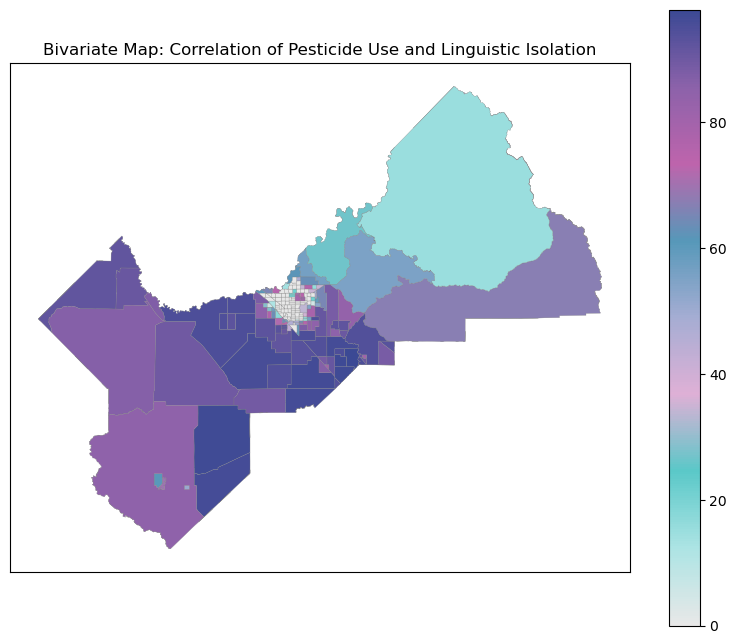

```python
import geopandas as gpd
import pandas as pd

```


```python

# Read shapefile
shapefile_path = "data/Fresno_County_PLSS_NAD83AlbersCA/Fresno_County.shp"
fresno_gdf = gpd.read_file(shapefile_path)
```


```python
import geopandas as gpd
import matplotlib.pyplot as plt

# Read merged GeoDataFrame
pur_gdf = gpd.read_file("data/PUR_geo.shp")
```


```python
pur_gdf.head()
```


<div>
<style scoped>
    .dataframe tbody tr th:only-of-type {
        vertical-align: middle;
    }

    .dataframe tbody tr th {
        vertical-align: top;
    }

    .dataframe thead th {
        text-align: right;
    }
</style>
<table border="1" class="dataframe">
  <thead>
    <tr style="text-align: right;">
      <th></th>
      <th>COUNTY_CD</th>
      <th>MTOWN</th>
      <th>RANGE</th>
      <th>SECTION</th>
      <th>REGIONNAME</th>
      <th>BASE_LN_ME</th>
      <th>TOWNSHIP</th>
      <th>MTRS</th>
      <th>MTR</th>
      <th>CO_MTRS</th>
      <th>REGION</th>
      <th>CO_MTR</th>
      <th>County_CDn</th>
      <th>NAME</th>
      <th>NAMELSAD</th>
      <th>OID_</th>
      <th>ADJUVANT</th>
      <th>YEAR</th>
      <th>DATE</th>
      <th>COUNTY_NAM</th>
      <th>COMTRS</th>
      <th>SITE_NAME</th>
      <th>PRODUCT_NA</th>
      <th>POUNDS_PRO</th>
      <th>CHEMICAL_N</th>
      <th>POUNDS_CHE</th>
      <th>AMOUNT_TRE</th>
      <th>UNIT_TREAT</th>
      <th>AERIAL_GRO</th>
      <th>geometry</th>
      <th>AMOUNT_SQMILES</th>
    </tr>
  </thead>
  <tbody>
    <tr>
      <th>0</th>
      <td>10</td>
      <td>M04S</td>
      <td>27E</td>
      <td>20</td>
      <td>LAHONTAN</td>
      <td>M</td>
      <td>04S</td>
      <td>M04S27E20</td>
      <td>M04S27E</td>
      <td>10M04S27E20</td>
      <td>6</td>
      <td>10M04S27E</td>
      <td>10</td>
      <td>Fresno</td>
      <td>Fresno County</td>
      <td>None</td>
      <td>None</td>
      <td>NaN</td>
      <td>None</td>
      <td>None</td>
      <td>None</td>
      <td>None</td>
      <td>None</td>
      <td>NaN</td>
      <td>None</td>
      <td>NaN</td>
      <td>NaN</td>
      <td>None</td>
      <td>None</td>
      <td>POLYGON ((86163.850 -47413.974, 86191.328 -474...</td>
      <td>NaN</td>
    </tr>
    <tr>
      <th>1</th>
      <td>10</td>
      <td>M04S</td>
      <td>27E</td>
      <td>19</td>
      <td>CENTRAL VALLEY</td>
      <td>M</td>
      <td>04S</td>
      <td>M04S27E19</td>
      <td>M04S27E</td>
      <td>10M04S27E19</td>
      <td>5</td>
      <td>10M04S27E</td>
      <td>10</td>
      <td>Fresno</td>
      <td>Fresno County</td>
      <td>None</td>
      <td>None</td>
      <td>NaN</td>
      <td>None</td>
      <td>None</td>
      <td>None</td>
      <td>None</td>
      <td>None</td>
      <td>NaN</td>
      <td>None</td>
      <td>NaN</td>
      <td>NaN</td>
      <td>None</td>
      <td>None</td>
      <td>POLYGON ((85698.772 -47889.337, 85702.950 -480...</td>
      <td>NaN</td>
    </tr>
    <tr>
      <th>2</th>
      <td>10</td>
      <td>M04S</td>
      <td>27E</td>
      <td>29</td>
      <td>CENTRAL VALLEY</td>
      <td>M</td>
      <td>04S</td>
      <td>M04S27E29</td>
      <td>M04S27E</td>
      <td>10M04S27E29</td>
      <td>5</td>
      <td>10M04S27E</td>
      <td>10</td>
      <td>Fresno</td>
      <td>Fresno County</td>
      <td>None</td>
      <td>None</td>
      <td>NaN</td>
      <td>None</td>
      <td>None</td>
      <td>None</td>
      <td>None</td>
      <td>None</td>
      <td>NaN</td>
      <td>None</td>
      <td>NaN</td>
      <td>NaN</td>
      <td>None</td>
      <td>None</td>
      <td>POLYGON ((85826.745 -48097.511, 87004.884 -480...</td>
      <td>NaN</td>
    </tr>
    <tr>
      <th>3</th>
      <td>10</td>
      <td>M04S</td>
      <td>27E</td>
      <td>30</td>
      <td>CENTRAL VALLEY</td>
      <td>M</td>
      <td>04S</td>
      <td>M04S27E30</td>
      <td>M04S27E</td>
      <td>10M04S27E30</td>
      <td>5</td>
      <td>10M04S27E</td>
      <td>10</td>
      <td>Fresno</td>
      <td>Fresno County</td>
      <td>None</td>
      <td>None</td>
      <td>NaN</td>
      <td>None</td>
      <td>None</td>
      <td>None</td>
      <td>None</td>
      <td>None</td>
      <td>NaN</td>
      <td>None</td>
      <td>NaN</td>
      <td>NaN</td>
      <td>None</td>
      <td>None</td>
      <td>POLYGON ((85492.147 -48100.514, 85702.950 -480...</td>
      <td>NaN</td>
    </tr>
    <tr>
      <th>4</th>
      <td>10</td>
      <td>M04S</td>
      <td>27E</td>
      <td>28</td>
      <td>LAHONTAN</td>
      <td>M</td>
      <td>04S</td>
      <td>M04S27E28</td>
      <td>M04S27E</td>
      <td>10M04S27E28</td>
      <td>6</td>
      <td>10M04S27E</td>
      <td>10</td>
      <td>Fresno</td>
      <td>Fresno County</td>
      <td>None</td>
      <td>None</td>
      <td>NaN</td>
      <td>None</td>
      <td>None</td>
      <td>None</td>
      <td>None</td>
      <td>None</td>
      <td>NaN</td>
      <td>None</td>
      <td>NaN</td>
      <td>NaN</td>
      <td>None</td>
      <td>None</td>
      <td>POLYGON ((89043.287 -49493.042, 89047.876 -496...</td>
      <td>NaN</td>
    </tr>
  </tbody>
</table>
</div>


```python
columns_to_check = ['ADJUVANT', 'YEAR', 'DATE', 'COUNTY_NAM',
                    'COMTRS', 'SITE_NAME', 'PRODUCT_NA', 'POUNDS_PRO', 'CHEMICAL_N',
                    'POUNDS_CHE', 'AMOUNT_TRE', 'UNIT_TREAT', 'AERIAL_GRO']

# Drop rows with missing values in any of the specified columns
pur_gdf2 = pur_gdf.dropna(subset=columns_to_check, how='any')
```


```python
pur_gdf2.shape[0]
```


    258102


```python
pd.set_option('display.max_columns', None)
pur_gdf2.head(50)
```


<div>
<style scoped>
    .dataframe tbody tr th:only-of-type {
        vertical-align: middle;
    }

    .dataframe tbody tr th {
        vertical-align: top;
    }

    .dataframe thead th {
        text-align: right;
    }
</style>
<table border="1" class="dataframe">
  <thead>
    <tr style="text-align: right;">
      <th></th>
      <th>COUNTY_CD</th>
      <th>MTOWN</th>
      <th>RANGE</th>
      <th>SECTION</th>
      <th>REGIONNAME</th>
      <th>BASE_LN_ME</th>
      <th>TOWNSHIP</th>
      <th>MTRS</th>
      <th>MTR</th>
      <th>CO_MTRS</th>
      <th>REGION</th>
      <th>CO_MTR</th>
      <th>County_CDn</th>
      <th>NAME</th>
      <th>NAMELSAD</th>
      <th>OID_</th>
      <th>ADJUVANT</th>
      <th>YEAR</th>
      <th>DATE</th>
      <th>COUNTY_NAM</th>
      <th>COMTRS</th>
      <th>SITE_NAME</th>
      <th>PRODUCT_NA</th>
      <th>POUNDS_PRO</th>
      <th>CHEMICAL_N</th>
      <th>POUNDS_CHE</th>
      <th>AMOUNT_TRE</th>
      <th>UNIT_TREAT</th>
      <th>AERIAL_GRO</th>
      <th>geometry</th>
      <th>AMOUNT_SQMILES</th>
    </tr>
  </thead>
  <tbody>
    <tr>
      <th>1289</th>
      <td>10</td>
      <td>M10S</td>
      <td>13E</td>
      <td>22</td>
      <td>CENTRAL VALLEY</td>
      <td>M</td>
      <td>10S</td>
      <td>M10S13E22</td>
      <td>M10S13E</td>
      <td>10M10S13E22</td>
      <td>5</td>
      <td>10M10S13E</td>
      <td>10</td>
      <td>Fresno</td>
      <td>Fresno County</td>
      <td>None</td>
      <td>NO</td>
      <td>2021.0</td>
      <td>27-AUG-21</td>
      <td>FRESNO</td>
      <td>10M10S13E22</td>
      <td>COTTON, GENERAL</td>
      <td>ASSAIL 70WP INSECTICIDE</td>
      <td>1.9400</td>
      <td>ACETAMIPRID</td>
      <td>1.358000</td>
      <td>14.0</td>
      <td>A</td>
      <td>G</td>
      <td>POLYGON ((-48165.756 -107898.621, -48107.770 -...</td>
      <td>0.021875</td>
    </tr>
    <tr>
      <th>1290</th>
      <td>10</td>
      <td>M10S</td>
      <td>13E</td>
      <td>22</td>
      <td>CENTRAL VALLEY</td>
      <td>M</td>
      <td>10S</td>
      <td>M10S13E22</td>
      <td>M10S13E</td>
      <td>10M10S13E22</td>
      <td>5</td>
      <td>10M10S13E</td>
      <td>10</td>
      <td>Fresno</td>
      <td>Fresno County</td>
      <td>None</td>
      <td>NO</td>
      <td>2021.0</td>
      <td>15-JUN-21</td>
      <td>FRESNO</td>
      <td>10M10S13E22</td>
      <td>COTTON, GENERAL</td>
      <td>BELAY INSECTICIDE</td>
      <td>5.0919</td>
      <td>CLOTHIANIDIN</td>
      <td>1.171137</td>
      <td>14.0</td>
      <td>A</td>
      <td>G</td>
      <td>POLYGON ((-48165.756 -107898.621, -48107.770 -...</td>
      <td>0.021875</td>
    </tr>
    <tr>
      <th>1291</th>
      <td>10</td>
      <td>M10S</td>
      <td>13E</td>
      <td>22</td>
      <td>CENTRAL VALLEY</td>
      <td>M</td>
      <td>10S</td>
      <td>M10S13E22</td>
      <td>M10S13E</td>
      <td>10M10S13E22</td>
      <td>5</td>
      <td>10M10S13E</td>
      <td>10</td>
      <td>Fresno</td>
      <td>Fresno County</td>
      <td>None</td>
      <td>NO</td>
      <td>2021.0</td>
      <td>16-SEP-21</td>
      <td>FRESNO</td>
      <td>10M10S13E22</td>
      <td>COTTON, GENERAL</td>
      <td>BOLL BUSTER</td>
      <td>38.0006</td>
      <td>ETHEPHON</td>
      <td>21.052332</td>
      <td>14.0</td>
      <td>A</td>
      <td>G</td>
      <td>POLYGON ((-48165.756 -107898.621, -48107.770 -...</td>
      <td>0.021875</td>
    </tr>
    <tr>
      <th>1292</th>
      <td>10</td>
      <td>M10S</td>
      <td>13E</td>
      <td>22</td>
      <td>CENTRAL VALLEY</td>
      <td>M</td>
      <td>10S</td>
      <td>M10S13E22</td>
      <td>M10S13E</td>
      <td>10M10S13E22</td>
      <td>5</td>
      <td>10M10S13E</td>
      <td>10</td>
      <td>Fresno</td>
      <td>Fresno County</td>
      <td>None</td>
      <td>NO</td>
      <td>2021.0</td>
      <td>16-SEP-21</td>
      <td>FRESNO</td>
      <td>10M10S13E22</td>
      <td>COTTON, GENERAL</td>
      <td>DIBROM 8 EMULSIVE</td>
      <td>22.7409</td>
      <td>NALED</td>
      <td>14.099358</td>
      <td>14.0</td>
      <td>A</td>
      <td>G</td>
      <td>POLYGON ((-48165.756 -107898.621, -48107.770 -...</td>
      <td>0.021875</td>
    </tr>
    <tr>
      <th>1293</th>
      <td>10</td>
      <td>M10S</td>
      <td>13E</td>
      <td>22</td>
      <td>CENTRAL VALLEY</td>
      <td>M</td>
      <td>10S</td>
      <td>M10S13E22</td>
      <td>M10S13E</td>
      <td>10M10S13E22</td>
      <td>5</td>
      <td>10M10S13E</td>
      <td>10</td>
      <td>Fresno</td>
      <td>Fresno County</td>
      <td>None</td>
      <td>NO</td>
      <td>2021.0</td>
      <td>29-SEP-21</td>
      <td>FRESNO</td>
      <td>10M10S13E22</td>
      <td>COTTON, GENERAL</td>
      <td>ET HERBICIDE/DEFOLIANT</td>
      <td>2.2851</td>
      <td>PYRAFLUFEN-ETHYL</td>
      <td>0.057127</td>
      <td>14.0</td>
      <td>A</td>
      <td>G</td>
      <td>POLYGON ((-48165.756 -107898.621, -48107.770 -...</td>
      <td>0.021875</td>
    </tr>
    <tr>
      <th>1294</th>
      <td>10</td>
      <td>M10S</td>
      <td>13E</td>
      <td>22</td>
      <td>CENTRAL VALLEY</td>
      <td>M</td>
      <td>10S</td>
      <td>M10S13E22</td>
      <td>M10S13E</td>
      <td>10M10S13E22</td>
      <td>5</td>
      <td>10M10S13E</td>
      <td>10</td>
      <td>Fresno</td>
      <td>Fresno County</td>
      <td>None</td>
      <td>NO</td>
      <td>2021.0</td>
      <td>16-SEP-21</td>
      <td>FRESNO</td>
      <td>10M10S13E22</td>
      <td>COTTON, GENERAL</td>
      <td>ET HERBICIDE/DEFOLIANT</td>
      <td>1.3541</td>
      <td>PYRAFLUFEN-ETHYL</td>
      <td>0.033853</td>
      <td>14.0</td>
      <td>A</td>
      <td>G</td>
      <td>POLYGON ((-48165.756 -107898.621, -48107.770 -...</td>
      <td>0.021875</td>
    </tr>
    <tr>
      <th>1296</th>
      <td>10</td>
      <td>M10S</td>
      <td>13E</td>
      <td>22</td>
      <td>CENTRAL VALLEY</td>
      <td>M</td>
      <td>10S</td>
      <td>M10S13E22</td>
      <td>M10S13E</td>
      <td>10M10S13E22</td>
      <td>5</td>
      <td>10M10S13E</td>
      <td>10</td>
      <td>Fresno</td>
      <td>Fresno County</td>
      <td>None</td>
      <td>NO</td>
      <td>2021.0</td>
      <td>14-FEB-21</td>
      <td>FRESNO</td>
      <td>10M10S13E22</td>
      <td>COTTON, GENERAL</td>
      <td>GALIGAN 2E</td>
      <td>15.7641</td>
      <td>OXYFLUORFEN</td>
      <td>3.499630</td>
      <td>14.0</td>
      <td>A</td>
      <td>G</td>
      <td>POLYGON ((-48165.756 -107898.621, -48107.770 -...</td>
      <td>0.021875</td>
    </tr>
    <tr>
      <th>1297</th>
      <td>10</td>
      <td>M10S</td>
      <td>13E</td>
      <td>22</td>
      <td>CENTRAL VALLEY</td>
      <td>M</td>
      <td>10S</td>
      <td>M10S13E22</td>
      <td>M10S13E</td>
      <td>10M10S13E22</td>
      <td>5</td>
      <td>10M10S13E</td>
      <td>10</td>
      <td>Fresno</td>
      <td>Fresno County</td>
      <td>None</td>
      <td>NO</td>
      <td>2021.0</td>
      <td>16-SEP-21</td>
      <td>FRESNO</td>
      <td>10M10S13E22</td>
      <td>COTTON, GENERAL</td>
      <td>GINSTAR EC COTTON DEFOLIANT</td>
      <td>7.1706</td>
      <td>DIURON</td>
      <td>0.430236</td>
      <td>14.0</td>
      <td>A</td>
      <td>G</td>
      <td>POLYGON ((-48165.756 -107898.621, -48107.770 -...</td>
      <td>0.021875</td>
    </tr>
    <tr>
      <th>1298</th>
      <td>10</td>
      <td>M10S</td>
      <td>13E</td>
      <td>22</td>
      <td>CENTRAL VALLEY</td>
      <td>M</td>
      <td>10S</td>
      <td>M10S13E22</td>
      <td>M10S13E</td>
      <td>10M10S13E22</td>
      <td>5</td>
      <td>10M10S13E</td>
      <td>10</td>
      <td>Fresno</td>
      <td>Fresno County</td>
      <td>None</td>
      <td>NO</td>
      <td>2021.0</td>
      <td>16-SEP-21</td>
      <td>FRESNO</td>
      <td>10M10S13E22</td>
      <td>COTTON, GENERAL</td>
      <td>GINSTAR EC COTTON DEFOLIANT</td>
      <td>7.1706</td>
      <td>THIDIAZURON</td>
      <td>0.860472</td>
      <td>14.0</td>
      <td>A</td>
      <td>G</td>
      <td>POLYGON ((-48165.756 -107898.621, -48107.770 -...</td>
      <td>0.021875</td>
    </tr>
    <tr>
      <th>1304</th>
      <td>10</td>
      <td>M10S</td>
      <td>13E</td>
      <td>22</td>
      <td>CENTRAL VALLEY</td>
      <td>M</td>
      <td>10S</td>
      <td>M10S13E22</td>
      <td>M10S13E</td>
      <td>10M10S13E22</td>
      <td>5</td>
      <td>10M10S13E</td>
      <td>10</td>
      <td>Fresno</td>
      <td>Fresno County</td>
      <td>None</td>
      <td>NO</td>
      <td>2021.0</td>
      <td>14-FEB-21</td>
      <td>FRESNO</td>
      <td>10M10S13E22</td>
      <td>COTTON, GENERAL</td>
      <td>MAKAZE</td>
      <td>34.1172</td>
      <td>GLYPHOSATE, ISOPROPYLAMINE SALT</td>
      <td>13.988052</td>
      <td>14.0</td>
      <td>A</td>
      <td>G</td>
      <td>POLYGON ((-48165.756 -107898.621, -48107.770 -...</td>
      <td>0.021875</td>
    </tr>
    <tr>
      <th>1305</th>
      <td>10</td>
      <td>M10S</td>
      <td>13E</td>
      <td>22</td>
      <td>CENTRAL VALLEY</td>
      <td>M</td>
      <td>10S</td>
      <td>M10S13E22</td>
      <td>M10S13E</td>
      <td>10M10S13E22</td>
      <td>5</td>
      <td>10M10S13E</td>
      <td>10</td>
      <td>Fresno</td>
      <td>Fresno County</td>
      <td>None</td>
      <td>NO</td>
      <td>2021.0</td>
      <td>02-JUL-21</td>
      <td>FRESNO</td>
      <td>10M10S13E22</td>
      <td>COTTON, GENERAL</td>
      <td>MEPIQUAT</td>
      <td>21.9430</td>
      <td>MEPIQUAT CHLORIDE</td>
      <td>0.921606</td>
      <td>14.0</td>
      <td>A</td>
      <td>A</td>
      <td>POLYGON ((-48165.756 -107898.621, -48107.770 -...</td>
      <td>0.021875</td>
    </tr>
    <tr>
      <th>1306</th>
      <td>10</td>
      <td>M10S</td>
      <td>13E</td>
      <td>22</td>
      <td>CENTRAL VALLEY</td>
      <td>M</td>
      <td>10S</td>
      <td>M10S13E22</td>
      <td>M10S13E</td>
      <td>10M10S13E22</td>
      <td>5</td>
      <td>10M10S13E</td>
      <td>10</td>
      <td>Fresno</td>
      <td>Fresno County</td>
      <td>None</td>
      <td>NO</td>
      <td>2021.0</td>
      <td>16-JUL-21</td>
      <td>FRESNO</td>
      <td>10M10S13E22</td>
      <td>COTTON, GENERAL</td>
      <td>MEPIQUAT</td>
      <td>21.9430</td>
      <td>MEPIQUAT CHLORIDE</td>
      <td>0.921606</td>
      <td>14.0</td>
      <td>A</td>
      <td>A</td>
      <td>POLYGON ((-48165.756 -107898.621, -48107.770 -...</td>
      <td>0.021875</td>
    </tr>
    <tr>
      <th>1307</th>
      <td>10</td>
      <td>M10S</td>
      <td>13E</td>
      <td>22</td>
      <td>CENTRAL VALLEY</td>
      <td>M</td>
      <td>10S</td>
      <td>M10S13E22</td>
      <td>M10S13E</td>
      <td>10M10S13E22</td>
      <td>5</td>
      <td>10M10S13E</td>
      <td>10</td>
      <td>Fresno</td>
      <td>Fresno County</td>
      <td>None</td>
      <td>NO</td>
      <td>2021.0</td>
      <td>15-JUN-21</td>
      <td>FRESNO</td>
      <td>10M10S13E22</td>
      <td>COTTON, GENERAL</td>
      <td>MEPIQUAT</td>
      <td>21.9430</td>
      <td>MEPIQUAT CHLORIDE</td>
      <td>0.921606</td>
      <td>14.0</td>
      <td>A</td>
      <td>G</td>
      <td>POLYGON ((-48165.756 -107898.621, -48107.770 -...</td>
      <td>0.021875</td>
    </tr>
    <tr>
      <th>1308</th>
      <td>10</td>
      <td>M10S</td>
      <td>13E</td>
      <td>22</td>
      <td>CENTRAL VALLEY</td>
      <td>M</td>
      <td>10S</td>
      <td>M10S13E22</td>
      <td>M10S13E</td>
      <td>10M10S13E22</td>
      <td>5</td>
      <td>10M10S13E</td>
      <td>10</td>
      <td>Fresno</td>
      <td>Fresno County</td>
      <td>None</td>
      <td>NO</td>
      <td>2021.0</td>
      <td>29-SEP-21</td>
      <td>FRESNO</td>
      <td>10M10S13E22</td>
      <td>COTTON, GENERAL</td>
      <td>PARAQUAT CONCENTRATE</td>
      <td>21.8546</td>
      <td>PARAQUAT DICHLORIDE</td>
      <td>9.441187</td>
      <td>14.0</td>
      <td>A</td>
      <td>G</td>
      <td>POLYGON ((-48165.756 -107898.621, -48107.770 -...</td>
      <td>0.021875</td>
    </tr>
    <tr>
      <th>1309</th>
      <td>10</td>
      <td>M10S</td>
      <td>13E</td>
      <td>22</td>
      <td>CENTRAL VALLEY</td>
      <td>M</td>
      <td>10S</td>
      <td>M10S13E22</td>
      <td>M10S13E</td>
      <td>10M10S13E22</td>
      <td>5</td>
      <td>10M10S13E</td>
      <td>10</td>
      <td>Fresno</td>
      <td>Fresno County</td>
      <td>None</td>
      <td>NO</td>
      <td>2021.0</td>
      <td>15-JUN-21</td>
      <td>FRESNO</td>
      <td>10M10S13E22</td>
      <td>COTTON, GENERAL</td>
      <td>REAPER CLEARFORM</td>
      <td>14.4317</td>
      <td>ABAMECTIN</td>
      <td>0.288634</td>
      <td>14.0</td>
      <td>A</td>
      <td>G</td>
      <td>POLYGON ((-48165.756 -107898.621, -48107.770 -...</td>
      <td>0.021875</td>
    </tr>
    <tr>
      <th>1310</th>
      <td>10</td>
      <td>M10S</td>
      <td>13E</td>
      <td>22</td>
      <td>CENTRAL VALLEY</td>
      <td>M</td>
      <td>10S</td>
      <td>M10S13E22</td>
      <td>M10S13E</td>
      <td>10M10S13E22</td>
      <td>5</td>
      <td>10M10S13E</td>
      <td>10</td>
      <td>Fresno</td>
      <td>Fresno County</td>
      <td>None</td>
      <td>NO</td>
      <td>2021.0</td>
      <td>27-AUG-21</td>
      <td>FRESNO</td>
      <td>10M10S13E22</td>
      <td>COTTON, GENERAL</td>
      <td>SNIPER</td>
      <td>5.5499</td>
      <td>BIFENTHRIN</td>
      <td>1.387475</td>
      <td>14.0</td>
      <td>A</td>
      <td>G</td>
      <td>POLYGON ((-48165.756 -107898.621, -48107.770 -...</td>
      <td>0.021875</td>
    </tr>
    <tr>
      <th>1344</th>
      <td>10</td>
      <td>M10S</td>
      <td>13E</td>
      <td>27</td>
      <td>CENTRAL VALLEY</td>
      <td>M</td>
      <td>10S</td>
      <td>M10S13E27</td>
      <td>M10S13E</td>
      <td>10M10S13E27</td>
      <td>5</td>
      <td>10M10S13E</td>
      <td>10</td>
      <td>Fresno</td>
      <td>Fresno County</td>
      <td>None</td>
      <td>NO</td>
      <td>2021.0</td>
      <td>29-JUL-21</td>
      <td>FRESNO</td>
      <td>10M10S13E27</td>
      <td>ALMOND</td>
      <td>ALTACOR INSECT CONTROL</td>
      <td>14.0600</td>
      <td>CHLORANTRANILIPROLE</td>
      <td>4.921000</td>
      <td>50.0</td>
      <td>A</td>
      <td>G</td>
      <td>POLYGON ((-47730.605 -108389.816, -47733.890 -...</td>
      <td>0.078125</td>
    </tr>
    <tr>
      <th>1345</th>
      <td>10</td>
      <td>M10S</td>
      <td>13E</td>
      <td>27</td>
      <td>CENTRAL VALLEY</td>
      <td>M</td>
      <td>10S</td>
      <td>M10S13E27</td>
      <td>M10S13E</td>
      <td>10M10S13E27</td>
      <td>5</td>
      <td>10M10S13E</td>
      <td>10</td>
      <td>Fresno</td>
      <td>Fresno County</td>
      <td>None</td>
      <td>NO</td>
      <td>2021.0</td>
      <td>29-JUL-21</td>
      <td>FRESNO</td>
      <td>10M10S13E27</td>
      <td>ALMOND</td>
      <td>CHECKMATE NOW-F</td>
      <td>9.5512</td>
      <td>(Z,Z)-11,13-HEXADECADIENAL</td>
      <td>0.110794</td>
      <td>50.0</td>
      <td>A</td>
      <td>G</td>
      <td>POLYGON ((-47730.605 -108389.816, -47733.890 -...</td>
      <td>0.078125</td>
    </tr>
    <tr>
      <th>1346</th>
      <td>10</td>
      <td>M10S</td>
      <td>13E</td>
      <td>27</td>
      <td>CENTRAL VALLEY</td>
      <td>M</td>
      <td>10S</td>
      <td>M10S13E27</td>
      <td>M10S13E</td>
      <td>10M10S13E27</td>
      <td>5</td>
      <td>10M10S13E</td>
      <td>10</td>
      <td>Fresno</td>
      <td>Fresno County</td>
      <td>None</td>
      <td>NO</td>
      <td>2021.0</td>
      <td>04-JUL-21</td>
      <td>FRESNO</td>
      <td>10M10S13E27</td>
      <td>ALMOND</td>
      <td>INTREPID 2F</td>
      <td>93.7625</td>
      <td>METHOXYFENOZIDE</td>
      <td>21.190325</td>
      <td>50.0</td>
      <td>A</td>
      <td>G</td>
      <td>POLYGON ((-47730.605 -108389.816, -47733.890 -...</td>
      <td>0.078125</td>
    </tr>
    <tr>
      <th>1347</th>
      <td>10</td>
      <td>M10S</td>
      <td>13E</td>
      <td>27</td>
      <td>CENTRAL VALLEY</td>
      <td>M</td>
      <td>10S</td>
      <td>M10S13E27</td>
      <td>M10S13E</td>
      <td>10M10S13E27</td>
      <td>5</td>
      <td>10M10S13E</td>
      <td>10</td>
      <td>Fresno</td>
      <td>Fresno County</td>
      <td>None</td>
      <td>NO</td>
      <td>2021.0</td>
      <td>23-FEB-21</td>
      <td>FRESNO</td>
      <td>10M10S13E27</td>
      <td>ALMOND</td>
      <td>LUNA SENSATION</td>
      <td>19.1252</td>
      <td>FLUOPYRAM</td>
      <td>4.092793</td>
      <td>50.0</td>
      <td>A</td>
      <td>G</td>
      <td>POLYGON ((-47730.605 -108389.816, -47733.890 -...</td>
      <td>0.078125</td>
    </tr>
    <tr>
      <th>1348</th>
      <td>10</td>
      <td>M10S</td>
      <td>13E</td>
      <td>27</td>
      <td>CENTRAL VALLEY</td>
      <td>M</td>
      <td>10S</td>
      <td>M10S13E27</td>
      <td>M10S13E</td>
      <td>10M10S13E27</td>
      <td>5</td>
      <td>10M10S13E</td>
      <td>10</td>
      <td>Fresno</td>
      <td>Fresno County</td>
      <td>None</td>
      <td>NO</td>
      <td>2021.0</td>
      <td>23-FEB-21</td>
      <td>FRESNO</td>
      <td>10M10S13E27</td>
      <td>ALMOND</td>
      <td>LUNA SENSATION</td>
      <td>19.1252</td>
      <td>TRIFLOXYSTROBIN</td>
      <td>4.092793</td>
      <td>50.0</td>
      <td>A</td>
      <td>G</td>
      <td>POLYGON ((-47730.605 -108389.816, -47733.890 -...</td>
      <td>0.078125</td>
    </tr>
    <tr>
      <th>1349</th>
      <td>10</td>
      <td>M10S</td>
      <td>13E</td>
      <td>27</td>
      <td>CENTRAL VALLEY</td>
      <td>M</td>
      <td>10S</td>
      <td>M10S13E27</td>
      <td>M10S13E</td>
      <td>10M10S13E27</td>
      <td>5</td>
      <td>10M10S13E</td>
      <td>10</td>
      <td>Fresno</td>
      <td>Fresno County</td>
      <td>None</td>
      <td>NO</td>
      <td>2021.0</td>
      <td>04-JUL-21</td>
      <td>FRESNO</td>
      <td>10M10S13E27</td>
      <td>ALMOND</td>
      <td>NEALTA MITICIDE</td>
      <td>48.8884</td>
      <td>CYFLUMETOFEN</td>
      <td>9.142131</td>
      <td>50.0</td>
      <td>A</td>
      <td>G</td>
      <td>POLYGON ((-47730.605 -108389.816, -47733.890 -...</td>
      <td>0.078125</td>
    </tr>
    <tr>
      <th>1350</th>
      <td>10</td>
      <td>M10S</td>
      <td>13E</td>
      <td>27</td>
      <td>CENTRAL VALLEY</td>
      <td>M</td>
      <td>10S</td>
      <td>M10S13E27</td>
      <td>M10S13E</td>
      <td>10M10S13E27</td>
      <td>5</td>
      <td>10M10S13E</td>
      <td>10</td>
      <td>Fresno</td>
      <td>Fresno County</td>
      <td>None</td>
      <td>NO</td>
      <td>2021.0</td>
      <td>04-JUL-21</td>
      <td>FRESNO</td>
      <td>10M10S13E27</td>
      <td>ALMOND</td>
      <td>PHT 415 SUPREME SPRAY OIL</td>
      <td>352.4007</td>
      <td>MINERAL OIL</td>
      <td>351.343498</td>
      <td>50.0</td>
      <td>A</td>
      <td>G</td>
      <td>POLYGON ((-47730.605 -108389.816, -47733.890 -...</td>
      <td>0.078125</td>
    </tr>
    <tr>
      <th>1356</th>
      <td>10</td>
      <td>M10S</td>
      <td>13E</td>
      <td>27</td>
      <td>CENTRAL VALLEY</td>
      <td>M</td>
      <td>10S</td>
      <td>M10S13E27</td>
      <td>M10S13E</td>
      <td>10M10S13E27</td>
      <td>5</td>
      <td>10M10S13E</td>
      <td>10</td>
      <td>Fresno</td>
      <td>Fresno County</td>
      <td>None</td>
      <td>NO</td>
      <td>2021.0</td>
      <td>27-AUG-21</td>
      <td>FRESNO</td>
      <td>10M10S13E27</td>
      <td>COTTON, GENERAL</td>
      <td>ASSAIL 70WP INSECTICIDE</td>
      <td>8.4700</td>
      <td>ACETAMIPRID</td>
      <td>5.929000</td>
      <td>61.0</td>
      <td>A</td>
      <td>G</td>
      <td>POLYGON ((-47730.605 -108389.816, -47733.890 -...</td>
      <td>0.095313</td>
    </tr>
    <tr>
      <th>1357</th>
      <td>10</td>
      <td>M10S</td>
      <td>13E</td>
      <td>27</td>
      <td>CENTRAL VALLEY</td>
      <td>M</td>
      <td>10S</td>
      <td>M10S13E27</td>
      <td>M10S13E</td>
      <td>10M10S13E27</td>
      <td>5</td>
      <td>10M10S13E</td>
      <td>10</td>
      <td>Fresno</td>
      <td>Fresno County</td>
      <td>None</td>
      <td>NO</td>
      <td>2021.0</td>
      <td>15-JUN-21</td>
      <td>FRESNO</td>
      <td>10M10S13E27</td>
      <td>COTTON, GENERAL</td>
      <td>BELAY INSECTICIDE</td>
      <td>22.0339</td>
      <td>CLOTHIANIDIN</td>
      <td>5.067797</td>
      <td>61.0</td>
      <td>A</td>
      <td>G</td>
      <td>POLYGON ((-47730.605 -108389.816, -47733.890 -...</td>
      <td>0.095313</td>
    </tr>
    <tr>
      <th>1358</th>
      <td>10</td>
      <td>M10S</td>
      <td>13E</td>
      <td>27</td>
      <td>CENTRAL VALLEY</td>
      <td>M</td>
      <td>10S</td>
      <td>M10S13E27</td>
      <td>M10S13E</td>
      <td>10M10S13E27</td>
      <td>5</td>
      <td>10M10S13E</td>
      <td>10</td>
      <td>Fresno</td>
      <td>Fresno County</td>
      <td>None</td>
      <td>NO</td>
      <td>2021.0</td>
      <td>16-SEP-21</td>
      <td>FRESNO</td>
      <td>10M10S13E27</td>
      <td>COTTON, GENERAL</td>
      <td>BOLL BUSTER</td>
      <td>165.5742</td>
      <td>ETHEPHON</td>
      <td>91.728107</td>
      <td>61.0</td>
      <td>A</td>
      <td>G</td>
      <td>POLYGON ((-47730.605 -108389.816, -47733.890 -...</td>
      <td>0.095313</td>
    </tr>
    <tr>
      <th>1359</th>
      <td>10</td>
      <td>M10S</td>
      <td>13E</td>
      <td>27</td>
      <td>CENTRAL VALLEY</td>
      <td>M</td>
      <td>10S</td>
      <td>M10S13E27</td>
      <td>M10S13E</td>
      <td>10M10S13E27</td>
      <td>5</td>
      <td>10M10S13E</td>
      <td>10</td>
      <td>Fresno</td>
      <td>Fresno County</td>
      <td>None</td>
      <td>NO</td>
      <td>2021.0</td>
      <td>16-SEP-21</td>
      <td>FRESNO</td>
      <td>10M10S13E27</td>
      <td>COTTON, GENERAL</td>
      <td>DIBROM 8 EMULSIVE</td>
      <td>99.1503</td>
      <td>NALED</td>
      <td>61.473186</td>
      <td>61.0</td>
      <td>A</td>
      <td>G</td>
      <td>POLYGON ((-47730.605 -108389.816, -47733.890 -...</td>
      <td>0.095313</td>
    </tr>
    <tr>
      <th>1360</th>
      <td>10</td>
      <td>M10S</td>
      <td>13E</td>
      <td>27</td>
      <td>CENTRAL VALLEY</td>
      <td>M</td>
      <td>10S</td>
      <td>M10S13E27</td>
      <td>M10S13E</td>
      <td>10M10S13E27</td>
      <td>5</td>
      <td>10M10S13E</td>
      <td>10</td>
      <td>Fresno</td>
      <td>Fresno County</td>
      <td>None</td>
      <td>NO</td>
      <td>2021.0</td>
      <td>29-SEP-21</td>
      <td>FRESNO</td>
      <td>10M10S13E27</td>
      <td>COTTON, GENERAL</td>
      <td>ET HERBICIDE/DEFOLIANT</td>
      <td>10.0713</td>
      <td>PYRAFLUFEN-ETHYL</td>
      <td>0.251783</td>
      <td>61.0</td>
      <td>A</td>
      <td>G</td>
      <td>POLYGON ((-47730.605 -108389.816, -47733.890 -...</td>
      <td>0.095313</td>
    </tr>
    <tr>
      <th>1361</th>
      <td>10</td>
      <td>M10S</td>
      <td>13E</td>
      <td>27</td>
      <td>CENTRAL VALLEY</td>
      <td>M</td>
      <td>10S</td>
      <td>M10S13E27</td>
      <td>M10S13E</td>
      <td>10M10S13E27</td>
      <td>5</td>
      <td>10M10S13E</td>
      <td>10</td>
      <td>Fresno</td>
      <td>Fresno County</td>
      <td>None</td>
      <td>NO</td>
      <td>2021.0</td>
      <td>16-SEP-21</td>
      <td>FRESNO</td>
      <td>10M10S13E27</td>
      <td>COTTON, GENERAL</td>
      <td>ET HERBICIDE/DEFOLIANT</td>
      <td>6.0936</td>
      <td>PYRAFLUFEN-ETHYL</td>
      <td>0.152340</td>
      <td>61.0</td>
      <td>A</td>
      <td>G</td>
      <td>POLYGON ((-47730.605 -108389.816, -47733.890 -...</td>
      <td>0.095313</td>
    </tr>
    <tr>
      <th>1363</th>
      <td>10</td>
      <td>M10S</td>
      <td>13E</td>
      <td>27</td>
      <td>CENTRAL VALLEY</td>
      <td>M</td>
      <td>10S</td>
      <td>M10S13E27</td>
      <td>M10S13E</td>
      <td>10M10S13E27</td>
      <td>5</td>
      <td>10M10S13E</td>
      <td>10</td>
      <td>Fresno</td>
      <td>Fresno County</td>
      <td>None</td>
      <td>NO</td>
      <td>2021.0</td>
      <td>14-FEB-21</td>
      <td>FRESNO</td>
      <td>10M10S13E27</td>
      <td>COTTON, GENERAL</td>
      <td>GALIGAN 2E</td>
      <td>68.7315</td>
      <td>OXYFLUORFEN</td>
      <td>15.258393</td>
      <td>61.0</td>
      <td>A</td>
      <td>G</td>
      <td>POLYGON ((-47730.605 -108389.816, -47733.890 -...</td>
      <td>0.095313</td>
    </tr>
    <tr>
      <th>1364</th>
      <td>10</td>
      <td>M10S</td>
      <td>13E</td>
      <td>27</td>
      <td>CENTRAL VALLEY</td>
      <td>M</td>
      <td>10S</td>
      <td>M10S13E27</td>
      <td>M10S13E</td>
      <td>10M10S13E27</td>
      <td>5</td>
      <td>10M10S13E</td>
      <td>10</td>
      <td>Fresno</td>
      <td>Fresno County</td>
      <td>None</td>
      <td>NO</td>
      <td>2021.0</td>
      <td>16-SEP-21</td>
      <td>FRESNO</td>
      <td>10M10S13E27</td>
      <td>COTTON, GENERAL</td>
      <td>GINSTAR EC COTTON DEFOLIANT</td>
      <td>31.0454</td>
      <td>DIURON</td>
      <td>1.862724</td>
      <td>61.0</td>
      <td>A</td>
      <td>G</td>
      <td>POLYGON ((-47730.605 -108389.816, -47733.890 -...</td>
      <td>0.095313</td>
    </tr>
    <tr>
      <th>1365</th>
      <td>10</td>
      <td>M10S</td>
      <td>13E</td>
      <td>27</td>
      <td>CENTRAL VALLEY</td>
      <td>M</td>
      <td>10S</td>
      <td>M10S13E27</td>
      <td>M10S13E</td>
      <td>10M10S13E27</td>
      <td>5</td>
      <td>10M10S13E</td>
      <td>10</td>
      <td>Fresno</td>
      <td>Fresno County</td>
      <td>None</td>
      <td>NO</td>
      <td>2021.0</td>
      <td>16-SEP-21</td>
      <td>FRESNO</td>
      <td>10M10S13E27</td>
      <td>COTTON, GENERAL</td>
      <td>GINSTAR EC COTTON DEFOLIANT</td>
      <td>31.0454</td>
      <td>THIDIAZURON</td>
      <td>3.725448</td>
      <td>61.0</td>
      <td>A</td>
      <td>G</td>
      <td>POLYGON ((-47730.605 -108389.816, -47733.890 -...</td>
      <td>0.095313</td>
    </tr>
    <tr>
      <th>1371</th>
      <td>10</td>
      <td>M10S</td>
      <td>13E</td>
      <td>27</td>
      <td>CENTRAL VALLEY</td>
      <td>M</td>
      <td>10S</td>
      <td>M10S13E27</td>
      <td>M10S13E</td>
      <td>10M10S13E27</td>
      <td>5</td>
      <td>10M10S13E</td>
      <td>10</td>
      <td>Fresno</td>
      <td>Fresno County</td>
      <td>None</td>
      <td>NO</td>
      <td>2021.0</td>
      <td>14-FEB-21</td>
      <td>FRESNO</td>
      <td>10M10S13E27</td>
      <td>COTTON, GENERAL</td>
      <td>MAKAZE</td>
      <td>148.6534</td>
      <td>GLYPHOSATE, ISOPROPYLAMINE SALT</td>
      <td>60.947894</td>
      <td>61.0</td>
      <td>A</td>
      <td>G</td>
      <td>POLYGON ((-47730.605 -108389.816, -47733.890 -...</td>
      <td>0.095313</td>
    </tr>
    <tr>
      <th>1372</th>
      <td>10</td>
      <td>M10S</td>
      <td>13E</td>
      <td>27</td>
      <td>CENTRAL VALLEY</td>
      <td>M</td>
      <td>10S</td>
      <td>M10S13E27</td>
      <td>M10S13E</td>
      <td>10M10S13E27</td>
      <td>5</td>
      <td>10M10S13E</td>
      <td>10</td>
      <td>Fresno</td>
      <td>Fresno County</td>
      <td>None</td>
      <td>NO</td>
      <td>2021.0</td>
      <td>16-JUL-21</td>
      <td>FRESNO</td>
      <td>10M10S13E27</td>
      <td>COTTON, GENERAL</td>
      <td>MEPIQUAT</td>
      <td>95.4477</td>
      <td>MEPIQUAT CHLORIDE</td>
      <td>4.008803</td>
      <td>61.0</td>
      <td>A</td>
      <td>A</td>
      <td>POLYGON ((-47730.605 -108389.816, -47733.890 -...</td>
      <td>0.095313</td>
    </tr>
    <tr>
      <th>1373</th>
      <td>10</td>
      <td>M10S</td>
      <td>13E</td>
      <td>27</td>
      <td>CENTRAL VALLEY</td>
      <td>M</td>
      <td>10S</td>
      <td>M10S13E27</td>
      <td>M10S13E</td>
      <td>10M10S13E27</td>
      <td>5</td>
      <td>10M10S13E</td>
      <td>10</td>
      <td>Fresno</td>
      <td>Fresno County</td>
      <td>None</td>
      <td>NO</td>
      <td>2021.0</td>
      <td>15-JUN-21</td>
      <td>FRESNO</td>
      <td>10M10S13E27</td>
      <td>COTTON, GENERAL</td>
      <td>MEPIQUAT</td>
      <td>95.4477</td>
      <td>MEPIQUAT CHLORIDE</td>
      <td>4.008803</td>
      <td>61.0</td>
      <td>A</td>
      <td>G</td>
      <td>POLYGON ((-47730.605 -108389.816, -47733.890 -...</td>
      <td>0.095313</td>
    </tr>
    <tr>
      <th>1374</th>
      <td>10</td>
      <td>M10S</td>
      <td>13E</td>
      <td>27</td>
      <td>CENTRAL VALLEY</td>
      <td>M</td>
      <td>10S</td>
      <td>M10S13E27</td>
      <td>M10S13E</td>
      <td>10M10S13E27</td>
      <td>5</td>
      <td>10M10S13E</td>
      <td>10</td>
      <td>Fresno</td>
      <td>Fresno County</td>
      <td>None</td>
      <td>NO</td>
      <td>2021.0</td>
      <td>02-JUL-21</td>
      <td>FRESNO</td>
      <td>10M10S13E27</td>
      <td>COTTON, GENERAL</td>
      <td>MEPIQUAT</td>
      <td>95.4477</td>
      <td>MEPIQUAT CHLORIDE</td>
      <td>4.008803</td>
      <td>61.0</td>
      <td>A</td>
      <td>A</td>
      <td>POLYGON ((-47730.605 -108389.816, -47733.890 -...</td>
      <td>0.095313</td>
    </tr>
    <tr>
      <th>1375</th>
      <td>10</td>
      <td>M10S</td>
      <td>13E</td>
      <td>27</td>
      <td>CENTRAL VALLEY</td>
      <td>M</td>
      <td>10S</td>
      <td>M10S13E27</td>
      <td>M10S13E</td>
      <td>10M10S13E27</td>
      <td>5</td>
      <td>10M10S13E</td>
      <td>10</td>
      <td>Fresno</td>
      <td>Fresno County</td>
      <td>None</td>
      <td>NO</td>
      <td>2021.0</td>
      <td>29-SEP-21</td>
      <td>FRESNO</td>
      <td>10M10S13E27</td>
      <td>COTTON, GENERAL</td>
      <td>PARAQUAT CONCENTRATE</td>
      <td>94.9906</td>
      <td>PARAQUAT DICHLORIDE</td>
      <td>41.035939</td>
      <td>61.0</td>
      <td>A</td>
      <td>G</td>
      <td>POLYGON ((-47730.605 -108389.816, -47733.890 -...</td>
      <td>0.095313</td>
    </tr>
    <tr>
      <th>1376</th>
      <td>10</td>
      <td>M10S</td>
      <td>13E</td>
      <td>27</td>
      <td>CENTRAL VALLEY</td>
      <td>M</td>
      <td>10S</td>
      <td>M10S13E27</td>
      <td>M10S13E</td>
      <td>10M10S13E27</td>
      <td>5</td>
      <td>10M10S13E</td>
      <td>10</td>
      <td>Fresno</td>
      <td>Fresno County</td>
      <td>None</td>
      <td>NO</td>
      <td>2021.0</td>
      <td>15-JUN-21</td>
      <td>FRESNO</td>
      <td>10M10S13E27</td>
      <td>COTTON, GENERAL</td>
      <td>REAPER CLEARFORM</td>
      <td>62.9223</td>
      <td>ABAMECTIN</td>
      <td>1.258446</td>
      <td>61.0</td>
      <td>A</td>
      <td>G</td>
      <td>POLYGON ((-47730.605 -108389.816, -47733.890 -...</td>
      <td>0.095313</td>
    </tr>
    <tr>
      <th>1377</th>
      <td>10</td>
      <td>M10S</td>
      <td>13E</td>
      <td>27</td>
      <td>CENTRAL VALLEY</td>
      <td>M</td>
      <td>10S</td>
      <td>M10S13E27</td>
      <td>M10S13E</td>
      <td>10M10S13E27</td>
      <td>5</td>
      <td>10M10S13E</td>
      <td>10</td>
      <td>Fresno</td>
      <td>Fresno County</td>
      <td>None</td>
      <td>NO</td>
      <td>2021.0</td>
      <td>27-AUG-21</td>
      <td>FRESNO</td>
      <td>10M10S13E27</td>
      <td>COTTON, GENERAL</td>
      <td>SNIPER</td>
      <td>24.1819</td>
      <td>BIFENTHRIN</td>
      <td>6.045475</td>
      <td>61.0</td>
      <td>A</td>
      <td>G</td>
      <td>POLYGON ((-47730.605 -108389.816, -47733.890 -...</td>
      <td>0.095313</td>
    </tr>
    <tr>
      <th>1388</th>
      <td>10</td>
      <td>M10S</td>
      <td>13E</td>
      <td>28</td>
      <td>CENTRAL VALLEY</td>
      <td>M</td>
      <td>10S</td>
      <td>M10S13E28</td>
      <td>M10S13E</td>
      <td>10M10S13E28</td>
      <td>5</td>
      <td>10M10S13E</td>
      <td>10</td>
      <td>Fresno</td>
      <td>Fresno County</td>
      <td>None</td>
      <td>NO</td>
      <td>2021.0</td>
      <td>03-JUL-21</td>
      <td>FRESNO</td>
      <td>10M10S13E28</td>
      <td>ALFALFA (FORAGE - FODDER) (ALFALFA HAY)</td>
      <td>PREVATHON INSECT CONTROL</td>
      <td>8.6324</td>
      <td>CHLORANTRANILIPROLE</td>
      <td>0.431620</td>
      <td>22.0</td>
      <td>A</td>
      <td>A</td>
      <td>POLYGON ((-48433.623 -108396.925, -48434.597 -...</td>
      <td>0.034375</td>
    </tr>
    <tr>
      <th>1389</th>
      <td>10</td>
      <td>M10S</td>
      <td>13E</td>
      <td>28</td>
      <td>CENTRAL VALLEY</td>
      <td>M</td>
      <td>10S</td>
      <td>M10S13E28</td>
      <td>M10S13E</td>
      <td>10M10S13E28</td>
      <td>5</td>
      <td>10M10S13E</td>
      <td>10</td>
      <td>Fresno</td>
      <td>Fresno County</td>
      <td>None</td>
      <td>NO</td>
      <td>2021.0</td>
      <td>03-JUL-21</td>
      <td>FRESNO</td>
      <td>10M10S13E28</td>
      <td>ALFALFA (FORAGE - FODDER) (ALFALFA HAY)</td>
      <td>PREVATHON INSECT CONTROL</td>
      <td>4.0475</td>
      <td>CHLORANTRANILIPROLE</td>
      <td>0.202375</td>
      <td>10.3</td>
      <td>A</td>
      <td>A</td>
      <td>POLYGON ((-48433.623 -108396.925, -48434.597 -...</td>
      <td>0.016094</td>
    </tr>
    <tr>
      <th>1390</th>
      <td>10</td>
      <td>M10S</td>
      <td>13E</td>
      <td>28</td>
      <td>CENTRAL VALLEY</td>
      <td>M</td>
      <td>10S</td>
      <td>M10S13E28</td>
      <td>M10S13E</td>
      <td>10M10S13E28</td>
      <td>5</td>
      <td>10M10S13E</td>
      <td>10</td>
      <td>Fresno</td>
      <td>Fresno County</td>
      <td>None</td>
      <td>NO</td>
      <td>2021.0</td>
      <td>28-AUG-21</td>
      <td>FRESNO</td>
      <td>10M10S13E28</td>
      <td>ALFALFA (FORAGE - FODDER) (ALFALFA HAY)</td>
      <td>PREVATHON INSECT CONTROL</td>
      <td>3.9043</td>
      <td>CHLORANTRANILIPROLE</td>
      <td>0.195215</td>
      <td>10.3</td>
      <td>A</td>
      <td>A</td>
      <td>POLYGON ((-48433.623 -108396.925, -48434.597 -...</td>
      <td>0.016094</td>
    </tr>
    <tr>
      <th>1391</th>
      <td>10</td>
      <td>M10S</td>
      <td>13E</td>
      <td>28</td>
      <td>CENTRAL VALLEY</td>
      <td>M</td>
      <td>10S</td>
      <td>M10S13E28</td>
      <td>M10S13E</td>
      <td>10M10S13E28</td>
      <td>5</td>
      <td>10M10S13E</td>
      <td>10</td>
      <td>Fresno</td>
      <td>Fresno County</td>
      <td>None</td>
      <td>NO</td>
      <td>2021.0</td>
      <td>28-AUG-21</td>
      <td>FRESNO</td>
      <td>10M10S13E28</td>
      <td>ALFALFA (FORAGE - FODDER) (ALFALFA HAY)</td>
      <td>PREVATHON INSECT CONTROL</td>
      <td>8.3816</td>
      <td>CHLORANTRANILIPROLE</td>
      <td>0.419080</td>
      <td>22.0</td>
      <td>A</td>
      <td>A</td>
      <td>POLYGON ((-48433.623 -108396.925, -48434.597 -...</td>
      <td>0.034375</td>
    </tr>
    <tr>
      <th>1392</th>
      <td>10</td>
      <td>M10S</td>
      <td>13E</td>
      <td>28</td>
      <td>CENTRAL VALLEY</td>
      <td>M</td>
      <td>10S</td>
      <td>M10S13E28</td>
      <td>M10S13E</td>
      <td>10M10S13E28</td>
      <td>5</td>
      <td>10M10S13E</td>
      <td>10</td>
      <td>Fresno</td>
      <td>Fresno County</td>
      <td>None</td>
      <td>NO</td>
      <td>2021.0</td>
      <td>03-JUL-21</td>
      <td>FRESNO</td>
      <td>10M10S13E28</td>
      <td>ALFALFA (FORAGE - FODDER) (ALFALFA HAY)</td>
      <td>PREVATHON INSECT CONTROL</td>
      <td>10.9606</td>
      <td>CHLORANTRANILIPROLE</td>
      <td>0.548030</td>
      <td>28.0</td>
      <td>A</td>
      <td>A</td>
      <td>POLYGON ((-48433.623 -108396.925, -48434.597 -...</td>
      <td>0.043750</td>
    </tr>
    <tr>
      <th>1393</th>
      <td>10</td>
      <td>M10S</td>
      <td>13E</td>
      <td>28</td>
      <td>CENTRAL VALLEY</td>
      <td>M</td>
      <td>10S</td>
      <td>M10S13E28</td>
      <td>M10S13E</td>
      <td>10M10S13E28</td>
      <td>5</td>
      <td>10M10S13E</td>
      <td>10</td>
      <td>Fresno</td>
      <td>Fresno County</td>
      <td>None</td>
      <td>NO</td>
      <td>2021.0</td>
      <td>28-AUG-21</td>
      <td>FRESNO</td>
      <td>10M10S13E28</td>
      <td>ALFALFA (FORAGE - FODDER) (ALFALFA HAY)</td>
      <td>PREVATHON INSECT CONTROL</td>
      <td>10.6382</td>
      <td>CHLORANTRANILIPROLE</td>
      <td>0.531910</td>
      <td>28.0</td>
      <td>A</td>
      <td>A</td>
      <td>POLYGON ((-48433.623 -108396.925, -48434.597 -...</td>
      <td>0.043750</td>
    </tr>
    <tr>
      <th>1394</th>
      <td>10</td>
      <td>M10S</td>
      <td>13E</td>
      <td>28</td>
      <td>CENTRAL VALLEY</td>
      <td>M</td>
      <td>10S</td>
      <td>M10S13E28</td>
      <td>M10S13E</td>
      <td>10M10S13E28</td>
      <td>5</td>
      <td>10M10S13E</td>
      <td>10</td>
      <td>Fresno</td>
      <td>Fresno County</td>
      <td>None</td>
      <td>NO</td>
      <td>2021.0</td>
      <td>28-JUL-21</td>
      <td>FRESNO</td>
      <td>10M10S13E28</td>
      <td>ALFALFA (FORAGE - FODDER) (ALFALFA HAY)</td>
      <td>PREVATHON INSECT CONTROL</td>
      <td>11.0323</td>
      <td>CHLORANTRANILIPROLE</td>
      <td>0.551615</td>
      <td>28.0</td>
      <td>A</td>
      <td>A</td>
      <td>POLYGON ((-48433.623 -108396.925, -48434.597 -...</td>
      <td>0.043750</td>
    </tr>
    <tr>
      <th>1395</th>
      <td>10</td>
      <td>M10S</td>
      <td>13E</td>
      <td>28</td>
      <td>CENTRAL VALLEY</td>
      <td>M</td>
      <td>10S</td>
      <td>M10S13E28</td>
      <td>M10S13E</td>
      <td>10M10S13E28</td>
      <td>5</td>
      <td>10M10S13E</td>
      <td>10</td>
      <td>Fresno</td>
      <td>Fresno County</td>
      <td>None</td>
      <td>NO</td>
      <td>2021.0</td>
      <td>28-JUL-21</td>
      <td>FRESNO</td>
      <td>10M10S13E28</td>
      <td>ALFALFA (FORAGE - FODDER) (ALFALFA HAY)</td>
      <td>PREVATHON INSECT CONTROL</td>
      <td>4.0475</td>
      <td>CHLORANTRANILIPROLE</td>
      <td>0.202375</td>
      <td>10.3</td>
      <td>A</td>
      <td>A</td>
      <td>POLYGON ((-48433.623 -108396.925, -48434.597 -...</td>
      <td>0.016094</td>
    </tr>
    <tr>
      <th>1396</th>
      <td>10</td>
      <td>M10S</td>
      <td>13E</td>
      <td>28</td>
      <td>CENTRAL VALLEY</td>
      <td>M</td>
      <td>10S</td>
      <td>M10S13E28</td>
      <td>M10S13E</td>
      <td>10M10S13E28</td>
      <td>5</td>
      <td>10M10S13E</td>
      <td>10</td>
      <td>Fresno</td>
      <td>Fresno County</td>
      <td>None</td>
      <td>NO</td>
      <td>2021.0</td>
      <td>28-JUL-21</td>
      <td>FRESNO</td>
      <td>10M10S13E28</td>
      <td>ALFALFA (FORAGE - FODDER) (ALFALFA HAY)</td>
      <td>PREVATHON INSECT CONTROL</td>
      <td>8.6682</td>
      <td>CHLORANTRANILIPROLE</td>
      <td>0.433410</td>
      <td>22.0</td>
      <td>A</td>
      <td>A</td>
      <td>POLYGON ((-48433.623 -108396.925, -48434.597 -...</td>
      <td>0.034375</td>
    </tr>
    <tr>
      <th>1397</th>
      <td>10</td>
      <td>M10S</td>
      <td>13E</td>
      <td>28</td>
      <td>CENTRAL VALLEY</td>
      <td>M</td>
      <td>10S</td>
      <td>M10S13E28</td>
      <td>M10S13E</td>
      <td>10M10S13E28</td>
      <td>5</td>
      <td>10M10S13E</td>
      <td>10</td>
      <td>Fresno</td>
      <td>Fresno County</td>
      <td>None</td>
      <td>NO</td>
      <td>2021.0</td>
      <td>28-AUG-21</td>
      <td>FRESNO</td>
      <td>10M10S13E28</td>
      <td>ALFALFA (FORAGE - FODDER) (ALFALFA HAY)</td>
      <td>SIVANTO PRIME</td>
      <td>5.1738</td>
      <td>FLUPYRADIFURONE</td>
      <td>0.884202</td>
      <td>10.3</td>
      <td>A</td>
      <td>A</td>
      <td>POLYGON ((-48433.623 -108396.925, -48434.597 -...</td>
      <td>0.016094</td>
    </tr>
    <tr>
      <th>1398</th>
      <td>10</td>
      <td>M10S</td>
      <td>13E</td>
      <td>28</td>
      <td>CENTRAL VALLEY</td>
      <td>M</td>
      <td>10S</td>
      <td>M10S13E28</td>
      <td>M10S13E</td>
      <td>10M10S13E28</td>
      <td>5</td>
      <td>10M10S13E</td>
      <td>10</td>
      <td>Fresno</td>
      <td>Fresno County</td>
      <td>None</td>
      <td>NO</td>
      <td>2021.0</td>
      <td>28-AUG-21</td>
      <td>FRESNO</td>
      <td>10M10S13E28</td>
      <td>ALFALFA (FORAGE - FODDER) (ALFALFA HAY)</td>
      <td>SIVANTO PRIME</td>
      <td>11.0310</td>
      <td>FLUPYRADIFURONE</td>
      <td>1.885198</td>
      <td>22.0</td>
      <td>A</td>
      <td>A</td>
      <td>POLYGON ((-48433.623 -108396.925, -48434.597 -...</td>
      <td>0.034375</td>
    </tr>
  </tbody>
</table>
</div>


```python
dat = pur_gdf2.loc[pur_gdf2['AMOUNT_SQMILES'].notnull()]
```


```python
dat.head()
```


<div>
<style scoped>
    .dataframe tbody tr th:only-of-type {
        vertical-align: middle;
    }

    .dataframe tbody tr th {
        vertical-align: top;
    }

    .dataframe thead th {
        text-align: right;
    }
</style>
<table border="1" class="dataframe">
  <thead>
    <tr style="text-align: right;">
      <th></th>
      <th>COUNTY_CD</th>
      <th>MTOWN</th>
      <th>RANGE</th>
      <th>SECTION</th>
      <th>REGIONNAME</th>
      <th>BASE_LN_ME</th>
      <th>TOWNSHIP</th>
      <th>MTRS</th>
      <th>MTR</th>
      <th>CO_MTRS</th>
      <th>REGION</th>
      <th>CO_MTR</th>
      <th>County_CDn</th>
      <th>NAME</th>
      <th>NAMELSAD</th>
      <th>OID_</th>
      <th>ADJUVANT</th>
      <th>YEAR</th>
      <th>DATE</th>
      <th>COUNTY_NAM</th>
      <th>COMTRS</th>
      <th>SITE_NAME</th>
      <th>PRODUCT_NA</th>
      <th>POUNDS_PRO</th>
      <th>CHEMICAL_N</th>
      <th>POUNDS_CHE</th>
      <th>AMOUNT_TRE</th>
      <th>UNIT_TREAT</th>
      <th>AERIAL_GRO</th>
      <th>AMOUNT_SQM</th>
      <th>Latitude</th>
      <th>Longitude</th>
      <th>geometry</th>
      <th>centroid</th>
    </tr>
  </thead>
  <tbody>
    <tr>
      <th>1287</th>
      <td>10</td>
      <td>M10S</td>
      <td>13E</td>
      <td>22</td>
      <td>CENTRAL VALLEY</td>
      <td>M</td>
      <td>10S</td>
      <td>M10S13E22</td>
      <td>M10S13E</td>
      <td>10M10S13E22</td>
      <td>5</td>
      <td>10M10S13E</td>
      <td>10</td>
      <td>Fresno</td>
      <td>Fresno County</td>
      <td>None</td>
      <td>None</td>
      <td>2021.0</td>
      <td>15-JUN-21</td>
      <td>FRESNO</td>
      <td>10M10S13E22</td>
      <td>COTTON, GENERAL</td>
      <td>AMIGO</td>
      <td>13.3836</td>
      <td>None</td>
      <td>NaN</td>
      <td>14.0</td>
      <td>A</td>
      <td>G</td>
      <td>0.021875</td>
      <td>-108134.36885</td>
      <td>-48198.642574</td>
      <td>POLYGON ((-48165.756 -107898.621, -48107.770 -...</td>
      <td>POINT (-48148.384 -108218.520)</td>
    </tr>
    <tr>
      <th>1288</th>
      <td>10</td>
      <td>M10S</td>
      <td>13E</td>
      <td>22</td>
      <td>CENTRAL VALLEY</td>
      <td>M</td>
      <td>10S</td>
      <td>M10S13E22</td>
      <td>M10S13E</td>
      <td>10M10S13E22</td>
      <td>5</td>
      <td>10M10S13E</td>
      <td>10</td>
      <td>Fresno</td>
      <td>Fresno County</td>
      <td>None</td>
      <td>None</td>
      <td>2021.0</td>
      <td>27-AUG-21</td>
      <td>FRESNO</td>
      <td>10M10S13E22</td>
      <td>COTTON, GENERAL</td>
      <td>AMIGO</td>
      <td>20.1136</td>
      <td>None</td>
      <td>NaN</td>
      <td>14.0</td>
      <td>A</td>
      <td>G</td>
      <td>0.021875</td>
      <td>-108134.36885</td>
      <td>-48198.642574</td>
      <td>POLYGON ((-48165.756 -107898.621, -48107.770 -...</td>
      <td>POINT (-48148.384 -108218.520)</td>
    </tr>
    <tr>
      <th>1289</th>
      <td>10</td>
      <td>M10S</td>
      <td>13E</td>
      <td>22</td>
      <td>CENTRAL VALLEY</td>
      <td>M</td>
      <td>10S</td>
      <td>M10S13E22</td>
      <td>M10S13E</td>
      <td>10M10S13E22</td>
      <td>5</td>
      <td>10M10S13E</td>
      <td>10</td>
      <td>Fresno</td>
      <td>Fresno County</td>
      <td>None</td>
      <td>NO</td>
      <td>2021.0</td>
      <td>27-AUG-21</td>
      <td>FRESNO</td>
      <td>10M10S13E22</td>
      <td>COTTON, GENERAL</td>
      <td>ASSAIL 70WP INSECTICIDE</td>
      <td>1.9400</td>
      <td>ACETAMIPRID</td>
      <td>1.358000</td>
      <td>14.0</td>
      <td>A</td>
      <td>G</td>
      <td>0.021875</td>
      <td>-108134.36885</td>
      <td>-48198.642574</td>
      <td>POLYGON ((-48165.756 -107898.621, -48107.770 -...</td>
      <td>POINT (-48148.384 -108218.520)</td>
    </tr>
    <tr>
      <th>1290</th>
      <td>10</td>
      <td>M10S</td>
      <td>13E</td>
      <td>22</td>
      <td>CENTRAL VALLEY</td>
      <td>M</td>
      <td>10S</td>
      <td>M10S13E22</td>
      <td>M10S13E</td>
      <td>10M10S13E22</td>
      <td>5</td>
      <td>10M10S13E</td>
      <td>10</td>
      <td>Fresno</td>
      <td>Fresno County</td>
      <td>None</td>
      <td>NO</td>
      <td>2021.0</td>
      <td>15-JUN-21</td>
      <td>FRESNO</td>
      <td>10M10S13E22</td>
      <td>COTTON, GENERAL</td>
      <td>BELAY INSECTICIDE</td>
      <td>5.0919</td>
      <td>CLOTHIANIDIN</td>
      <td>1.171137</td>
      <td>14.0</td>
      <td>A</td>
      <td>G</td>
      <td>0.021875</td>
      <td>-108134.36885</td>
      <td>-48198.642574</td>
      <td>POLYGON ((-48165.756 -107898.621, -48107.770 -...</td>
      <td>POINT (-48148.384 -108218.520)</td>
    </tr>
    <tr>
      <th>1291</th>
      <td>10</td>
      <td>M10S</td>
      <td>13E</td>
      <td>22</td>
      <td>CENTRAL VALLEY</td>
      <td>M</td>
      <td>10S</td>
      <td>M10S13E22</td>
      <td>M10S13E</td>
      <td>10M10S13E22</td>
      <td>5</td>
      <td>10M10S13E</td>
      <td>10</td>
      <td>Fresno</td>
      <td>Fresno County</td>
      <td>None</td>
      <td>NO</td>
      <td>2021.0</td>
      <td>16-SEP-21</td>
      <td>FRESNO</td>
      <td>10M10S13E22</td>
      <td>COTTON, GENERAL</td>
      <td>BOLL BUSTER</td>
      <td>38.0006</td>
      <td>ETHEPHON</td>
      <td>21.052332</td>
      <td>14.0</td>
      <td>A</td>
      <td>G</td>
      <td>0.021875</td>
      <td>-108134.36885</td>
      <td>-48198.642574</td>
      <td>POLYGON ((-48165.756 -107898.621, -48107.770 -...</td>
      <td>POINT (-48148.384 -108218.520)</td>
    </tr>
  </tbody>
</table>
</div>


```python

import pandas as pd
pd.set_option('display.max_columns', None)
pur_gdf2['centroid'] = pur_gdf2['geometry'].centroid
pur_gdf2.head(50)
```

    C:\Users\marti\anaconda3\Lib\site-packages\geopandas\geodataframe.py:1525: SettingWithCopyWarning: 
    A value is trying to be set on a copy of a slice from a DataFrame.
    Try using .loc[row_indexer,col_indexer] = value instead
    
    See the caveats in the documentation: https://pandas.pydata.org/pandas-docs/stable/user_guide/indexing.html#returning-a-view-versus-a-copy
      super().__setitem__(key, value)
    


<div>
<style scoped>
    .dataframe tbody tr th:only-of-type {
        vertical-align: middle;
    }

    .dataframe tbody tr th {
        vertical-align: top;
    }

    .dataframe thead th {
        text-align: right;
    }
</style>
<table border="1" class="dataframe">
  <thead>
    <tr style="text-align: right;">
      <th></th>
      <th>COUNTY_CD</th>
      <th>MTOWN</th>
      <th>RANGE</th>
      <th>SECTION</th>
      <th>REGIONNAME</th>
      <th>BASE_LN_ME</th>
      <th>TOWNSHIP</th>
      <th>MTRS</th>
      <th>MTR</th>
      <th>CO_MTRS</th>
      <th>REGION</th>
      <th>CO_MTR</th>
      <th>County_CDn</th>
      <th>NAME</th>
      <th>NAMELSAD</th>
      <th>OID_</th>
      <th>ADJUVANT</th>
      <th>YEAR</th>
      <th>DATE</th>
      <th>COUNTY_NAM</th>
      <th>COMTRS</th>
      <th>SITE_NAME</th>
      <th>PRODUCT_NA</th>
      <th>POUNDS_PRO</th>
      <th>CHEMICAL_N</th>
      <th>POUNDS_CHE</th>
      <th>AMOUNT_TRE</th>
      <th>UNIT_TREAT</th>
      <th>AERIAL_GRO</th>
      <th>geometry</th>
      <th>AMOUNT_SQMILES</th>
      <th>centroid</th>
    </tr>
  </thead>
  <tbody>
    <tr>
      <th>1289</th>
      <td>10</td>
      <td>M10S</td>
      <td>13E</td>
      <td>22</td>
      <td>CENTRAL VALLEY</td>
      <td>M</td>
      <td>10S</td>
      <td>M10S13E22</td>
      <td>M10S13E</td>
      <td>10M10S13E22</td>
      <td>5</td>
      <td>10M10S13E</td>
      <td>10</td>
      <td>Fresno</td>
      <td>Fresno County</td>
      <td>None</td>
      <td>NO</td>
      <td>2021.0</td>
      <td>27-AUG-21</td>
      <td>FRESNO</td>
      <td>10M10S13E22</td>
      <td>COTTON, GENERAL</td>
      <td>ASSAIL 70WP INSECTICIDE</td>
      <td>1.9400</td>
      <td>ACETAMIPRID</td>
      <td>1.358000</td>
      <td>14.0</td>
      <td>A</td>
      <td>G</td>
      <td>POLYGON ((-48165.756 -107898.621, -48107.770 -...</td>
      <td>0.021875</td>
      <td>POINT (-48148.384 -108218.520)</td>
    </tr>
    <tr>
      <th>1290</th>
      <td>10</td>
      <td>M10S</td>
      <td>13E</td>
      <td>22</td>
      <td>CENTRAL VALLEY</td>
      <td>M</td>
      <td>10S</td>
      <td>M10S13E22</td>
      <td>M10S13E</td>
      <td>10M10S13E22</td>
      <td>5</td>
      <td>10M10S13E</td>
      <td>10</td>
      <td>Fresno</td>
      <td>Fresno County</td>
      <td>None</td>
      <td>NO</td>
      <td>2021.0</td>
      <td>15-JUN-21</td>
      <td>FRESNO</td>
      <td>10M10S13E22</td>
      <td>COTTON, GENERAL</td>
      <td>BELAY INSECTICIDE</td>
      <td>5.0919</td>
      <td>CLOTHIANIDIN</td>
      <td>1.171137</td>
      <td>14.0</td>
      <td>A</td>
      <td>G</td>
      <td>POLYGON ((-48165.756 -107898.621, -48107.770 -...</td>
      <td>0.021875</td>
      <td>POINT (-48148.384 -108218.520)</td>
    </tr>
    <tr>
      <th>1291</th>
      <td>10</td>
      <td>M10S</td>
      <td>13E</td>
      <td>22</td>
      <td>CENTRAL VALLEY</td>
      <td>M</td>
      <td>10S</td>
      <td>M10S13E22</td>
      <td>M10S13E</td>
      <td>10M10S13E22</td>
      <td>5</td>
      <td>10M10S13E</td>
      <td>10</td>
      <td>Fresno</td>
      <td>Fresno County</td>
      <td>None</td>
      <td>NO</td>
      <td>2021.0</td>
      <td>16-SEP-21</td>
      <td>FRESNO</td>
      <td>10M10S13E22</td>
      <td>COTTON, GENERAL</td>
      <td>BOLL BUSTER</td>
      <td>38.0006</td>
      <td>ETHEPHON</td>
      <td>21.052332</td>
      <td>14.0</td>
      <td>A</td>
      <td>G</td>
      <td>POLYGON ((-48165.756 -107898.621, -48107.770 -...</td>
      <td>0.021875</td>
      <td>POINT (-48148.384 -108218.520)</td>
    </tr>
    <tr>
      <th>1292</th>
      <td>10</td>
      <td>M10S</td>
      <td>13E</td>
      <td>22</td>
      <td>CENTRAL VALLEY</td>
      <td>M</td>
      <td>10S</td>
      <td>M10S13E22</td>
      <td>M10S13E</td>
      <td>10M10S13E22</td>
      <td>5</td>
      <td>10M10S13E</td>
      <td>10</td>
      <td>Fresno</td>
      <td>Fresno County</td>
      <td>None</td>
      <td>NO</td>
      <td>2021.0</td>
      <td>16-SEP-21</td>
      <td>FRESNO</td>
      <td>10M10S13E22</td>
      <td>COTTON, GENERAL</td>
      <td>DIBROM 8 EMULSIVE</td>
      <td>22.7409</td>
      <td>NALED</td>
      <td>14.099358</td>
      <td>14.0</td>
      <td>A</td>
      <td>G</td>
      <td>POLYGON ((-48165.756 -107898.621, -48107.770 -...</td>
      <td>0.021875</td>
      <td>POINT (-48148.384 -108218.520)</td>
    </tr>
    <tr>
      <th>1293</th>
      <td>10</td>
      <td>M10S</td>
      <td>13E</td>
      <td>22</td>
      <td>CENTRAL VALLEY</td>
      <td>M</td>
      <td>10S</td>
      <td>M10S13E22</td>
      <td>M10S13E</td>
      <td>10M10S13E22</td>
      <td>5</td>
      <td>10M10S13E</td>
      <td>10</td>
      <td>Fresno</td>
      <td>Fresno County</td>
      <td>None</td>
      <td>NO</td>
      <td>2021.0</td>
      <td>29-SEP-21</td>
      <td>FRESNO</td>
      <td>10M10S13E22</td>
      <td>COTTON, GENERAL</td>
      <td>ET HERBICIDE/DEFOLIANT</td>
      <td>2.2851</td>
      <td>PYRAFLUFEN-ETHYL</td>
      <td>0.057127</td>
      <td>14.0</td>
      <td>A</td>
      <td>G</td>
      <td>POLYGON ((-48165.756 -107898.621, -48107.770 -...</td>
      <td>0.021875</td>
      <td>POINT (-48148.384 -108218.520)</td>
    </tr>
    <tr>
      <th>1294</th>
      <td>10</td>
      <td>M10S</td>
      <td>13E</td>
      <td>22</td>
      <td>CENTRAL VALLEY</td>
      <td>M</td>
      <td>10S</td>
      <td>M10S13E22</td>
      <td>M10S13E</td>
      <td>10M10S13E22</td>
      <td>5</td>
      <td>10M10S13E</td>
      <td>10</td>
      <td>Fresno</td>
      <td>Fresno County</td>
      <td>None</td>
      <td>NO</td>
      <td>2021.0</td>
      <td>16-SEP-21</td>
      <td>FRESNO</td>
      <td>10M10S13E22</td>
      <td>COTTON, GENERAL</td>
      <td>ET HERBICIDE/DEFOLIANT</td>
      <td>1.3541</td>
      <td>PYRAFLUFEN-ETHYL</td>
      <td>0.033853</td>
      <td>14.0</td>
      <td>A</td>
      <td>G</td>
      <td>POLYGON ((-48165.756 -107898.621, -48107.770 -...</td>
      <td>0.021875</td>
      <td>POINT (-48148.384 -108218.520)</td>
    </tr>
    <tr>
      <th>1296</th>
      <td>10</td>
      <td>M10S</td>
      <td>13E</td>
      <td>22</td>
      <td>CENTRAL VALLEY</td>
      <td>M</td>
      <td>10S</td>
      <td>M10S13E22</td>
      <td>M10S13E</td>
      <td>10M10S13E22</td>
      <td>5</td>
      <td>10M10S13E</td>
      <td>10</td>
      <td>Fresno</td>
      <td>Fresno County</td>
      <td>None</td>
      <td>NO</td>
      <td>2021.0</td>
      <td>14-FEB-21</td>
      <td>FRESNO</td>
      <td>10M10S13E22</td>
      <td>COTTON, GENERAL</td>
      <td>GALIGAN 2E</td>
      <td>15.7641</td>
      <td>OXYFLUORFEN</td>
      <td>3.499630</td>
      <td>14.0</td>
      <td>A</td>
      <td>G</td>
      <td>POLYGON ((-48165.756 -107898.621, -48107.770 -...</td>
      <td>0.021875</td>
      <td>POINT (-48148.384 -108218.520)</td>
    </tr>
    <tr>
      <th>1297</th>
      <td>10</td>
      <td>M10S</td>
      <td>13E</td>
      <td>22</td>
      <td>CENTRAL VALLEY</td>
      <td>M</td>
      <td>10S</td>
      <td>M10S13E22</td>
      <td>M10S13E</td>
      <td>10M10S13E22</td>
      <td>5</td>
      <td>10M10S13E</td>
      <td>10</td>
      <td>Fresno</td>
      <td>Fresno County</td>
      <td>None</td>
      <td>NO</td>
      <td>2021.0</td>
      <td>16-SEP-21</td>
      <td>FRESNO</td>
      <td>10M10S13E22</td>
      <td>COTTON, GENERAL</td>
      <td>GINSTAR EC COTTON DEFOLIANT</td>
      <td>7.1706</td>
      <td>DIURON</td>
      <td>0.430236</td>
      <td>14.0</td>
      <td>A</td>
      <td>G</td>
      <td>POLYGON ((-48165.756 -107898.621, -48107.770 -...</td>
      <td>0.021875</td>
      <td>POINT (-48148.384 -108218.520)</td>
    </tr>
    <tr>
      <th>1298</th>
      <td>10</td>
      <td>M10S</td>
      <td>13E</td>
      <td>22</td>
      <td>CENTRAL VALLEY</td>
      <td>M</td>
      <td>10S</td>
      <td>M10S13E22</td>
      <td>M10S13E</td>
      <td>10M10S13E22</td>
      <td>5</td>
      <td>10M10S13E</td>
      <td>10</td>
      <td>Fresno</td>
      <td>Fresno County</td>
      <td>None</td>
      <td>NO</td>
      <td>2021.0</td>
      <td>16-SEP-21</td>
      <td>FRESNO</td>
      <td>10M10S13E22</td>
      <td>COTTON, GENERAL</td>
      <td>GINSTAR EC COTTON DEFOLIANT</td>
      <td>7.1706</td>
      <td>THIDIAZURON</td>
      <td>0.860472</td>
      <td>14.0</td>
      <td>A</td>
      <td>G</td>
      <td>POLYGON ((-48165.756 -107898.621, -48107.770 -...</td>
      <td>0.021875</td>
      <td>POINT (-48148.384 -108218.520)</td>
    </tr>
    <tr>
      <th>1304</th>
      <td>10</td>
      <td>M10S</td>
      <td>13E</td>
      <td>22</td>
      <td>CENTRAL VALLEY</td>
      <td>M</td>
      <td>10S</td>
      <td>M10S13E22</td>
      <td>M10S13E</td>
      <td>10M10S13E22</td>
      <td>5</td>
      <td>10M10S13E</td>
      <td>10</td>
      <td>Fresno</td>
      <td>Fresno County</td>
      <td>None</td>
      <td>NO</td>
      <td>2021.0</td>
      <td>14-FEB-21</td>
      <td>FRESNO</td>
      <td>10M10S13E22</td>
      <td>COTTON, GENERAL</td>
      <td>MAKAZE</td>
      <td>34.1172</td>
      <td>GLYPHOSATE, ISOPROPYLAMINE SALT</td>
      <td>13.988052</td>
      <td>14.0</td>
      <td>A</td>
      <td>G</td>
      <td>POLYGON ((-48165.756 -107898.621, -48107.770 -...</td>
      <td>0.021875</td>
      <td>POINT (-48148.384 -108218.520)</td>
    </tr>
    <tr>
      <th>1305</th>
      <td>10</td>
      <td>M10S</td>
      <td>13E</td>
      <td>22</td>
      <td>CENTRAL VALLEY</td>
      <td>M</td>
      <td>10S</td>
      <td>M10S13E22</td>
      <td>M10S13E</td>
      <td>10M10S13E22</td>
      <td>5</td>
      <td>10M10S13E</td>
      <td>10</td>
      <td>Fresno</td>
      <td>Fresno County</td>
      <td>None</td>
      <td>NO</td>
      <td>2021.0</td>
      <td>02-JUL-21</td>
      <td>FRESNO</td>
      <td>10M10S13E22</td>
      <td>COTTON, GENERAL</td>
      <td>MEPIQUAT</td>
      <td>21.9430</td>
      <td>MEPIQUAT CHLORIDE</td>
      <td>0.921606</td>
      <td>14.0</td>
      <td>A</td>
      <td>A</td>
      <td>POLYGON ((-48165.756 -107898.621, -48107.770 -...</td>
      <td>0.021875</td>
      <td>POINT (-48148.384 -108218.520)</td>
    </tr>
    <tr>
      <th>1306</th>
      <td>10</td>
      <td>M10S</td>
      <td>13E</td>
      <td>22</td>
      <td>CENTRAL VALLEY</td>
      <td>M</td>
      <td>10S</td>
      <td>M10S13E22</td>
      <td>M10S13E</td>
      <td>10M10S13E22</td>
      <td>5</td>
      <td>10M10S13E</td>
      <td>10</td>
      <td>Fresno</td>
      <td>Fresno County</td>
      <td>None</td>
      <td>NO</td>
      <td>2021.0</td>
      <td>16-JUL-21</td>
      <td>FRESNO</td>
      <td>10M10S13E22</td>
      <td>COTTON, GENERAL</td>
      <td>MEPIQUAT</td>
      <td>21.9430</td>
      <td>MEPIQUAT CHLORIDE</td>
      <td>0.921606</td>
      <td>14.0</td>
      <td>A</td>
      <td>A</td>
      <td>POLYGON ((-48165.756 -107898.621, -48107.770 -...</td>
      <td>0.021875</td>
      <td>POINT (-48148.384 -108218.520)</td>
    </tr>
    <tr>
      <th>1307</th>
      <td>10</td>
      <td>M10S</td>
      <td>13E</td>
      <td>22</td>
      <td>CENTRAL VALLEY</td>
      <td>M</td>
      <td>10S</td>
      <td>M10S13E22</td>
      <td>M10S13E</td>
      <td>10M10S13E22</td>
      <td>5</td>
      <td>10M10S13E</td>
      <td>10</td>
      <td>Fresno</td>
      <td>Fresno County</td>
      <td>None</td>
      <td>NO</td>
      <td>2021.0</td>
      <td>15-JUN-21</td>
      <td>FRESNO</td>
      <td>10M10S13E22</td>
      <td>COTTON, GENERAL</td>
      <td>MEPIQUAT</td>
      <td>21.9430</td>
      <td>MEPIQUAT CHLORIDE</td>
      <td>0.921606</td>
      <td>14.0</td>
      <td>A</td>
      <td>G</td>
      <td>POLYGON ((-48165.756 -107898.621, -48107.770 -...</td>
      <td>0.021875</td>
      <td>POINT (-48148.384 -108218.520)</td>
    </tr>
    <tr>
      <th>1308</th>
      <td>10</td>
      <td>M10S</td>
      <td>13E</td>
      <td>22</td>
      <td>CENTRAL VALLEY</td>
      <td>M</td>
      <td>10S</td>
      <td>M10S13E22</td>
      <td>M10S13E</td>
      <td>10M10S13E22</td>
      <td>5</td>
      <td>10M10S13E</td>
      <td>10</td>
      <td>Fresno</td>
      <td>Fresno County</td>
      <td>None</td>
      <td>NO</td>
      <td>2021.0</td>
      <td>29-SEP-21</td>
      <td>FRESNO</td>
      <td>10M10S13E22</td>
      <td>COTTON, GENERAL</td>
      <td>PARAQUAT CONCENTRATE</td>
      <td>21.8546</td>
      <td>PARAQUAT DICHLORIDE</td>
      <td>9.441187</td>
      <td>14.0</td>
      <td>A</td>
      <td>G</td>
      <td>POLYGON ((-48165.756 -107898.621, -48107.770 -...</td>
      <td>0.021875</td>
      <td>POINT (-48148.384 -108218.520)</td>
    </tr>
    <tr>
      <th>1309</th>
      <td>10</td>
      <td>M10S</td>
      <td>13E</td>
      <td>22</td>
      <td>CENTRAL VALLEY</td>
      <td>M</td>
      <td>10S</td>
      <td>M10S13E22</td>
      <td>M10S13E</td>
      <td>10M10S13E22</td>
      <td>5</td>
      <td>10M10S13E</td>
      <td>10</td>
      <td>Fresno</td>
      <td>Fresno County</td>
      <td>None</td>
      <td>NO</td>
      <td>2021.0</td>
      <td>15-JUN-21</td>
      <td>FRESNO</td>
      <td>10M10S13E22</td>
      <td>COTTON, GENERAL</td>
      <td>REAPER CLEARFORM</td>
      <td>14.4317</td>
      <td>ABAMECTIN</td>
      <td>0.288634</td>
      <td>14.0</td>
      <td>A</td>
      <td>G</td>
      <td>POLYGON ((-48165.756 -107898.621, -48107.770 -...</td>
      <td>0.021875</td>
      <td>POINT (-48148.384 -108218.520)</td>
    </tr>
    <tr>
      <th>1310</th>
      <td>10</td>
      <td>M10S</td>
      <td>13E</td>
      <td>22</td>
      <td>CENTRAL VALLEY</td>
      <td>M</td>
      <td>10S</td>
      <td>M10S13E22</td>
      <td>M10S13E</td>
      <td>10M10S13E22</td>
      <td>5</td>
      <td>10M10S13E</td>
      <td>10</td>
      <td>Fresno</td>
      <td>Fresno County</td>
      <td>None</td>
      <td>NO</td>
      <td>2021.0</td>
      <td>27-AUG-21</td>
      <td>FRESNO</td>
      <td>10M10S13E22</td>
      <td>COTTON, GENERAL</td>
      <td>SNIPER</td>
      <td>5.5499</td>
      <td>BIFENTHRIN</td>
      <td>1.387475</td>
      <td>14.0</td>
      <td>A</td>
      <td>G</td>
      <td>POLYGON ((-48165.756 -107898.621, -48107.770 -...</td>
      <td>0.021875</td>
      <td>POINT (-48148.384 -108218.520)</td>
    </tr>
    <tr>
      <th>1344</th>
      <td>10</td>
      <td>M10S</td>
      <td>13E</td>
      <td>27</td>
      <td>CENTRAL VALLEY</td>
      <td>M</td>
      <td>10S</td>
      <td>M10S13E27</td>
      <td>M10S13E</td>
      <td>10M10S13E27</td>
      <td>5</td>
      <td>10M10S13E</td>
      <td>10</td>
      <td>Fresno</td>
      <td>Fresno County</td>
      <td>None</td>
      <td>NO</td>
      <td>2021.0</td>
      <td>29-JUL-21</td>
      <td>FRESNO</td>
      <td>10M10S13E27</td>
      <td>ALMOND</td>
      <td>ALTACOR INSECT CONTROL</td>
      <td>14.0600</td>
      <td>CHLORANTRANILIPROLE</td>
      <td>4.921000</td>
      <td>50.0</td>
      <td>A</td>
      <td>G</td>
      <td>POLYGON ((-47730.605 -108389.816, -47733.890 -...</td>
      <td>0.078125</td>
      <td>POINT (-48141.114 -108893.879)</td>
    </tr>
    <tr>
      <th>1345</th>
      <td>10</td>
      <td>M10S</td>
      <td>13E</td>
      <td>27</td>
      <td>CENTRAL VALLEY</td>
      <td>M</td>
      <td>10S</td>
      <td>M10S13E27</td>
      <td>M10S13E</td>
      <td>10M10S13E27</td>
      <td>5</td>
      <td>10M10S13E</td>
      <td>10</td>
      <td>Fresno</td>
      <td>Fresno County</td>
      <td>None</td>
      <td>NO</td>
      <td>2021.0</td>
      <td>29-JUL-21</td>
      <td>FRESNO</td>
      <td>10M10S13E27</td>
      <td>ALMOND</td>
      <td>CHECKMATE NOW-F</td>
      <td>9.5512</td>
      <td>(Z,Z)-11,13-HEXADECADIENAL</td>
      <td>0.110794</td>
      <td>50.0</td>
      <td>A</td>
      <td>G</td>
      <td>POLYGON ((-47730.605 -108389.816, -47733.890 -...</td>
      <td>0.078125</td>
      <td>POINT (-48141.114 -108893.879)</td>
    </tr>
    <tr>
      <th>1346</th>
      <td>10</td>
      <td>M10S</td>
      <td>13E</td>
      <td>27</td>
      <td>CENTRAL VALLEY</td>
      <td>M</td>
      <td>10S</td>
      <td>M10S13E27</td>
      <td>M10S13E</td>
      <td>10M10S13E27</td>
      <td>5</td>
      <td>10M10S13E</td>
      <td>10</td>
      <td>Fresno</td>
      <td>Fresno County</td>
      <td>None</td>
      <td>NO</td>
      <td>2021.0</td>
      <td>04-JUL-21</td>
      <td>FRESNO</td>
      <td>10M10S13E27</td>
      <td>ALMOND</td>
      <td>INTREPID 2F</td>
      <td>93.7625</td>
      <td>METHOXYFENOZIDE</td>
      <td>21.190325</td>
      <td>50.0</td>
      <td>A</td>
      <td>G</td>
      <td>POLYGON ((-47730.605 -108389.816, -47733.890 -...</td>
      <td>0.078125</td>
      <td>POINT (-48141.114 -108893.879)</td>
    </tr>
    <tr>
      <th>1347</th>
      <td>10</td>
      <td>M10S</td>
      <td>13E</td>
      <td>27</td>
      <td>CENTRAL VALLEY</td>
      <td>M</td>
      <td>10S</td>
      <td>M10S13E27</td>
      <td>M10S13E</td>
      <td>10M10S13E27</td>
      <td>5</td>
      <td>10M10S13E</td>
      <td>10</td>
      <td>Fresno</td>
      <td>Fresno County</td>
      <td>None</td>
      <td>NO</td>
      <td>2021.0</td>
      <td>23-FEB-21</td>
      <td>FRESNO</td>
      <td>10M10S13E27</td>
      <td>ALMOND</td>
      <td>LUNA SENSATION</td>
      <td>19.1252</td>
      <td>FLUOPYRAM</td>
      <td>4.092793</td>
      <td>50.0</td>
      <td>A</td>
      <td>G</td>
      <td>POLYGON ((-47730.605 -108389.816, -47733.890 -...</td>
      <td>0.078125</td>
      <td>POINT (-48141.114 -108893.879)</td>
    </tr>
    <tr>
      <th>1348</th>
      <td>10</td>
      <td>M10S</td>
      <td>13E</td>
      <td>27</td>
      <td>CENTRAL VALLEY</td>
      <td>M</td>
      <td>10S</td>
      <td>M10S13E27</td>
      <td>M10S13E</td>
      <td>10M10S13E27</td>
      <td>5</td>
      <td>10M10S13E</td>
      <td>10</td>
      <td>Fresno</td>
      <td>Fresno County</td>
      <td>None</td>
      <td>NO</td>
      <td>2021.0</td>
      <td>23-FEB-21</td>
      <td>FRESNO</td>
      <td>10M10S13E27</td>
      <td>ALMOND</td>
      <td>LUNA SENSATION</td>
      <td>19.1252</td>
      <td>TRIFLOXYSTROBIN</td>
      <td>4.092793</td>
      <td>50.0</td>
      <td>A</td>
      <td>G</td>
      <td>POLYGON ((-47730.605 -108389.816, -47733.890 -...</td>
      <td>0.078125</td>
      <td>POINT (-48141.114 -108893.879)</td>
    </tr>
    <tr>
      <th>1349</th>
      <td>10</td>
      <td>M10S</td>
      <td>13E</td>
      <td>27</td>
      <td>CENTRAL VALLEY</td>
      <td>M</td>
      <td>10S</td>
      <td>M10S13E27</td>
      <td>M10S13E</td>
      <td>10M10S13E27</td>
      <td>5</td>
      <td>10M10S13E</td>
      <td>10</td>
      <td>Fresno</td>
      <td>Fresno County</td>
      <td>None</td>
      <td>NO</td>
      <td>2021.0</td>
      <td>04-JUL-21</td>
      <td>FRESNO</td>
      <td>10M10S13E27</td>
      <td>ALMOND</td>
      <td>NEALTA MITICIDE</td>
      <td>48.8884</td>
      <td>CYFLUMETOFEN</td>
      <td>9.142131</td>
      <td>50.0</td>
      <td>A</td>
      <td>G</td>
      <td>POLYGON ((-47730.605 -108389.816, -47733.890 -...</td>
      <td>0.078125</td>
      <td>POINT (-48141.114 -108893.879)</td>
    </tr>
    <tr>
      <th>1350</th>
      <td>10</td>
      <td>M10S</td>
      <td>13E</td>
      <td>27</td>
      <td>CENTRAL VALLEY</td>
      <td>M</td>
      <td>10S</td>
      <td>M10S13E27</td>
      <td>M10S13E</td>
      <td>10M10S13E27</td>
      <td>5</td>
      <td>10M10S13E</td>
      <td>10</td>
      <td>Fresno</td>
      <td>Fresno County</td>
      <td>None</td>
      <td>NO</td>
      <td>2021.0</td>
      <td>04-JUL-21</td>
      <td>FRESNO</td>
      <td>10M10S13E27</td>
      <td>ALMOND</td>
      <td>PHT 415 SUPREME SPRAY OIL</td>
      <td>352.4007</td>
      <td>MINERAL OIL</td>
      <td>351.343498</td>
      <td>50.0</td>
      <td>A</td>
      <td>G</td>
      <td>POLYGON ((-47730.605 -108389.816, -47733.890 -...</td>
      <td>0.078125</td>
      <td>POINT (-48141.114 -108893.879)</td>
    </tr>
    <tr>
      <th>1356</th>
      <td>10</td>
      <td>M10S</td>
      <td>13E</td>
      <td>27</td>
      <td>CENTRAL VALLEY</td>
      <td>M</td>
      <td>10S</td>
      <td>M10S13E27</td>
      <td>M10S13E</td>
      <td>10M10S13E27</td>
      <td>5</td>
      <td>10M10S13E</td>
      <td>10</td>
      <td>Fresno</td>
      <td>Fresno County</td>
      <td>None</td>
      <td>NO</td>
      <td>2021.0</td>
      <td>27-AUG-21</td>
      <td>FRESNO</td>
      <td>10M10S13E27</td>
      <td>COTTON, GENERAL</td>
      <td>ASSAIL 70WP INSECTICIDE</td>
      <td>8.4700</td>
      <td>ACETAMIPRID</td>
      <td>5.929000</td>
      <td>61.0</td>
      <td>A</td>
      <td>G</td>
      <td>POLYGON ((-47730.605 -108389.816, -47733.890 -...</td>
      <td>0.095313</td>
      <td>POINT (-48141.114 -108893.879)</td>
    </tr>
    <tr>
      <th>1357</th>
      <td>10</td>
      <td>M10S</td>
      <td>13E</td>
      <td>27</td>
      <td>CENTRAL VALLEY</td>
      <td>M</td>
      <td>10S</td>
      <td>M10S13E27</td>
      <td>M10S13E</td>
      <td>10M10S13E27</td>
      <td>5</td>
      <td>10M10S13E</td>
      <td>10</td>
      <td>Fresno</td>
      <td>Fresno County</td>
      <td>None</td>
      <td>NO</td>
      <td>2021.0</td>
      <td>15-JUN-21</td>
      <td>FRESNO</td>
      <td>10M10S13E27</td>
      <td>COTTON, GENERAL</td>
      <td>BELAY INSECTICIDE</td>
      <td>22.0339</td>
      <td>CLOTHIANIDIN</td>
      <td>5.067797</td>
      <td>61.0</td>
      <td>A</td>
      <td>G</td>
      <td>POLYGON ((-47730.605 -108389.816, -47733.890 -...</td>
      <td>0.095313</td>
      <td>POINT (-48141.114 -108893.879)</td>
    </tr>
    <tr>
      <th>1358</th>
      <td>10</td>
      <td>M10S</td>
      <td>13E</td>
      <td>27</td>
      <td>CENTRAL VALLEY</td>
      <td>M</td>
      <td>10S</td>
      <td>M10S13E27</td>
      <td>M10S13E</td>
      <td>10M10S13E27</td>
      <td>5</td>
      <td>10M10S13E</td>
      <td>10</td>
      <td>Fresno</td>
      <td>Fresno County</td>
      <td>None</td>
      <td>NO</td>
      <td>2021.0</td>
      <td>16-SEP-21</td>
      <td>FRESNO</td>
      <td>10M10S13E27</td>
      <td>COTTON, GENERAL</td>
      <td>BOLL BUSTER</td>
      <td>165.5742</td>
      <td>ETHEPHON</td>
      <td>91.728107</td>
      <td>61.0</td>
      <td>A</td>
      <td>G</td>
      <td>POLYGON ((-47730.605 -108389.816, -47733.890 -...</td>
      <td>0.095313</td>
      <td>POINT (-48141.114 -108893.879)</td>
    </tr>
    <tr>
      <th>1359</th>
      <td>10</td>
      <td>M10S</td>
      <td>13E</td>
      <td>27</td>
      <td>CENTRAL VALLEY</td>
      <td>M</td>
      <td>10S</td>
      <td>M10S13E27</td>
      <td>M10S13E</td>
      <td>10M10S13E27</td>
      <td>5</td>
      <td>10M10S13E</td>
      <td>10</td>
      <td>Fresno</td>
      <td>Fresno County</td>
      <td>None</td>
      <td>NO</td>
      <td>2021.0</td>
      <td>16-SEP-21</td>
      <td>FRESNO</td>
      <td>10M10S13E27</td>
      <td>COTTON, GENERAL</td>
      <td>DIBROM 8 EMULSIVE</td>
      <td>99.1503</td>
      <td>NALED</td>
      <td>61.473186</td>
      <td>61.0</td>
      <td>A</td>
      <td>G</td>
      <td>POLYGON ((-47730.605 -108389.816, -47733.890 -...</td>
      <td>0.095313</td>
      <td>POINT (-48141.114 -108893.879)</td>
    </tr>
    <tr>
      <th>1360</th>
      <td>10</td>
      <td>M10S</td>
      <td>13E</td>
      <td>27</td>
      <td>CENTRAL VALLEY</td>
      <td>M</td>
      <td>10S</td>
      <td>M10S13E27</td>
      <td>M10S13E</td>
      <td>10M10S13E27</td>
      <td>5</td>
      <td>10M10S13E</td>
      <td>10</td>
      <td>Fresno</td>
      <td>Fresno County</td>
      <td>None</td>
      <td>NO</td>
      <td>2021.0</td>
      <td>29-SEP-21</td>
      <td>FRESNO</td>
      <td>10M10S13E27</td>
      <td>COTTON, GENERAL</td>
      <td>ET HERBICIDE/DEFOLIANT</td>
      <td>10.0713</td>
      <td>PYRAFLUFEN-ETHYL</td>
      <td>0.251783</td>
      <td>61.0</td>
      <td>A</td>
      <td>G</td>
      <td>POLYGON ((-47730.605 -108389.816, -47733.890 -...</td>
      <td>0.095313</td>
      <td>POINT (-48141.114 -108893.879)</td>
    </tr>
    <tr>
      <th>1361</th>
      <td>10</td>
      <td>M10S</td>
      <td>13E</td>
      <td>27</td>
      <td>CENTRAL VALLEY</td>
      <td>M</td>
      <td>10S</td>
      <td>M10S13E27</td>
      <td>M10S13E</td>
      <td>10M10S13E27</td>
      <td>5</td>
      <td>10M10S13E</td>
      <td>10</td>
      <td>Fresno</td>
      <td>Fresno County</td>
      <td>None</td>
      <td>NO</td>
      <td>2021.0</td>
      <td>16-SEP-21</td>
      <td>FRESNO</td>
      <td>10M10S13E27</td>
      <td>COTTON, GENERAL</td>
      <td>ET HERBICIDE/DEFOLIANT</td>
      <td>6.0936</td>
      <td>PYRAFLUFEN-ETHYL</td>
      <td>0.152340</td>
      <td>61.0</td>
      <td>A</td>
      <td>G</td>
      <td>POLYGON ((-47730.605 -108389.816, -47733.890 -...</td>
      <td>0.095313</td>
      <td>POINT (-48141.114 -108893.879)</td>
    </tr>
    <tr>
      <th>1363</th>
      <td>10</td>
      <td>M10S</td>
      <td>13E</td>
      <td>27</td>
      <td>CENTRAL VALLEY</td>
      <td>M</td>
      <td>10S</td>
      <td>M10S13E27</td>
      <td>M10S13E</td>
      <td>10M10S13E27</td>
      <td>5</td>
      <td>10M10S13E</td>
      <td>10</td>
      <td>Fresno</td>
      <td>Fresno County</td>
      <td>None</td>
      <td>NO</td>
      <td>2021.0</td>
      <td>14-FEB-21</td>
      <td>FRESNO</td>
      <td>10M10S13E27</td>
      <td>COTTON, GENERAL</td>
      <td>GALIGAN 2E</td>
      <td>68.7315</td>
      <td>OXYFLUORFEN</td>
      <td>15.258393</td>
      <td>61.0</td>
      <td>A</td>
      <td>G</td>
      <td>POLYGON ((-47730.605 -108389.816, -47733.890 -...</td>
      <td>0.095313</td>
      <td>POINT (-48141.114 -108893.879)</td>
    </tr>
    <tr>
      <th>1364</th>
      <td>10</td>
      <td>M10S</td>
      <td>13E</td>
      <td>27</td>
      <td>CENTRAL VALLEY</td>
      <td>M</td>
      <td>10S</td>
      <td>M10S13E27</td>
      <td>M10S13E</td>
      <td>10M10S13E27</td>
      <td>5</td>
      <td>10M10S13E</td>
      <td>10</td>
      <td>Fresno</td>
      <td>Fresno County</td>
      <td>None</td>
      <td>NO</td>
      <td>2021.0</td>
      <td>16-SEP-21</td>
      <td>FRESNO</td>
      <td>10M10S13E27</td>
      <td>COTTON, GENERAL</td>
      <td>GINSTAR EC COTTON DEFOLIANT</td>
      <td>31.0454</td>
      <td>DIURON</td>
      <td>1.862724</td>
      <td>61.0</td>
      <td>A</td>
      <td>G</td>
      <td>POLYGON ((-47730.605 -108389.816, -47733.890 -...</td>
      <td>0.095313</td>
      <td>POINT (-48141.114 -108893.879)</td>
    </tr>
    <tr>
      <th>1365</th>
      <td>10</td>
      <td>M10S</td>
      <td>13E</td>
      <td>27</td>
      <td>CENTRAL VALLEY</td>
      <td>M</td>
      <td>10S</td>
      <td>M10S13E27</td>
      <td>M10S13E</td>
      <td>10M10S13E27</td>
      <td>5</td>
      <td>10M10S13E</td>
      <td>10</td>
      <td>Fresno</td>
      <td>Fresno County</td>
      <td>None</td>
      <td>NO</td>
      <td>2021.0</td>
      <td>16-SEP-21</td>
      <td>FRESNO</td>
      <td>10M10S13E27</td>
      <td>COTTON, GENERAL</td>
      <td>GINSTAR EC COTTON DEFOLIANT</td>
      <td>31.0454</td>
      <td>THIDIAZURON</td>
      <td>3.725448</td>
      <td>61.0</td>
      <td>A</td>
      <td>G</td>
      <td>POLYGON ((-47730.605 -108389.816, -47733.890 -...</td>
      <td>0.095313</td>
      <td>POINT (-48141.114 -108893.879)</td>
    </tr>
    <tr>
      <th>1371</th>
      <td>10</td>
      <td>M10S</td>
      <td>13E</td>
      <td>27</td>
      <td>CENTRAL VALLEY</td>
      <td>M</td>
      <td>10S</td>
      <td>M10S13E27</td>
      <td>M10S13E</td>
      <td>10M10S13E27</td>
      <td>5</td>
      <td>10M10S13E</td>
      <td>10</td>
      <td>Fresno</td>
      <td>Fresno County</td>
      <td>None</td>
      <td>NO</td>
      <td>2021.0</td>
      <td>14-FEB-21</td>
      <td>FRESNO</td>
      <td>10M10S13E27</td>
      <td>COTTON, GENERAL</td>
      <td>MAKAZE</td>
      <td>148.6534</td>
      <td>GLYPHOSATE, ISOPROPYLAMINE SALT</td>
      <td>60.947894</td>
      <td>61.0</td>
      <td>A</td>
      <td>G</td>
      <td>POLYGON ((-47730.605 -108389.816, -47733.890 -...</td>
      <td>0.095313</td>
      <td>POINT (-48141.114 -108893.879)</td>
    </tr>
    <tr>
      <th>1372</th>
      <td>10</td>
      <td>M10S</td>
      <td>13E</td>
      <td>27</td>
      <td>CENTRAL VALLEY</td>
      <td>M</td>
      <td>10S</td>
      <td>M10S13E27</td>
      <td>M10S13E</td>
      <td>10M10S13E27</td>
      <td>5</td>
      <td>10M10S13E</td>
      <td>10</td>
      <td>Fresno</td>
      <td>Fresno County</td>
      <td>None</td>
      <td>NO</td>
      <td>2021.0</td>
      <td>16-JUL-21</td>
      <td>FRESNO</td>
      <td>10M10S13E27</td>
      <td>COTTON, GENERAL</td>
      <td>MEPIQUAT</td>
      <td>95.4477</td>
      <td>MEPIQUAT CHLORIDE</td>
      <td>4.008803</td>
      <td>61.0</td>
      <td>A</td>
      <td>A</td>
      <td>POLYGON ((-47730.605 -108389.816, -47733.890 -...</td>
      <td>0.095313</td>
      <td>POINT (-48141.114 -108893.879)</td>
    </tr>
    <tr>
      <th>1373</th>
      <td>10</td>
      <td>M10S</td>
      <td>13E</td>
      <td>27</td>
      <td>CENTRAL VALLEY</td>
      <td>M</td>
      <td>10S</td>
      <td>M10S13E27</td>
      <td>M10S13E</td>
      <td>10M10S13E27</td>
      <td>5</td>
      <td>10M10S13E</td>
      <td>10</td>
      <td>Fresno</td>
      <td>Fresno County</td>
      <td>None</td>
      <td>NO</td>
      <td>2021.0</td>
      <td>15-JUN-21</td>
      <td>FRESNO</td>
      <td>10M10S13E27</td>
      <td>COTTON, GENERAL</td>
      <td>MEPIQUAT</td>
      <td>95.4477</td>
      <td>MEPIQUAT CHLORIDE</td>
      <td>4.008803</td>
      <td>61.0</td>
      <td>A</td>
      <td>G</td>
      <td>POLYGON ((-47730.605 -108389.816, -47733.890 -...</td>
      <td>0.095313</td>
      <td>POINT (-48141.114 -108893.879)</td>
    </tr>
    <tr>
      <th>1374</th>
      <td>10</td>
      <td>M10S</td>
      <td>13E</td>
      <td>27</td>
      <td>CENTRAL VALLEY</td>
      <td>M</td>
      <td>10S</td>
      <td>M10S13E27</td>
      <td>M10S13E</td>
      <td>10M10S13E27</td>
      <td>5</td>
      <td>10M10S13E</td>
      <td>10</td>
      <td>Fresno</td>
      <td>Fresno County</td>
      <td>None</td>
      <td>NO</td>
      <td>2021.0</td>
      <td>02-JUL-21</td>
      <td>FRESNO</td>
      <td>10M10S13E27</td>
      <td>COTTON, GENERAL</td>
      <td>MEPIQUAT</td>
      <td>95.4477</td>
      <td>MEPIQUAT CHLORIDE</td>
      <td>4.008803</td>
      <td>61.0</td>
      <td>A</td>
      <td>A</td>
      <td>POLYGON ((-47730.605 -108389.816, -47733.890 -...</td>
      <td>0.095313</td>
      <td>POINT (-48141.114 -108893.879)</td>
    </tr>
    <tr>
      <th>1375</th>
      <td>10</td>
      <td>M10S</td>
      <td>13E</td>
      <td>27</td>
      <td>CENTRAL VALLEY</td>
      <td>M</td>
      <td>10S</td>
      <td>M10S13E27</td>
      <td>M10S13E</td>
      <td>10M10S13E27</td>
      <td>5</td>
      <td>10M10S13E</td>
      <td>10</td>
      <td>Fresno</td>
      <td>Fresno County</td>
      <td>None</td>
      <td>NO</td>
      <td>2021.0</td>
      <td>29-SEP-21</td>
      <td>FRESNO</td>
      <td>10M10S13E27</td>
      <td>COTTON, GENERAL</td>
      <td>PARAQUAT CONCENTRATE</td>
      <td>94.9906</td>
      <td>PARAQUAT DICHLORIDE</td>
      <td>41.035939</td>
      <td>61.0</td>
      <td>A</td>
      <td>G</td>
      <td>POLYGON ((-47730.605 -108389.816, -47733.890 -...</td>
      <td>0.095313</td>
      <td>POINT (-48141.114 -108893.879)</td>
    </tr>
    <tr>
      <th>1376</th>
      <td>10</td>
      <td>M10S</td>
      <td>13E</td>
      <td>27</td>
      <td>CENTRAL VALLEY</td>
      <td>M</td>
      <td>10S</td>
      <td>M10S13E27</td>
      <td>M10S13E</td>
      <td>10M10S13E27</td>
      <td>5</td>
      <td>10M10S13E</td>
      <td>10</td>
      <td>Fresno</td>
      <td>Fresno County</td>
      <td>None</td>
      <td>NO</td>
      <td>2021.0</td>
      <td>15-JUN-21</td>
      <td>FRESNO</td>
      <td>10M10S13E27</td>
      <td>COTTON, GENERAL</td>
      <td>REAPER CLEARFORM</td>
      <td>62.9223</td>
      <td>ABAMECTIN</td>
      <td>1.258446</td>
      <td>61.0</td>
      <td>A</td>
      <td>G</td>
      <td>POLYGON ((-47730.605 -108389.816, -47733.890 -...</td>
      <td>0.095313</td>
      <td>POINT (-48141.114 -108893.879)</td>
    </tr>
    <tr>
      <th>1377</th>
      <td>10</td>
      <td>M10S</td>
      <td>13E</td>
      <td>27</td>
      <td>CENTRAL VALLEY</td>
      <td>M</td>
      <td>10S</td>
      <td>M10S13E27</td>
      <td>M10S13E</td>
      <td>10M10S13E27</td>
      <td>5</td>
      <td>10M10S13E</td>
      <td>10</td>
      <td>Fresno</td>
      <td>Fresno County</td>
      <td>None</td>
      <td>NO</td>
      <td>2021.0</td>
      <td>27-AUG-21</td>
      <td>FRESNO</td>
      <td>10M10S13E27</td>
      <td>COTTON, GENERAL</td>
      <td>SNIPER</td>
      <td>24.1819</td>
      <td>BIFENTHRIN</td>
      <td>6.045475</td>
      <td>61.0</td>
      <td>A</td>
      <td>G</td>
      <td>POLYGON ((-47730.605 -108389.816, -47733.890 -...</td>
      <td>0.095313</td>
      <td>POINT (-48141.114 -108893.879)</td>
    </tr>
    <tr>
      <th>1388</th>
      <td>10</td>
      <td>M10S</td>
      <td>13E</td>
      <td>28</td>
      <td>CENTRAL VALLEY</td>
      <td>M</td>
      <td>10S</td>
      <td>M10S13E28</td>
      <td>M10S13E</td>
      <td>10M10S13E28</td>
      <td>5</td>
      <td>10M10S13E</td>
      <td>10</td>
      <td>Fresno</td>
      <td>Fresno County</td>
      <td>None</td>
      <td>NO</td>
      <td>2021.0</td>
      <td>03-JUL-21</td>
      <td>FRESNO</td>
      <td>10M10S13E28</td>
      <td>ALFALFA (FORAGE - FODDER) (ALFALFA HAY)</td>
      <td>PREVATHON INSECT CONTROL</td>
      <td>8.6324</td>
      <td>CHLORANTRANILIPROLE</td>
      <td>0.431620</td>
      <td>22.0</td>
      <td>A</td>
      <td>A</td>
      <td>POLYGON ((-48433.623 -108396.925, -48434.597 -...</td>
      <td>0.034375</td>
      <td>POINT (-49044.085 -109412.032)</td>
    </tr>
    <tr>
      <th>1389</th>
      <td>10</td>
      <td>M10S</td>
      <td>13E</td>
      <td>28</td>
      <td>CENTRAL VALLEY</td>
      <td>M</td>
      <td>10S</td>
      <td>M10S13E28</td>
      <td>M10S13E</td>
      <td>10M10S13E28</td>
      <td>5</td>
      <td>10M10S13E</td>
      <td>10</td>
      <td>Fresno</td>
      <td>Fresno County</td>
      <td>None</td>
      <td>NO</td>
      <td>2021.0</td>
      <td>03-JUL-21</td>
      <td>FRESNO</td>
      <td>10M10S13E28</td>
      <td>ALFALFA (FORAGE - FODDER) (ALFALFA HAY)</td>
      <td>PREVATHON INSECT CONTROL</td>
      <td>4.0475</td>
      <td>CHLORANTRANILIPROLE</td>
      <td>0.202375</td>
      <td>10.3</td>
      <td>A</td>
      <td>A</td>
      <td>POLYGON ((-48433.623 -108396.925, -48434.597 -...</td>
      <td>0.016094</td>
      <td>POINT (-49044.085 -109412.032)</td>
    </tr>
    <tr>
      <th>1390</th>
      <td>10</td>
      <td>M10S</td>
      <td>13E</td>
      <td>28</td>
      <td>CENTRAL VALLEY</td>
      <td>M</td>
      <td>10S</td>
      <td>M10S13E28</td>
      <td>M10S13E</td>
      <td>10M10S13E28</td>
      <td>5</td>
      <td>10M10S13E</td>
      <td>10</td>
      <td>Fresno</td>
      <td>Fresno County</td>
      <td>None</td>
      <td>NO</td>
      <td>2021.0</td>
      <td>28-AUG-21</td>
      <td>FRESNO</td>
      <td>10M10S13E28</td>
      <td>ALFALFA (FORAGE - FODDER) (ALFALFA HAY)</td>
      <td>PREVATHON INSECT CONTROL</td>
      <td>3.9043</td>
      <td>CHLORANTRANILIPROLE</td>
      <td>0.195215</td>
      <td>10.3</td>
      <td>A</td>
      <td>A</td>
      <td>POLYGON ((-48433.623 -108396.925, -48434.597 -...</td>
      <td>0.016094</td>
      <td>POINT (-49044.085 -109412.032)</td>
    </tr>
    <tr>
      <th>1391</th>
      <td>10</td>
      <td>M10S</td>
      <td>13E</td>
      <td>28</td>
      <td>CENTRAL VALLEY</td>
      <td>M</td>
      <td>10S</td>
      <td>M10S13E28</td>
      <td>M10S13E</td>
      <td>10M10S13E28</td>
      <td>5</td>
      <td>10M10S13E</td>
      <td>10</td>
      <td>Fresno</td>
      <td>Fresno County</td>
      <td>None</td>
      <td>NO</td>
      <td>2021.0</td>
      <td>28-AUG-21</td>
      <td>FRESNO</td>
      <td>10M10S13E28</td>
      <td>ALFALFA (FORAGE - FODDER) (ALFALFA HAY)</td>
      <td>PREVATHON INSECT CONTROL</td>
      <td>8.3816</td>
      <td>CHLORANTRANILIPROLE</td>
      <td>0.419080</td>
      <td>22.0</td>
      <td>A</td>
      <td>A</td>
      <td>POLYGON ((-48433.623 -108396.925, -48434.597 -...</td>
      <td>0.034375</td>
      <td>POINT (-49044.085 -109412.032)</td>
    </tr>
    <tr>
      <th>1392</th>
      <td>10</td>
      <td>M10S</td>
      <td>13E</td>
      <td>28</td>
      <td>CENTRAL VALLEY</td>
      <td>M</td>
      <td>10S</td>
      <td>M10S13E28</td>
      <td>M10S13E</td>
      <td>10M10S13E28</td>
      <td>5</td>
      <td>10M10S13E</td>
      <td>10</td>
      <td>Fresno</td>
      <td>Fresno County</td>
      <td>None</td>
      <td>NO</td>
      <td>2021.0</td>
      <td>03-JUL-21</td>
      <td>FRESNO</td>
      <td>10M10S13E28</td>
      <td>ALFALFA (FORAGE - FODDER) (ALFALFA HAY)</td>
      <td>PREVATHON INSECT CONTROL</td>
      <td>10.9606</td>
      <td>CHLORANTRANILIPROLE</td>
      <td>0.548030</td>
      <td>28.0</td>
      <td>A</td>
      <td>A</td>
      <td>POLYGON ((-48433.623 -108396.925, -48434.597 -...</td>
      <td>0.043750</td>
      <td>POINT (-49044.085 -109412.032)</td>
    </tr>
    <tr>
      <th>1393</th>
      <td>10</td>
      <td>M10S</td>
      <td>13E</td>
      <td>28</td>
      <td>CENTRAL VALLEY</td>
      <td>M</td>
      <td>10S</td>
      <td>M10S13E28</td>
      <td>M10S13E</td>
      <td>10M10S13E28</td>
      <td>5</td>
      <td>10M10S13E</td>
      <td>10</td>
      <td>Fresno</td>
      <td>Fresno County</td>
      <td>None</td>
      <td>NO</td>
      <td>2021.0</td>
      <td>28-AUG-21</td>
      <td>FRESNO</td>
      <td>10M10S13E28</td>
      <td>ALFALFA (FORAGE - FODDER) (ALFALFA HAY)</td>
      <td>PREVATHON INSECT CONTROL</td>
      <td>10.6382</td>
      <td>CHLORANTRANILIPROLE</td>
      <td>0.531910</td>
      <td>28.0</td>
      <td>A</td>
      <td>A</td>
      <td>POLYGON ((-48433.623 -108396.925, -48434.597 -...</td>
      <td>0.043750</td>
      <td>POINT (-49044.085 -109412.032)</td>
    </tr>
    <tr>
      <th>1394</th>
      <td>10</td>
      <td>M10S</td>
      <td>13E</td>
      <td>28</td>
      <td>CENTRAL VALLEY</td>
      <td>M</td>
      <td>10S</td>
      <td>M10S13E28</td>
      <td>M10S13E</td>
      <td>10M10S13E28</td>
      <td>5</td>
      <td>10M10S13E</td>
      <td>10</td>
      <td>Fresno</td>
      <td>Fresno County</td>
      <td>None</td>
      <td>NO</td>
      <td>2021.0</td>
      <td>28-JUL-21</td>
      <td>FRESNO</td>
      <td>10M10S13E28</td>
      <td>ALFALFA (FORAGE - FODDER) (ALFALFA HAY)</td>
      <td>PREVATHON INSECT CONTROL</td>
      <td>11.0323</td>
      <td>CHLORANTRANILIPROLE</td>
      <td>0.551615</td>
      <td>28.0</td>
      <td>A</td>
      <td>A</td>
      <td>POLYGON ((-48433.623 -108396.925, -48434.597 -...</td>
      <td>0.043750</td>
      <td>POINT (-49044.085 -109412.032)</td>
    </tr>
    <tr>
      <th>1395</th>
      <td>10</td>
      <td>M10S</td>
      <td>13E</td>
      <td>28</td>
      <td>CENTRAL VALLEY</td>
      <td>M</td>
      <td>10S</td>
      <td>M10S13E28</td>
      <td>M10S13E</td>
      <td>10M10S13E28</td>
      <td>5</td>
      <td>10M10S13E</td>
      <td>10</td>
      <td>Fresno</td>
      <td>Fresno County</td>
      <td>None</td>
      <td>NO</td>
      <td>2021.0</td>
      <td>28-JUL-21</td>
      <td>FRESNO</td>
      <td>10M10S13E28</td>
      <td>ALFALFA (FORAGE - FODDER) (ALFALFA HAY)</td>
      <td>PREVATHON INSECT CONTROL</td>
      <td>4.0475</td>
      <td>CHLORANTRANILIPROLE</td>
      <td>0.202375</td>
      <td>10.3</td>
      <td>A</td>
      <td>A</td>
      <td>POLYGON ((-48433.623 -108396.925, -48434.597 -...</td>
      <td>0.016094</td>
      <td>POINT (-49044.085 -109412.032)</td>
    </tr>
    <tr>
      <th>1396</th>
      <td>10</td>
      <td>M10S</td>
      <td>13E</td>
      <td>28</td>
      <td>CENTRAL VALLEY</td>
      <td>M</td>
      <td>10S</td>
      <td>M10S13E28</td>
      <td>M10S13E</td>
      <td>10M10S13E28</td>
      <td>5</td>
      <td>10M10S13E</td>
      <td>10</td>
      <td>Fresno</td>
      <td>Fresno County</td>
      <td>None</td>
      <td>NO</td>
      <td>2021.0</td>
      <td>28-JUL-21</td>
      <td>FRESNO</td>
      <td>10M10S13E28</td>
      <td>ALFALFA (FORAGE - FODDER) (ALFALFA HAY)</td>
      <td>PREVATHON INSECT CONTROL</td>
      <td>8.6682</td>
      <td>CHLORANTRANILIPROLE</td>
      <td>0.433410</td>
      <td>22.0</td>
      <td>A</td>
      <td>A</td>
      <td>POLYGON ((-48433.623 -108396.925, -48434.597 -...</td>
      <td>0.034375</td>
      <td>POINT (-49044.085 -109412.032)</td>
    </tr>
    <tr>
      <th>1397</th>
      <td>10</td>
      <td>M10S</td>
      <td>13E</td>
      <td>28</td>
      <td>CENTRAL VALLEY</td>
      <td>M</td>
      <td>10S</td>
      <td>M10S13E28</td>
      <td>M10S13E</td>
      <td>10M10S13E28</td>
      <td>5</td>
      <td>10M10S13E</td>
      <td>10</td>
      <td>Fresno</td>
      <td>Fresno County</td>
      <td>None</td>
      <td>NO</td>
      <td>2021.0</td>
      <td>28-AUG-21</td>
      <td>FRESNO</td>
      <td>10M10S13E28</td>
      <td>ALFALFA (FORAGE - FODDER) (ALFALFA HAY)</td>
      <td>SIVANTO PRIME</td>
      <td>5.1738</td>
      <td>FLUPYRADIFURONE</td>
      <td>0.884202</td>
      <td>10.3</td>
      <td>A</td>
      <td>A</td>
      <td>POLYGON ((-48433.623 -108396.925, -48434.597 -...</td>
      <td>0.016094</td>
      <td>POINT (-49044.085 -109412.032)</td>
    </tr>
    <tr>
      <th>1398</th>
      <td>10</td>
      <td>M10S</td>
      <td>13E</td>
      <td>28</td>
      <td>CENTRAL VALLEY</td>
      <td>M</td>
      <td>10S</td>
      <td>M10S13E28</td>
      <td>M10S13E</td>
      <td>10M10S13E28</td>
      <td>5</td>
      <td>10M10S13E</td>
      <td>10</td>
      <td>Fresno</td>
      <td>Fresno County</td>
      <td>None</td>
      <td>NO</td>
      <td>2021.0</td>
      <td>28-AUG-21</td>
      <td>FRESNO</td>
      <td>10M10S13E28</td>
      <td>ALFALFA (FORAGE - FODDER) (ALFALFA HAY)</td>
      <td>SIVANTO PRIME</td>
      <td>11.0310</td>
      <td>FLUPYRADIFURONE</td>
      <td>1.885198</td>
      <td>22.0</td>
      <td>A</td>
      <td>A</td>
      <td>POLYGON ((-48433.623 -108396.925, -48434.597 -...</td>
      <td>0.034375</td>
      <td>POINT (-49044.085 -109412.032)</td>
    </tr>
  </tbody>
</table>
</div>


```python
pur_centroids = pur_gdf2.drop('geometry', axis=1)
```


```python
pur_centroids = pur_centroids.rename (columns={'centroid': 'geometry'})
```


```python
pur_centroids.to_file("data/pur_centroids_geo.shp", index=False)  # Export to a new shapefile
pur_centroids.to_csv("data/pur_centroids_geo.csv", index=False)  # Export to a new csv file
```

    C:\Users\marti\AppData\Local\Temp\ipykernel_1660\947620036.py:1: UserWarning: Column names longer than 10 characters will be truncated when saved to ESRI Shapefile.
      pur_centroids.to_file("data/pur_centroids_geo.shp", index=False)  # Export to a new shapefile
    


```python
# Read merged GeoDataFrame
pur_centroids = gpd.read_file("data/pur_centroids_geo.shp")
```


```python
pur_centroids.head(50)
```


<div>
<style scoped>
    .dataframe tbody tr th:only-of-type {
        vertical-align: middle;
    }

    .dataframe tbody tr th {
        vertical-align: top;
    }

    .dataframe thead th {
        text-align: right;
    }
</style>
<table border="1" class="dataframe">
  <thead>
    <tr style="text-align: right;">
      <th></th>
      <th>COUNTY_CD</th>
      <th>MTOWN</th>
      <th>RANGE</th>
      <th>SECTION</th>
      <th>REGIONNAME</th>
      <th>BASE_LN_ME</th>
      <th>TOWNSHIP</th>
      <th>MTRS</th>
      <th>MTR</th>
      <th>CO_MTRS</th>
      <th>...</th>
      <th>SITE_NAME</th>
      <th>PRODUCT_NA</th>
      <th>POUNDS_PRO</th>
      <th>CHEMICAL_N</th>
      <th>POUNDS_CHE</th>
      <th>AMOUNT_TRE</th>
      <th>UNIT_TREAT</th>
      <th>AERIAL_GRO</th>
      <th>AMOUNT_SQM</th>
      <th>geometry</th>
    </tr>
  </thead>
  <tbody>
    <tr>
      <th>0</th>
      <td>10</td>
      <td>M10S</td>
      <td>13E</td>
      <td>22</td>
      <td>CENTRAL VALLEY</td>
      <td>M</td>
      <td>10S</td>
      <td>M10S13E22</td>
      <td>M10S13E</td>
      <td>10M10S13E22</td>
      <td>...</td>
      <td>COTTON, GENERAL</td>
      <td>ASSAIL 70WP INSECTICIDE</td>
      <td>1.9400</td>
      <td>ACETAMIPRID</td>
      <td>1.358000</td>
      <td>14.0</td>
      <td>A</td>
      <td>G</td>
      <td>0.021875</td>
      <td>POINT (-48148.384 -108218.520)</td>
    </tr>
    <tr>
      <th>1</th>
      <td>10</td>
      <td>M10S</td>
      <td>13E</td>
      <td>22</td>
      <td>CENTRAL VALLEY</td>
      <td>M</td>
      <td>10S</td>
      <td>M10S13E22</td>
      <td>M10S13E</td>
      <td>10M10S13E22</td>
      <td>...</td>
      <td>COTTON, GENERAL</td>
      <td>BELAY INSECTICIDE</td>
      <td>5.0919</td>
      <td>CLOTHIANIDIN</td>
      <td>1.171137</td>
      <td>14.0</td>
      <td>A</td>
      <td>G</td>
      <td>0.021875</td>
      <td>POINT (-48148.384 -108218.520)</td>
    </tr>
    <tr>
      <th>2</th>
      <td>10</td>
      <td>M10S</td>
      <td>13E</td>
      <td>22</td>
      <td>CENTRAL VALLEY</td>
      <td>M</td>
      <td>10S</td>
      <td>M10S13E22</td>
      <td>M10S13E</td>
      <td>10M10S13E22</td>
      <td>...</td>
      <td>COTTON, GENERAL</td>
      <td>BOLL BUSTER</td>
      <td>38.0006</td>
      <td>ETHEPHON</td>
      <td>21.052332</td>
      <td>14.0</td>
      <td>A</td>
      <td>G</td>
      <td>0.021875</td>
      <td>POINT (-48148.384 -108218.520)</td>
    </tr>
    <tr>
      <th>3</th>
      <td>10</td>
      <td>M10S</td>
      <td>13E</td>
      <td>22</td>
      <td>CENTRAL VALLEY</td>
      <td>M</td>
      <td>10S</td>
      <td>M10S13E22</td>
      <td>M10S13E</td>
      <td>10M10S13E22</td>
      <td>...</td>
      <td>COTTON, GENERAL</td>
      <td>DIBROM 8 EMULSIVE</td>
      <td>22.7409</td>
      <td>NALED</td>
      <td>14.099358</td>
      <td>14.0</td>
      <td>A</td>
      <td>G</td>
      <td>0.021875</td>
      <td>POINT (-48148.384 -108218.520)</td>
    </tr>
    <tr>
      <th>4</th>
      <td>10</td>
      <td>M10S</td>
      <td>13E</td>
      <td>22</td>
      <td>CENTRAL VALLEY</td>
      <td>M</td>
      <td>10S</td>
      <td>M10S13E22</td>
      <td>M10S13E</td>
      <td>10M10S13E22</td>
      <td>...</td>
      <td>COTTON, GENERAL</td>
      <td>ET HERBICIDE/DEFOLIANT</td>
      <td>2.2851</td>
      <td>PYRAFLUFEN-ETHYL</td>
      <td>0.057127</td>
      <td>14.0</td>
      <td>A</td>
      <td>G</td>
      <td>0.021875</td>
      <td>POINT (-48148.384 -108218.520)</td>
    </tr>
    <tr>
      <th>5</th>
      <td>10</td>
      <td>M10S</td>
      <td>13E</td>
      <td>22</td>
      <td>CENTRAL VALLEY</td>
      <td>M</td>
      <td>10S</td>
      <td>M10S13E22</td>
      <td>M10S13E</td>
      <td>10M10S13E22</td>
      <td>...</td>
      <td>COTTON, GENERAL</td>
      <td>ET HERBICIDE/DEFOLIANT</td>
      <td>1.3541</td>
      <td>PYRAFLUFEN-ETHYL</td>
      <td>0.033853</td>
      <td>14.0</td>
      <td>A</td>
      <td>G</td>
      <td>0.021875</td>
      <td>POINT (-48148.384 -108218.520)</td>
    </tr>
    <tr>
      <th>6</th>
      <td>10</td>
      <td>M10S</td>
      <td>13E</td>
      <td>22</td>
      <td>CENTRAL VALLEY</td>
      <td>M</td>
      <td>10S</td>
      <td>M10S13E22</td>
      <td>M10S13E</td>
      <td>10M10S13E22</td>
      <td>...</td>
      <td>COTTON, GENERAL</td>
      <td>GALIGAN 2E</td>
      <td>15.7641</td>
      <td>OXYFLUORFEN</td>
      <td>3.499630</td>
      <td>14.0</td>
      <td>A</td>
      <td>G</td>
      <td>0.021875</td>
      <td>POINT (-48148.384 -108218.520)</td>
    </tr>
    <tr>
      <th>7</th>
      <td>10</td>
      <td>M10S</td>
      <td>13E</td>
      <td>22</td>
      <td>CENTRAL VALLEY</td>
      <td>M</td>
      <td>10S</td>
      <td>M10S13E22</td>
      <td>M10S13E</td>
      <td>10M10S13E22</td>
      <td>...</td>
      <td>COTTON, GENERAL</td>
      <td>GINSTAR EC COTTON DEFOLIANT</td>
      <td>7.1706</td>
      <td>DIURON</td>
      <td>0.430236</td>
      <td>14.0</td>
      <td>A</td>
      <td>G</td>
      <td>0.021875</td>
      <td>POINT (-48148.384 -108218.520)</td>
    </tr>
    <tr>
      <th>8</th>
      <td>10</td>
      <td>M10S</td>
      <td>13E</td>
      <td>22</td>
      <td>CENTRAL VALLEY</td>
      <td>M</td>
      <td>10S</td>
      <td>M10S13E22</td>
      <td>M10S13E</td>
      <td>10M10S13E22</td>
      <td>...</td>
      <td>COTTON, GENERAL</td>
      <td>GINSTAR EC COTTON DEFOLIANT</td>
      <td>7.1706</td>
      <td>THIDIAZURON</td>
      <td>0.860472</td>
      <td>14.0</td>
      <td>A</td>
      <td>G</td>
      <td>0.021875</td>
      <td>POINT (-48148.384 -108218.520)</td>
    </tr>
    <tr>
      <th>9</th>
      <td>10</td>
      <td>M10S</td>
      <td>13E</td>
      <td>22</td>
      <td>CENTRAL VALLEY</td>
      <td>M</td>
      <td>10S</td>
      <td>M10S13E22</td>
      <td>M10S13E</td>
      <td>10M10S13E22</td>
      <td>...</td>
      <td>COTTON, GENERAL</td>
      <td>MAKAZE</td>
      <td>34.1172</td>
      <td>GLYPHOSATE, ISOPROPYLAMINE SALT</td>
      <td>13.988052</td>
      <td>14.0</td>
      <td>A</td>
      <td>G</td>
      <td>0.021875</td>
      <td>POINT (-48148.384 -108218.520)</td>
    </tr>
    <tr>
      <th>10</th>
      <td>10</td>
      <td>M10S</td>
      <td>13E</td>
      <td>22</td>
      <td>CENTRAL VALLEY</td>
      <td>M</td>
      <td>10S</td>
      <td>M10S13E22</td>
      <td>M10S13E</td>
      <td>10M10S13E22</td>
      <td>...</td>
      <td>COTTON, GENERAL</td>
      <td>MEPIQUAT</td>
      <td>21.9430</td>
      <td>MEPIQUAT CHLORIDE</td>
      <td>0.921606</td>
      <td>14.0</td>
      <td>A</td>
      <td>A</td>
      <td>0.021875</td>
      <td>POINT (-48148.384 -108218.520)</td>
    </tr>
    <tr>
      <th>11</th>
      <td>10</td>
      <td>M10S</td>
      <td>13E</td>
      <td>22</td>
      <td>CENTRAL VALLEY</td>
      <td>M</td>
      <td>10S</td>
      <td>M10S13E22</td>
      <td>M10S13E</td>
      <td>10M10S13E22</td>
      <td>...</td>
      <td>COTTON, GENERAL</td>
      <td>MEPIQUAT</td>
      <td>21.9430</td>
      <td>MEPIQUAT CHLORIDE</td>
      <td>0.921606</td>
      <td>14.0</td>
      <td>A</td>
      <td>A</td>
      <td>0.021875</td>
      <td>POINT (-48148.384 -108218.520)</td>
    </tr>
    <tr>
      <th>12</th>
      <td>10</td>
      <td>M10S</td>
      <td>13E</td>
      <td>22</td>
      <td>CENTRAL VALLEY</td>
      <td>M</td>
      <td>10S</td>
      <td>M10S13E22</td>
      <td>M10S13E</td>
      <td>10M10S13E22</td>
      <td>...</td>
      <td>COTTON, GENERAL</td>
      <td>MEPIQUAT</td>
      <td>21.9430</td>
      <td>MEPIQUAT CHLORIDE</td>
      <td>0.921606</td>
      <td>14.0</td>
      <td>A</td>
      <td>G</td>
      <td>0.021875</td>
      <td>POINT (-48148.384 -108218.520)</td>
    </tr>
    <tr>
      <th>13</th>
      <td>10</td>
      <td>M10S</td>
      <td>13E</td>
      <td>22</td>
      <td>CENTRAL VALLEY</td>
      <td>M</td>
      <td>10S</td>
      <td>M10S13E22</td>
      <td>M10S13E</td>
      <td>10M10S13E22</td>
      <td>...</td>
      <td>COTTON, GENERAL</td>
      <td>PARAQUAT CONCENTRATE</td>
      <td>21.8546</td>
      <td>PARAQUAT DICHLORIDE</td>
      <td>9.441187</td>
      <td>14.0</td>
      <td>A</td>
      <td>G</td>
      <td>0.021875</td>
      <td>POINT (-48148.384 -108218.520)</td>
    </tr>
    <tr>
      <th>14</th>
      <td>10</td>
      <td>M10S</td>
      <td>13E</td>
      <td>22</td>
      <td>CENTRAL VALLEY</td>
      <td>M</td>
      <td>10S</td>
      <td>M10S13E22</td>
      <td>M10S13E</td>
      <td>10M10S13E22</td>
      <td>...</td>
      <td>COTTON, GENERAL</td>
      <td>REAPER CLEARFORM</td>
      <td>14.4317</td>
      <td>ABAMECTIN</td>
      <td>0.288634</td>
      <td>14.0</td>
      <td>A</td>
      <td>G</td>
      <td>0.021875</td>
      <td>POINT (-48148.384 -108218.520)</td>
    </tr>
    <tr>
      <th>15</th>
      <td>10</td>
      <td>M10S</td>
      <td>13E</td>
      <td>22</td>
      <td>CENTRAL VALLEY</td>
      <td>M</td>
      <td>10S</td>
      <td>M10S13E22</td>
      <td>M10S13E</td>
      <td>10M10S13E22</td>
      <td>...</td>
      <td>COTTON, GENERAL</td>
      <td>SNIPER</td>
      <td>5.5499</td>
      <td>BIFENTHRIN</td>
      <td>1.387475</td>
      <td>14.0</td>
      <td>A</td>
      <td>G</td>
      <td>0.021875</td>
      <td>POINT (-48148.384 -108218.520)</td>
    </tr>
    <tr>
      <th>16</th>
      <td>10</td>
      <td>M10S</td>
      <td>13E</td>
      <td>27</td>
      <td>CENTRAL VALLEY</td>
      <td>M</td>
      <td>10S</td>
      <td>M10S13E27</td>
      <td>M10S13E</td>
      <td>10M10S13E27</td>
      <td>...</td>
      <td>ALMOND</td>
      <td>ALTACOR INSECT CONTROL</td>
      <td>14.0600</td>
      <td>CHLORANTRANILIPROLE</td>
      <td>4.921000</td>
      <td>50.0</td>
      <td>A</td>
      <td>G</td>
      <td>0.078125</td>
      <td>POINT (-48141.114 -108893.879)</td>
    </tr>
    <tr>
      <th>17</th>
      <td>10</td>
      <td>M10S</td>
      <td>13E</td>
      <td>27</td>
      <td>CENTRAL VALLEY</td>
      <td>M</td>
      <td>10S</td>
      <td>M10S13E27</td>
      <td>M10S13E</td>
      <td>10M10S13E27</td>
      <td>...</td>
      <td>ALMOND</td>
      <td>CHECKMATE NOW-F</td>
      <td>9.5512</td>
      <td>(Z,Z)-11,13-HEXADECADIENAL</td>
      <td>0.110794</td>
      <td>50.0</td>
      <td>A</td>
      <td>G</td>
      <td>0.078125</td>
      <td>POINT (-48141.114 -108893.879)</td>
    </tr>
    <tr>
      <th>18</th>
      <td>10</td>
      <td>M10S</td>
      <td>13E</td>
      <td>27</td>
      <td>CENTRAL VALLEY</td>
      <td>M</td>
      <td>10S</td>
      <td>M10S13E27</td>
      <td>M10S13E</td>
      <td>10M10S13E27</td>
      <td>...</td>
      <td>ALMOND</td>
      <td>INTREPID 2F</td>
      <td>93.7625</td>
      <td>METHOXYFENOZIDE</td>
      <td>21.190325</td>
      <td>50.0</td>
      <td>A</td>
      <td>G</td>
      <td>0.078125</td>
      <td>POINT (-48141.114 -108893.879)</td>
    </tr>
    <tr>
      <th>19</th>
      <td>10</td>
      <td>M10S</td>
      <td>13E</td>
      <td>27</td>
      <td>CENTRAL VALLEY</td>
      <td>M</td>
      <td>10S</td>
      <td>M10S13E27</td>
      <td>M10S13E</td>
      <td>10M10S13E27</td>
      <td>...</td>
      <td>ALMOND</td>
      <td>LUNA SENSATION</td>
      <td>19.1252</td>
      <td>FLUOPYRAM</td>
      <td>4.092793</td>
      <td>50.0</td>
      <td>A</td>
      <td>G</td>
      <td>0.078125</td>
      <td>POINT (-48141.114 -108893.879)</td>
    </tr>
    <tr>
      <th>20</th>
      <td>10</td>
      <td>M10S</td>
      <td>13E</td>
      <td>27</td>
      <td>CENTRAL VALLEY</td>
      <td>M</td>
      <td>10S</td>
      <td>M10S13E27</td>
      <td>M10S13E</td>
      <td>10M10S13E27</td>
      <td>...</td>
      <td>ALMOND</td>
      <td>LUNA SENSATION</td>
      <td>19.1252</td>
      <td>TRIFLOXYSTROBIN</td>
      <td>4.092793</td>
      <td>50.0</td>
      <td>A</td>
      <td>G</td>
      <td>0.078125</td>
      <td>POINT (-48141.114 -108893.879)</td>
    </tr>
    <tr>
      <th>21</th>
      <td>10</td>
      <td>M10S</td>
      <td>13E</td>
      <td>27</td>
      <td>CENTRAL VALLEY</td>
      <td>M</td>
      <td>10S</td>
      <td>M10S13E27</td>
      <td>M10S13E</td>
      <td>10M10S13E27</td>
      <td>...</td>
      <td>ALMOND</td>
      <td>NEALTA MITICIDE</td>
      <td>48.8884</td>
      <td>CYFLUMETOFEN</td>
      <td>9.142131</td>
      <td>50.0</td>
      <td>A</td>
      <td>G</td>
      <td>0.078125</td>
      <td>POINT (-48141.114 -108893.879)</td>
    </tr>
    <tr>
      <th>22</th>
      <td>10</td>
      <td>M10S</td>
      <td>13E</td>
      <td>27</td>
      <td>CENTRAL VALLEY</td>
      <td>M</td>
      <td>10S</td>
      <td>M10S13E27</td>
      <td>M10S13E</td>
      <td>10M10S13E27</td>
      <td>...</td>
      <td>ALMOND</td>
      <td>PHT 415 SUPREME SPRAY OIL</td>
      <td>352.4007</td>
      <td>MINERAL OIL</td>
      <td>351.343498</td>
      <td>50.0</td>
      <td>A</td>
      <td>G</td>
      <td>0.078125</td>
      <td>POINT (-48141.114 -108893.879)</td>
    </tr>
    <tr>
      <th>23</th>
      <td>10</td>
      <td>M10S</td>
      <td>13E</td>
      <td>27</td>
      <td>CENTRAL VALLEY</td>
      <td>M</td>
      <td>10S</td>
      <td>M10S13E27</td>
      <td>M10S13E</td>
      <td>10M10S13E27</td>
      <td>...</td>
      <td>COTTON, GENERAL</td>
      <td>ASSAIL 70WP INSECTICIDE</td>
      <td>8.4700</td>
      <td>ACETAMIPRID</td>
      <td>5.929000</td>
      <td>61.0</td>
      <td>A</td>
      <td>G</td>
      <td>0.095312</td>
      <td>POINT (-48141.114 -108893.879)</td>
    </tr>
    <tr>
      <th>24</th>
      <td>10</td>
      <td>M10S</td>
      <td>13E</td>
      <td>27</td>
      <td>CENTRAL VALLEY</td>
      <td>M</td>
      <td>10S</td>
      <td>M10S13E27</td>
      <td>M10S13E</td>
      <td>10M10S13E27</td>
      <td>...</td>
      <td>COTTON, GENERAL</td>
      <td>BELAY INSECTICIDE</td>
      <td>22.0339</td>
      <td>CLOTHIANIDIN</td>
      <td>5.067797</td>
      <td>61.0</td>
      <td>A</td>
      <td>G</td>
      <td>0.095312</td>
      <td>POINT (-48141.114 -108893.879)</td>
    </tr>
    <tr>
      <th>25</th>
      <td>10</td>
      <td>M10S</td>
      <td>13E</td>
      <td>27</td>
      <td>CENTRAL VALLEY</td>
      <td>M</td>
      <td>10S</td>
      <td>M10S13E27</td>
      <td>M10S13E</td>
      <td>10M10S13E27</td>
      <td>...</td>
      <td>COTTON, GENERAL</td>
      <td>BOLL BUSTER</td>
      <td>165.5742</td>
      <td>ETHEPHON</td>
      <td>91.728107</td>
      <td>61.0</td>
      <td>A</td>
      <td>G</td>
      <td>0.095312</td>
      <td>POINT (-48141.114 -108893.879)</td>
    </tr>
    <tr>
      <th>26</th>
      <td>10</td>
      <td>M10S</td>
      <td>13E</td>
      <td>27</td>
      <td>CENTRAL VALLEY</td>
      <td>M</td>
      <td>10S</td>
      <td>M10S13E27</td>
      <td>M10S13E</td>
      <td>10M10S13E27</td>
      <td>...</td>
      <td>COTTON, GENERAL</td>
      <td>DIBROM 8 EMULSIVE</td>
      <td>99.1503</td>
      <td>NALED</td>
      <td>61.473186</td>
      <td>61.0</td>
      <td>A</td>
      <td>G</td>
      <td>0.095312</td>
      <td>POINT (-48141.114 -108893.879)</td>
    </tr>
    <tr>
      <th>27</th>
      <td>10</td>
      <td>M10S</td>
      <td>13E</td>
      <td>27</td>
      <td>CENTRAL VALLEY</td>
      <td>M</td>
      <td>10S</td>
      <td>M10S13E27</td>
      <td>M10S13E</td>
      <td>10M10S13E27</td>
      <td>...</td>
      <td>COTTON, GENERAL</td>
      <td>ET HERBICIDE/DEFOLIANT</td>
      <td>10.0713</td>
      <td>PYRAFLUFEN-ETHYL</td>
      <td>0.251783</td>
      <td>61.0</td>
      <td>A</td>
      <td>G</td>
      <td>0.095312</td>
      <td>POINT (-48141.114 -108893.879)</td>
    </tr>
    <tr>
      <th>28</th>
      <td>10</td>
      <td>M10S</td>
      <td>13E</td>
      <td>27</td>
      <td>CENTRAL VALLEY</td>
      <td>M</td>
      <td>10S</td>
      <td>M10S13E27</td>
      <td>M10S13E</td>
      <td>10M10S13E27</td>
      <td>...</td>
      <td>COTTON, GENERAL</td>
      <td>ET HERBICIDE/DEFOLIANT</td>
      <td>6.0936</td>
      <td>PYRAFLUFEN-ETHYL</td>
      <td>0.152340</td>
      <td>61.0</td>
      <td>A</td>
      <td>G</td>
      <td>0.095312</td>
      <td>POINT (-48141.114 -108893.879)</td>
    </tr>
    <tr>
      <th>29</th>
      <td>10</td>
      <td>M10S</td>
      <td>13E</td>
      <td>27</td>
      <td>CENTRAL VALLEY</td>
      <td>M</td>
      <td>10S</td>
      <td>M10S13E27</td>
      <td>M10S13E</td>
      <td>10M10S13E27</td>
      <td>...</td>
      <td>COTTON, GENERAL</td>
      <td>GALIGAN 2E</td>
      <td>68.7315</td>
      <td>OXYFLUORFEN</td>
      <td>15.258393</td>
      <td>61.0</td>
      <td>A</td>
      <td>G</td>
      <td>0.095312</td>
      <td>POINT (-48141.114 -108893.879)</td>
    </tr>
    <tr>
      <th>30</th>
      <td>10</td>
      <td>M10S</td>
      <td>13E</td>
      <td>27</td>
      <td>CENTRAL VALLEY</td>
      <td>M</td>
      <td>10S</td>
      <td>M10S13E27</td>
      <td>M10S13E</td>
      <td>10M10S13E27</td>
      <td>...</td>
      <td>COTTON, GENERAL</td>
      <td>GINSTAR EC COTTON DEFOLIANT</td>
      <td>31.0454</td>
      <td>DIURON</td>
      <td>1.862724</td>
      <td>61.0</td>
      <td>A</td>
      <td>G</td>
      <td>0.095312</td>
      <td>POINT (-48141.114 -108893.879)</td>
    </tr>
    <tr>
      <th>31</th>
      <td>10</td>
      <td>M10S</td>
      <td>13E</td>
      <td>27</td>
      <td>CENTRAL VALLEY</td>
      <td>M</td>
      <td>10S</td>
      <td>M10S13E27</td>
      <td>M10S13E</td>
      <td>10M10S13E27</td>
      <td>...</td>
      <td>COTTON, GENERAL</td>
      <td>GINSTAR EC COTTON DEFOLIANT</td>
      <td>31.0454</td>
      <td>THIDIAZURON</td>
      <td>3.725448</td>
      <td>61.0</td>
      <td>A</td>
      <td>G</td>
      <td>0.095312</td>
      <td>POINT (-48141.114 -108893.879)</td>
    </tr>
    <tr>
      <th>32</th>
      <td>10</td>
      <td>M10S</td>
      <td>13E</td>
      <td>27</td>
      <td>CENTRAL VALLEY</td>
      <td>M</td>
      <td>10S</td>
      <td>M10S13E27</td>
      <td>M10S13E</td>
      <td>10M10S13E27</td>
      <td>...</td>
      <td>COTTON, GENERAL</td>
      <td>MAKAZE</td>
      <td>148.6534</td>
      <td>GLYPHOSATE, ISOPROPYLAMINE SALT</td>
      <td>60.947894</td>
      <td>61.0</td>
      <td>A</td>
      <td>G</td>
      <td>0.095312</td>
      <td>POINT (-48141.114 -108893.879)</td>
    </tr>
    <tr>
      <th>33</th>
      <td>10</td>
      <td>M10S</td>
      <td>13E</td>
      <td>27</td>
      <td>CENTRAL VALLEY</td>
      <td>M</td>
      <td>10S</td>
      <td>M10S13E27</td>
      <td>M10S13E</td>
      <td>10M10S13E27</td>
      <td>...</td>
      <td>COTTON, GENERAL</td>
      <td>MEPIQUAT</td>
      <td>95.4477</td>
      <td>MEPIQUAT CHLORIDE</td>
      <td>4.008803</td>
      <td>61.0</td>
      <td>A</td>
      <td>A</td>
      <td>0.095312</td>
      <td>POINT (-48141.114 -108893.879)</td>
    </tr>
    <tr>
      <th>34</th>
      <td>10</td>
      <td>M10S</td>
      <td>13E</td>
      <td>27</td>
      <td>CENTRAL VALLEY</td>
      <td>M</td>
      <td>10S</td>
      <td>M10S13E27</td>
      <td>M10S13E</td>
      <td>10M10S13E27</td>
      <td>...</td>
      <td>COTTON, GENERAL</td>
      <td>MEPIQUAT</td>
      <td>95.4477</td>
      <td>MEPIQUAT CHLORIDE</td>
      <td>4.008803</td>
      <td>61.0</td>
      <td>A</td>
      <td>G</td>
      <td>0.095312</td>
      <td>POINT (-48141.114 -108893.879)</td>
    </tr>
    <tr>
      <th>35</th>
      <td>10</td>
      <td>M10S</td>
      <td>13E</td>
      <td>27</td>
      <td>CENTRAL VALLEY</td>
      <td>M</td>
      <td>10S</td>
      <td>M10S13E27</td>
      <td>M10S13E</td>
      <td>10M10S13E27</td>
      <td>...</td>
      <td>COTTON, GENERAL</td>
      <td>MEPIQUAT</td>
      <td>95.4477</td>
      <td>MEPIQUAT CHLORIDE</td>
      <td>4.008803</td>
      <td>61.0</td>
      <td>A</td>
      <td>A</td>
      <td>0.095312</td>
      <td>POINT (-48141.114 -108893.879)</td>
    </tr>
    <tr>
      <th>36</th>
      <td>10</td>
      <td>M10S</td>
      <td>13E</td>
      <td>27</td>
      <td>CENTRAL VALLEY</td>
      <td>M</td>
      <td>10S</td>
      <td>M10S13E27</td>
      <td>M10S13E</td>
      <td>10M10S13E27</td>
      <td>...</td>
      <td>COTTON, GENERAL</td>
      <td>PARAQUAT CONCENTRATE</td>
      <td>94.9906</td>
      <td>PARAQUAT DICHLORIDE</td>
      <td>41.035939</td>
      <td>61.0</td>
      <td>A</td>
      <td>G</td>
      <td>0.095312</td>
      <td>POINT (-48141.114 -108893.879)</td>
    </tr>
    <tr>
      <th>37</th>
      <td>10</td>
      <td>M10S</td>
      <td>13E</td>
      <td>27</td>
      <td>CENTRAL VALLEY</td>
      <td>M</td>
      <td>10S</td>
      <td>M10S13E27</td>
      <td>M10S13E</td>
      <td>10M10S13E27</td>
      <td>...</td>
      <td>COTTON, GENERAL</td>
      <td>REAPER CLEARFORM</td>
      <td>62.9223</td>
      <td>ABAMECTIN</td>
      <td>1.258446</td>
      <td>61.0</td>
      <td>A</td>
      <td>G</td>
      <td>0.095312</td>
      <td>POINT (-48141.114 -108893.879)</td>
    </tr>
    <tr>
      <th>38</th>
      <td>10</td>
      <td>M10S</td>
      <td>13E</td>
      <td>27</td>
      <td>CENTRAL VALLEY</td>
      <td>M</td>
      <td>10S</td>
      <td>M10S13E27</td>
      <td>M10S13E</td>
      <td>10M10S13E27</td>
      <td>...</td>
      <td>COTTON, GENERAL</td>
      <td>SNIPER</td>
      <td>24.1819</td>
      <td>BIFENTHRIN</td>
      <td>6.045475</td>
      <td>61.0</td>
      <td>A</td>
      <td>G</td>
      <td>0.095312</td>
      <td>POINT (-48141.114 -108893.879)</td>
    </tr>
    <tr>
      <th>39</th>
      <td>10</td>
      <td>M10S</td>
      <td>13E</td>
      <td>28</td>
      <td>CENTRAL VALLEY</td>
      <td>M</td>
      <td>10S</td>
      <td>M10S13E28</td>
      <td>M10S13E</td>
      <td>10M10S13E28</td>
      <td>...</td>
      <td>ALFALFA (FORAGE - FODDER) (ALFALFA HAY)</td>
      <td>PREVATHON INSECT CONTROL</td>
      <td>8.6324</td>
      <td>CHLORANTRANILIPROLE</td>
      <td>0.431620</td>
      <td>22.0</td>
      <td>A</td>
      <td>A</td>
      <td>0.034375</td>
      <td>POINT (-49044.085 -109412.032)</td>
    </tr>
    <tr>
      <th>40</th>
      <td>10</td>
      <td>M10S</td>
      <td>13E</td>
      <td>28</td>
      <td>CENTRAL VALLEY</td>
      <td>M</td>
      <td>10S</td>
      <td>M10S13E28</td>
      <td>M10S13E</td>
      <td>10M10S13E28</td>
      <td>...</td>
      <td>ALFALFA (FORAGE - FODDER) (ALFALFA HAY)</td>
      <td>PREVATHON INSECT CONTROL</td>
      <td>4.0475</td>
      <td>CHLORANTRANILIPROLE</td>
      <td>0.202375</td>
      <td>10.3</td>
      <td>A</td>
      <td>A</td>
      <td>0.016094</td>
      <td>POINT (-49044.085 -109412.032)</td>
    </tr>
    <tr>
      <th>41</th>
      <td>10</td>
      <td>M10S</td>
      <td>13E</td>
      <td>28</td>
      <td>CENTRAL VALLEY</td>
      <td>M</td>
      <td>10S</td>
      <td>M10S13E28</td>
      <td>M10S13E</td>
      <td>10M10S13E28</td>
      <td>...</td>
      <td>ALFALFA (FORAGE - FODDER) (ALFALFA HAY)</td>
      <td>PREVATHON INSECT CONTROL</td>
      <td>3.9043</td>
      <td>CHLORANTRANILIPROLE</td>
      <td>0.195215</td>
      <td>10.3</td>
      <td>A</td>
      <td>A</td>
      <td>0.016094</td>
      <td>POINT (-49044.085 -109412.032)</td>
    </tr>
    <tr>
      <th>42</th>
      <td>10</td>
      <td>M10S</td>
      <td>13E</td>
      <td>28</td>
      <td>CENTRAL VALLEY</td>
      <td>M</td>
      <td>10S</td>
      <td>M10S13E28</td>
      <td>M10S13E</td>
      <td>10M10S13E28</td>
      <td>...</td>
      <td>ALFALFA (FORAGE - FODDER) (ALFALFA HAY)</td>
      <td>PREVATHON INSECT CONTROL</td>
      <td>8.3816</td>
      <td>CHLORANTRANILIPROLE</td>
      <td>0.419080</td>
      <td>22.0</td>
      <td>A</td>
      <td>A</td>
      <td>0.034375</td>
      <td>POINT (-49044.085 -109412.032)</td>
    </tr>
    <tr>
      <th>43</th>
      <td>10</td>
      <td>M10S</td>
      <td>13E</td>
      <td>28</td>
      <td>CENTRAL VALLEY</td>
      <td>M</td>
      <td>10S</td>
      <td>M10S13E28</td>
      <td>M10S13E</td>
      <td>10M10S13E28</td>
      <td>...</td>
      <td>ALFALFA (FORAGE - FODDER) (ALFALFA HAY)</td>
      <td>PREVATHON INSECT CONTROL</td>
      <td>10.9606</td>
      <td>CHLORANTRANILIPROLE</td>
      <td>0.548030</td>
      <td>28.0</td>
      <td>A</td>
      <td>A</td>
      <td>0.043750</td>
      <td>POINT (-49044.085 -109412.032)</td>
    </tr>
    <tr>
      <th>44</th>
      <td>10</td>
      <td>M10S</td>
      <td>13E</td>
      <td>28</td>
      <td>CENTRAL VALLEY</td>
      <td>M</td>
      <td>10S</td>
      <td>M10S13E28</td>
      <td>M10S13E</td>
      <td>10M10S13E28</td>
      <td>...</td>
      <td>ALFALFA (FORAGE - FODDER) (ALFALFA HAY)</td>
      <td>PREVATHON INSECT CONTROL</td>
      <td>10.6382</td>
      <td>CHLORANTRANILIPROLE</td>
      <td>0.531910</td>
      <td>28.0</td>
      <td>A</td>
      <td>A</td>
      <td>0.043750</td>
      <td>POINT (-49044.085 -109412.032)</td>
    </tr>
    <tr>
      <th>45</th>
      <td>10</td>
      <td>M10S</td>
      <td>13E</td>
      <td>28</td>
      <td>CENTRAL VALLEY</td>
      <td>M</td>
      <td>10S</td>
      <td>M10S13E28</td>
      <td>M10S13E</td>
      <td>10M10S13E28</td>
      <td>...</td>
      <td>ALFALFA (FORAGE - FODDER) (ALFALFA HAY)</td>
      <td>PREVATHON INSECT CONTROL</td>
      <td>11.0323</td>
      <td>CHLORANTRANILIPROLE</td>
      <td>0.551615</td>
      <td>28.0</td>
      <td>A</td>
      <td>A</td>
      <td>0.043750</td>
      <td>POINT (-49044.085 -109412.032)</td>
    </tr>
    <tr>
      <th>46</th>
      <td>10</td>
      <td>M10S</td>
      <td>13E</td>
      <td>28</td>
      <td>CENTRAL VALLEY</td>
      <td>M</td>
      <td>10S</td>
      <td>M10S13E28</td>
      <td>M10S13E</td>
      <td>10M10S13E28</td>
      <td>...</td>
      <td>ALFALFA (FORAGE - FODDER) (ALFALFA HAY)</td>
      <td>PREVATHON INSECT CONTROL</td>
      <td>4.0475</td>
      <td>CHLORANTRANILIPROLE</td>
      <td>0.202375</td>
      <td>10.3</td>
      <td>A</td>
      <td>A</td>
      <td>0.016094</td>
      <td>POINT (-49044.085 -109412.032)</td>
    </tr>
    <tr>
      <th>47</th>
      <td>10</td>
      <td>M10S</td>
      <td>13E</td>
      <td>28</td>
      <td>CENTRAL VALLEY</td>
      <td>M</td>
      <td>10S</td>
      <td>M10S13E28</td>
      <td>M10S13E</td>
      <td>10M10S13E28</td>
      <td>...</td>
      <td>ALFALFA (FORAGE - FODDER) (ALFALFA HAY)</td>
      <td>PREVATHON INSECT CONTROL</td>
      <td>8.6682</td>
      <td>CHLORANTRANILIPROLE</td>
      <td>0.433410</td>
      <td>22.0</td>
      <td>A</td>
      <td>A</td>
      <td>0.034375</td>
      <td>POINT (-49044.085 -109412.032)</td>
    </tr>
    <tr>
      <th>48</th>
      <td>10</td>
      <td>M10S</td>
      <td>13E</td>
      <td>28</td>
      <td>CENTRAL VALLEY</td>
      <td>M</td>
      <td>10S</td>
      <td>M10S13E28</td>
      <td>M10S13E</td>
      <td>10M10S13E28</td>
      <td>...</td>
      <td>ALFALFA (FORAGE - FODDER) (ALFALFA HAY)</td>
      <td>SIVANTO PRIME</td>
      <td>5.1738</td>
      <td>FLUPYRADIFURONE</td>
      <td>0.884202</td>
      <td>10.3</td>
      <td>A</td>
      <td>A</td>
      <td>0.016094</td>
      <td>POINT (-49044.085 -109412.032)</td>
    </tr>
    <tr>
      <th>49</th>
      <td>10</td>
      <td>M10S</td>
      <td>13E</td>
      <td>28</td>
      <td>CENTRAL VALLEY</td>
      <td>M</td>
      <td>10S</td>
      <td>M10S13E28</td>
      <td>M10S13E</td>
      <td>10M10S13E28</td>
      <td>...</td>
      <td>ALFALFA (FORAGE - FODDER) (ALFALFA HAY)</td>
      <td>SIVANTO PRIME</td>
      <td>11.0310</td>
      <td>FLUPYRADIFURONE</td>
      <td>1.885198</td>
      <td>22.0</td>
      <td>A</td>
      <td>A</td>
      <td>0.034375</td>
      <td>POINT (-49044.085 -109412.032)</td>
    </tr>
  </tbody>
</table>
<p>50 rows  31 columns</p>
</div>


```python
# export merged data
#drop geometry column and rename centroid column as geometry
# dot loc drop row based on column value - did this already in earlier step
# .plot(set perameter for markersize, markersize=dataframe[columnname]
```


```python
!pip install geopandas matplotlib shapely

```

    Requirement already satisfied: geopandas in c:\users\marti\anaconda3\lib\site-packages (0.14.3)
    Requirement already satisfied: matplotlib in c:\users\marti\anaconda3\lib\site-packages (3.8.0)
    Requirement already satisfied: shapely in c:\users\marti\anaconda3\lib\site-packages (2.0.3)
    Requirement already satisfied: fiona>=1.8.21 in c:\users\marti\anaconda3\lib\site-packages (from geopandas) (1.9.6)
    Requirement already satisfied: packaging in c:\users\marti\anaconda3\lib\site-packages (from geopandas) (23.1)
    Requirement already satisfied: pandas>=1.4.0 in c:\users\marti\anaconda3\lib\site-packages (from geopandas) (2.1.4)
    Requirement already satisfied: pyproj>=3.3.0 in c:\users\marti\anaconda3\lib\site-packages (from geopandas) (3.6.1)
    Requirement already satisfied: contourpy>=1.0.1 in c:\users\marti\anaconda3\lib\site-packages (from matplotlib) (1.2.0)
    Requirement already satisfied: cycler>=0.10 in c:\users\marti\anaconda3\lib\site-packages (from matplotlib) (0.11.0)
    Requirement already satisfied: fonttools>=4.22.0 in c:\users\marti\anaconda3\lib\site-packages (from matplotlib) (4.25.0)
    Requirement already satisfied: kiwisolver>=1.0.1 in c:\users\marti\anaconda3\lib\site-packages (from matplotlib) (1.4.4)
    Requirement already satisfied: numpy<2,>=1.21 in c:\users\marti\anaconda3\lib\site-packages (from matplotlib) (1.26.4)
    Requirement already satisfied: pillow>=6.2.0 in c:\users\marti\anaconda3\lib\site-packages (from matplotlib) (10.2.0)
    Requirement already satisfied: pyparsing>=2.3.1 in c:\users\marti\anaconda3\lib\site-packages (from matplotlib) (3.0.9)
    Requirement already satisfied: python-dateutil>=2.7 in c:\users\marti\anaconda3\lib\site-packages (from matplotlib) (2.8.2)
    Requirement already satisfied: attrs>=19.2.0 in c:\users\marti\anaconda3\lib\site-packages (from fiona>=1.8.21->geopandas) (23.1.0)
    Requirement already satisfied: certifi in c:\users\marti\anaconda3\lib\site-packages (from fiona>=1.8.21->geopandas) (2024.2.2)
    Requirement already satisfied: click~=8.0 in c:\users\marti\anaconda3\lib\site-packages (from fiona>=1.8.21->geopandas) (8.1.7)
    Requirement already satisfied: click-plugins>=1.0 in c:\users\marti\anaconda3\lib\site-packages (from fiona>=1.8.21->geopandas) (1.1.1)
    Requirement already satisfied: cligj>=0.5 in c:\users\marti\anaconda3\lib\site-packages (from fiona>=1.8.21->geopandas) (0.7.2)
    Requirement already satisfied: six in c:\users\marti\anaconda3\lib\site-packages (from fiona>=1.8.21->geopandas) (1.16.0)
    Requirement already satisfied: pytz>=2020.1 in c:\users\marti\anaconda3\lib\site-packages (from pandas>=1.4.0->geopandas) (2023.3.post1)
    Requirement already satisfied: tzdata>=2022.1 in c:\users\marti\anaconda3\lib\site-packages (from pandas>=1.4.0->geopandas) (2023.3)
    Requirement already satisfied: colorama in c:\users\marti\anaconda3\lib\site-packages (from click~=8.0->fiona>=1.8.21->geopandas) (0.4.6)
    


```python
geometry_type = pur_centroids.geom_type.iloc[0]  # Get the geometry type of the first row
print(geometry_type)
```

    Point
    


```python
!pip install geopandas matplotlib shapely

```

    Requirement already satisfied: geopandas in c:\users\marti\anaconda3\lib\site-packages (0.14.3)
    Requirement already satisfied: matplotlib in c:\users\marti\anaconda3\lib\site-packages (3.8.0)
    Requirement already satisfied: shapely in c:\users\marti\anaconda3\lib\site-packages (2.0.3)
    Requirement already satisfied: fiona>=1.8.21 in c:\users\marti\anaconda3\lib\site-packages (from geopandas) (1.9.6)
    Requirement already satisfied: packaging in c:\users\marti\anaconda3\lib\site-packages (from geopandas) (23.1)
    Requirement already satisfied: pandas>=1.4.0 in c:\users\marti\anaconda3\lib\site-packages (from geopandas) (2.1.4)
    Requirement already satisfied: pyproj>=3.3.0 in c:\users\marti\anaconda3\lib\site-packages (from geopandas) (3.6.1)
    Requirement already satisfied: contourpy>=1.0.1 in c:\users\marti\anaconda3\lib\site-packages (from matplotlib) (1.2.0)
    Requirement already satisfied: cycler>=0.10 in c:\users\marti\anaconda3\lib\site-packages (from matplotlib) (0.11.0)
    Requirement already satisfied: fonttools>=4.22.0 in c:\users\marti\anaconda3\lib\site-packages (from matplotlib) (4.25.0)
    Requirement already satisfied: kiwisolver>=1.0.1 in c:\users\marti\anaconda3\lib\site-packages (from matplotlib) (1.4.4)
    Requirement already satisfied: numpy<2,>=1.21 in c:\users\marti\anaconda3\lib\site-packages (from matplotlib) (1.26.4)
    Requirement already satisfied: pillow>=6.2.0 in c:\users\marti\anaconda3\lib\site-packages (from matplotlib) (10.2.0)
    Requirement already satisfied: pyparsing>=2.3.1 in c:\users\marti\anaconda3\lib\site-packages (from matplotlib) (3.0.9)
    Requirement already satisfied: python-dateutil>=2.7 in c:\users\marti\anaconda3\lib\site-packages (from matplotlib) (2.8.2)
    Requirement already satisfied: attrs>=19.2.0 in c:\users\marti\anaconda3\lib\site-packages (from fiona>=1.8.21->geopandas) (23.1.0)
    Requirement already satisfied: certifi in c:\users\marti\anaconda3\lib\site-packages (from fiona>=1.8.21->geopandas) (2024.2.2)
    Requirement already satisfied: click~=8.0 in c:\users\marti\anaconda3\lib\site-packages (from fiona>=1.8.21->geopandas) (8.1.7)
    Requirement already satisfied: click-plugins>=1.0 in c:\users\marti\anaconda3\lib\site-packages (from fiona>=1.8.21->geopandas) (1.1.1)
    Requirement already satisfied: cligj>=0.5 in c:\users\marti\anaconda3\lib\site-packages (from fiona>=1.8.21->geopandas) (0.7.2)
    Requirement already satisfied: six in c:\users\marti\anaconda3\lib\site-packages (from fiona>=1.8.21->geopandas) (1.16.0)
    Requirement already satisfied: pytz>=2020.1 in c:\users\marti\anaconda3\lib\site-packages (from pandas>=1.4.0->geopandas) (2023.3.post1)
    Requirement already satisfied: tzdata>=2022.1 in c:\users\marti\anaconda3\lib\site-packages (from pandas>=1.4.0->geopandas) (2023.3)
    Requirement already satisfied: colorama in c:\users\marti\anaconda3\lib\site-packages (from click~=8.0->fiona>=1.8.21->geopandas) (0.4.6)
    


```python
# Function to convert square miles to square degrees
def convert_sq_miles_to_sq_degrees(sq_miles):
    # Approximation: 1 square mile is approximately 2.59 square kilometers
    # Approximation: 1 square degree (latitude/longitude) is approximately 12364.58 square kilometers at the equator
    sq_kilometers = sq_miles * 2.59
    sq_degrees = sq_kilometers / 12364.58
    return sq_degrees

# Precompute the square degrees and add as a new column
pur_centroids['sq_degrees'] = pur_centroids['AMOUNT_SQM'].apply(convert_sq_miles_to_sq_degrees)

```


```python
ces_gdf.head()
```


<div>
<style scoped>
    .dataframe tbody tr th:only-of-type {
        vertical-align: middle;
    }

    .dataframe tbody tr th {
        vertical-align: top;
    }

    .dataframe thead th {
        text-align: right;
    }
</style>
<table border="1" class="dataframe">
  <thead>
    <tr style="text-align: right;">
      <th></th>
      <th>OBJECTID_1</th>
      <th>tract</th>
      <th>ACS2019Tot</th>
      <th>CIscore</th>
      <th>CIscoreP</th>
      <th>CIdecile</th>
      <th>CIvigintil</th>
      <th>ozone</th>
      <th>ozoneP</th>
      <th>pm</th>
      <th>pmP</th>
      <th>diesel</th>
      <th>dieselP</th>
      <th>pest</th>
      <th>pestP</th>
      <th>RSEIhaz</th>
      <th>RSEIhazP</th>
      <th>traffic</th>
      <th>trafficP</th>
      <th>drink</th>
      <th>drinkP</th>
      <th>lead</th>
      <th>leadP</th>
      <th>cleanups</th>
      <th>cleanupsP</th>
      <th>gwthreats</th>
      <th>gwthreatsP</th>
      <th>haz</th>
      <th>hazP</th>
      <th>iwb</th>
      <th>iwbP</th>
      <th>swis</th>
      <th>swisP</th>
      <th>Pollution</th>
      <th>PollutionS</th>
      <th>PollutionP</th>
      <th>asthma</th>
      <th>asthmaP</th>
      <th>lbw</th>
      <th>lbwP</th>
      <th>cvd</th>
      <th>cvdP</th>
      <th>edu</th>
      <th>eduP</th>
      <th>ling</th>
      <th>lingP</th>
      <th>pov</th>
      <th>povP</th>
      <th>unemp</th>
      <th>unempP</th>
      <th>housingB</th>
      <th>housingBP</th>
      <th>PopChar</th>
      <th>PopCharSco</th>
      <th>PopCharP</th>
      <th>Children_u</th>
      <th>Children_1</th>
      <th>Pop_10_64_</th>
      <th>Pop_10_641</th>
      <th>Elderly_65</th>
      <th>Elderly_66</th>
      <th>Hispanic</th>
      <th>Hispanic_p</th>
      <th>White</th>
      <th>White_pct</th>
      <th>African_Am</th>
      <th>African__1</th>
      <th>Native_Ame</th>
      <th>Native_A_1</th>
      <th>Asian_Amer</th>
      <th>Asian_Am_1</th>
      <th>Other_Mult</th>
      <th>Other_Mu_1</th>
      <th>TractTXT</th>
      <th>Shape_Leng</th>
      <th>Shape_Area</th>
      <th>geometry</th>
    </tr>
  </thead>
  <tbody>
    <tr>
      <th>0</th>
      <td>0</td>
      <td>6.053011e+09</td>
      <td>4462</td>
      <td>25.522626</td>
      <td>49.899143</td>
      <td>5</td>
      <td>10</td>
      <td>0.044807</td>
      <td>37.635345</td>
      <td>4.907932</td>
      <td>1.020535</td>
      <td>0.001704</td>
      <td>0.647169</td>
      <td>69.442481</td>
      <td>74.379310</td>
      <td>31.300467</td>
      <td>14.628657</td>
      <td>139.378674</td>
      <td>2.1750</td>
      <td>620.652834</td>
      <td>69.726489</td>
      <td>44.351300</td>
      <td>43.427851</td>
      <td>4.0</td>
      <td>37.551325</td>
      <td>100.30</td>
      <td>96.596381</td>
      <td>3.000</td>
      <td>96.042356</td>
      <td>8</td>
      <td>72.154557</td>
      <td>26.50</td>
      <td>99.404353</td>
      <td>47.086628</td>
      <td>5.749268</td>
      <td>62.501556</td>
      <td>29.94</td>
      <td>24.800598</td>
      <td>5.48</td>
      <td>63.895304</td>
      <td>10.29</td>
      <td>32.240778</td>
      <td>13.0</td>
      <td>50.733991</td>
      <td>3.4</td>
      <td>27.256733</td>
      <td>39.2</td>
      <td>67.851759</td>
      <td>0.0</td>
      <td>0.000000</td>
      <td>14.4</td>
      <td>35.272497</td>
      <td>42.795486</td>
      <td>4.439283</td>
      <td>39.309128</td>
      <td>435</td>
      <td>9.75</td>
      <td>3361</td>
      <td>75.32</td>
      <td>666</td>
      <td>14.93</td>
      <td>1273</td>
      <td>28.53</td>
      <td>2684</td>
      <td>60.15</td>
      <td>169</td>
      <td>3.79</td>
      <td>7</td>
      <td>0.16</td>
      <td>155</td>
      <td>3.47</td>
      <td>174</td>
      <td>3.90</td>
      <td>6053011400</td>
      <td>88490.065315</td>
      <td>4.517708e+05</td>
      <td>MULTIPOLYGON (((-28967.866 -234346.984, -28733...</td>
    </tr>
    <tr>
      <th>1</th>
      <td>0</td>
      <td>6.051000e+09</td>
      <td>3697</td>
      <td>16.867198</td>
      <td>30.143722</td>
      <td>4</td>
      <td>7</td>
      <td>0.044814</td>
      <td>37.647791</td>
      <td>3.339250</td>
      <td>0.199129</td>
      <td>0.000835</td>
      <td>0.236465</td>
      <td>6.328301</td>
      <td>56.310345</td>
      <td>0.177404</td>
      <td>3.025756</td>
      <td>175.223934</td>
      <td>3.2375</td>
      <td>747.770908</td>
      <td>85.013114</td>
      <td>18.370085</td>
      <td>10.636421</td>
      <td>1.0</td>
      <td>17.077268</td>
      <td>4.00</td>
      <td>26.166362</td>
      <td>0.325</td>
      <td>53.514229</td>
      <td>10</td>
      <td>82.969341</td>
      <td>14.95</td>
      <td>95.784651</td>
      <td>34.726333</td>
      <td>4.240078</td>
      <td>28.388301</td>
      <td>44.13</td>
      <td>47.744267</td>
      <td>6.18</td>
      <td>78.650244</td>
      <td>10.48</td>
      <td>34.010469</td>
      <td>7.4</td>
      <td>31.700835</td>
      <td>0.0</td>
      <td>0.000000</td>
      <td>30.1</td>
      <td>54.145729</td>
      <td>0.0</td>
      <td>0.000000</td>
      <td>8.1</td>
      <td>7.072243</td>
      <td>38.349014</td>
      <td>3.978039</td>
      <td>32.917297</td>
      <td>221</td>
      <td>5.98</td>
      <td>2536</td>
      <td>68.60</td>
      <td>940</td>
      <td>25.43</td>
      <td>536</td>
      <td>14.50</td>
      <td>2973</td>
      <td>80.42</td>
      <td>11</td>
      <td>0.30</td>
      <td>95</td>
      <td>2.57</td>
      <td>50</td>
      <td>1.35</td>
      <td>32</td>
      <td>0.87</td>
      <td>6051000101</td>
      <td>31065.864515</td>
      <td>6.476935e+05</td>
      <td>MULTIPOLYGON (((100979.512 -58936.566, 100977....</td>
    </tr>
    <tr>
      <th>2</th>
      <td>0</td>
      <td>6.051000e+09</td>
      <td>8169</td>
      <td>14.588442</td>
      <td>24.520928</td>
      <td>3</td>
      <td>5</td>
      <td>0.046462</td>
      <td>47.019291</td>
      <td>3.404996</td>
      <td>0.236465</td>
      <td>0.016840</td>
      <td>6.135657</td>
      <td>0.571129</td>
      <td>39.275862</td>
      <td>0.000000</td>
      <td>0.000000</td>
      <td>345.023281</td>
      <td>10.7375</td>
      <td>388.855061</td>
      <td>40.951667</td>
      <td>28.409842</td>
      <td>22.054190</td>
      <td>0.0</td>
      <td>0.000000</td>
      <td>0.00</td>
      <td>0.000000</td>
      <td>0.300</td>
      <td>50.138981</td>
      <td>8</td>
      <td>72.154557</td>
      <td>3.00</td>
      <td>63.665521</td>
      <td>26.264823</td>
      <td>3.206930</td>
      <td>10.690728</td>
      <td>47.37</td>
      <td>52.691924</td>
      <td>8.18</td>
      <td>97.164486</td>
      <td>9.69</td>
      <td>27.018943</td>
      <td>14.2</td>
      <td>53.581372</td>
      <td>0.0</td>
      <td>0.000000</td>
      <td>30.9</td>
      <td>55.238693</td>
      <td>0.3</td>
      <td>0.078084</td>
      <td>7.7</td>
      <td>6.096324</td>
      <td>43.853535</td>
      <td>4.549037</td>
      <td>40.935451</td>
      <td>843</td>
      <td>10.32</td>
      <td>6911</td>
      <td>84.60</td>
      <td>415</td>
      <td>5.08</td>
      <td>3063</td>
      <td>37.50</td>
      <td>4481</td>
      <td>54.85</td>
      <td>24</td>
      <td>0.29</td>
      <td>22</td>
      <td>0.27</td>
      <td>300</td>
      <td>3.67</td>
      <td>279</td>
      <td>3.42</td>
      <td>6051000200</td>
      <td>8959.732393</td>
      <td>3.472741e+05</td>
      <td>MULTIPOLYGON (((94809.704 -51438.210, 94748.73...</td>
    </tr>
    <tr>
      <th>3</th>
      <td>0</td>
      <td>6.039000e+09</td>
      <td>4060</td>
      <td>15.735503</td>
      <td>27.206253</td>
      <td>3</td>
      <td>6</td>
      <td>0.048918</td>
      <td>57.149969</td>
      <td>7.002161</td>
      <td>6.820162</td>
      <td>0.001792</td>
      <td>0.746733</td>
      <td>0.164491</td>
      <td>29.620690</td>
      <td>32.431835</td>
      <td>14.891223</td>
      <td>287.291217</td>
      <td>7.6000</td>
      <td>753.196002</td>
      <td>85.587611</td>
      <td>41.928936</td>
      <td>39.773157</td>
      <td>6.0</td>
      <td>46.080627</td>
      <td>17.00</td>
      <td>63.373734</td>
      <td>0.100</td>
      <td>16.637988</td>
      <td>4</td>
      <td>43.784124</td>
      <td>7.10</td>
      <td>83.482245</td>
      <td>37.073043</td>
      <td>4.526611</td>
      <td>34.499067</td>
      <td>18.50</td>
      <td>7.103689</td>
      <td>5.52</td>
      <td>65.024378</td>
      <td>9.01</td>
      <td>21.136590</td>
      <td>8.5</td>
      <td>36.180714</td>
      <td>0.9</td>
      <td>5.643524</td>
      <td>25.2</td>
      <td>44.874372</td>
      <td>8.1</td>
      <td>76.054138</td>
      <td>10.7</td>
      <td>16.920152</td>
      <td>33.511400</td>
      <td>3.476221</td>
      <td>25.050429</td>
      <td>418</td>
      <td>10.30</td>
      <td>2393</td>
      <td>58.94</td>
      <td>1249</td>
      <td>30.76</td>
      <td>580</td>
      <td>14.29</td>
      <td>3039</td>
      <td>74.85</td>
      <td>0</td>
      <td>0.00</td>
      <td>224</td>
      <td>5.52</td>
      <td>57</td>
      <td>1.40</td>
      <td>160</td>
      <td>3.94</td>
      <td>6039000102</td>
      <td>154681.476236</td>
      <td>1.730294e+06</td>
      <td>MULTIPOLYGON (((25498.638 -113863.959, 25492.4...</td>
    </tr>
    <tr>
      <th>4</th>
      <td>0</td>
      <td>6.039000e+09</td>
      <td>1279</td>
      <td>45.033985</td>
      <td>82.022189</td>
      <td>9</td>
      <td>17</td>
      <td>0.055353</td>
      <td>72.831363</td>
      <td>11.032849</td>
      <td>55.196017</td>
      <td>0.042126</td>
      <td>15.146235</td>
      <td>1200.262227</td>
      <td>90.103448</td>
      <td>509.802333</td>
      <td>51.887972</td>
      <td>253.196490</td>
      <td>6.0750</td>
      <td>761.531628</td>
      <td>86.624204</td>
      <td>80.995372</td>
      <td>90.132325</td>
      <td>0.0</td>
      <td>0.000000</td>
      <td>55.55</td>
      <td>91.565665</td>
      <td>0.075</td>
      <td>10.152217</td>
      <td>13</td>
      <td>91.873163</td>
      <td>4.50</td>
      <td>72.394044</td>
      <td>56.732053</td>
      <td>6.926972</td>
      <td>85.737399</td>
      <td>62.86</td>
      <td>72.245763</td>
      <td>2.52</td>
      <td>4.708750</td>
      <td>23.03</td>
      <td>95.164506</td>
      <td>28.4</td>
      <td>78.132118</td>
      <td>13.4</td>
      <td>72.513195</td>
      <td>42.8</td>
      <td>73.203518</td>
      <td>12.2</td>
      <td>92.647059</td>
      <td>12.0</td>
      <td>23.371356</td>
      <td>62.673228</td>
      <td>6.501251</td>
      <td>69.704992</td>
      <td>255</td>
      <td>19.94</td>
      <td>884</td>
      <td>69.12</td>
      <td>140</td>
      <td>10.95</td>
      <td>890</td>
      <td>69.59</td>
      <td>331</td>
      <td>25.88</td>
      <td>9</td>
      <td>0.70</td>
      <td>27</td>
      <td>2.11</td>
      <td>5</td>
      <td>0.39</td>
      <td>17</td>
      <td>1.33</td>
      <td>6039000400</td>
      <td>69695.245871</td>
      <td>6.669020e+05</td>
      <td>MULTIPOLYGON (((-25120.873 -138854.482, -25101...</td>
    </tr>
  </tbody>
</table>
</div>


```python
# Read shapefile
shapefile_path = "data/Public Schools.shp"
public = gpd.read_file(shapefile_path)
```


```python
public.head()
```


<div>
<style scoped>
    .dataframe tbody tr th:only-of-type {
        vertical-align: middle;
    }

    .dataframe tbody tr th {
        vertical-align: top;
    }

    .dataframe thead th {
        text-align: right;
    }
</style>
<table border="1" class="dataframe">
  <thead>
    <tr style="text-align: right;">
      <th></th>
      <th>CDSCode</th>
      <th>Status</th>
      <th>Charter</th>
      <th>Ed_Type</th>
      <th>Level_</th>
      <th>Pb_Prv_BIE</th>
      <th>School</th>
      <th>District</th>
      <th>County</th>
      <th>Street</th>
      <th>City</th>
      <th>State</th>
      <th>Zip</th>
      <th>Lat</th>
      <th>Long</th>
      <th>Stacked</th>
      <th>Stack_cnt</th>
      <th>Source</th>
      <th>Notes</th>
      <th>Locations</th>
      <th>CDS_uniq</th>
      <th>GradesOffe</th>
      <th>GradesServ</th>
      <th>PartCount</th>
      <th>geometry</th>
    </tr>
  </thead>
  <tbody>
    <tr>
      <th>0</th>
      <td>19768696023816</td>
      <td>Active</td>
      <td>No</td>
      <td>Traditional</td>
      <td>Elementary</td>
      <td>Public</td>
      <td>138th Street</td>
      <td>Wiseburn Unified</td>
      <td>Los Angeles</td>
      <td>5403 West 138th Street</td>
      <td>Hawthorne</td>
      <td>CA</td>
      <td>90250-6431</td>
      <td>33.908583</td>
      <td>-118.376468</td>
      <td>Yes</td>
      <td>3</td>
      <td>Los Angeles CO Parcels</td>
      <td>None</td>
      <td>None</td>
      <td>19768696023816</td>
      <td>3-5</td>
      <td>3-5</td>
      <td>1</td>
      <td>POINT (-13177726.443 4016542.042)</td>
    </tr>
    <tr>
      <th>1</th>
      <td>19768690119016</td>
      <td>Active</td>
      <td>Yes</td>
      <td>Traditional</td>
      <td>High School</td>
      <td>Public</td>
      <td>Da Vinci Science</td>
      <td>Wiseburn Unified</td>
      <td>Los Angeles</td>
      <td>201 N. Douglas Street</td>
      <td>El Segundo</td>
      <td>CA</td>
      <td>90245-4637</td>
      <td>33.918876</td>
      <td>-118.384333</td>
      <td>Yes</td>
      <td>2</td>
      <td>Los Angeles CO Parcels 2020</td>
      <td>Updated location 2020</td>
      <td>None</td>
      <td>19768690119016</td>
      <td>9-12</td>
      <td>9-12</td>
      <td>1</td>
      <td>POINT (-13178434.169 4017890.159)</td>
    </tr>
    <tr>
      <th>2</th>
      <td>19768690119636</td>
      <td>Active</td>
      <td>Yes</td>
      <td>Traditional</td>
      <td>High School</td>
      <td>Public</td>
      <td>Da Vinci Design</td>
      <td>Wiseburn Unified</td>
      <td>Los Angeles</td>
      <td>12501 Isis Avenue</td>
      <td>Hawthorne</td>
      <td>CA</td>
      <td>90250-4149</td>
      <td>33.919227</td>
      <td>-118.375501</td>
      <td>Yes</td>
      <td>2</td>
      <td>Los Angeles CO Parcels 2020</td>
      <td>Updated location 2020</td>
      <td>None</td>
      <td>19768690119636</td>
      <td>9-12</td>
      <td>9-12</td>
      <td>1</td>
      <td>POINT (-13177521.622 4017976.963)</td>
    </tr>
    <tr>
      <th>3</th>
      <td>19768690128728</td>
      <td>Active</td>
      <td>Yes</td>
      <td>Traditional</td>
      <td>Elementary - Intermediate/Middle/Junior High C...</td>
      <td>Public</td>
      <td>Da Vinci Connect</td>
      <td>Wiseburn Unified</td>
      <td>Los Angeles</td>
      <td>12501 Isis Avenue</td>
      <td>Hawthorne</td>
      <td>CA</td>
      <td>90250-6462</td>
      <td>33.919231</td>
      <td>-118.375507</td>
      <td>Yes</td>
      <td>2</td>
      <td>Los Angeles CO Parcels 2020</td>
      <td>Updated location 2020</td>
      <td>None</td>
      <td>19768690128728</td>
      <td>K-12</td>
      <td>K-8</td>
      <td>1</td>
      <td>POINT (-13177460.072 4018061.405)</td>
    </tr>
    <tr>
      <th>4</th>
      <td>19768696023808</td>
      <td>Active</td>
      <td>No</td>
      <td>Traditional</td>
      <td>Elementary</td>
      <td>Public</td>
      <td>Juan De Anza Elementary</td>
      <td>Wiseburn Unified</td>
      <td>Los Angeles</td>
      <td>12110 Hindry Avenue</td>
      <td>Hawthorne</td>
      <td>CA</td>
      <td>90250-3403</td>
      <td>33.922632</td>
      <td>-118.371115</td>
      <td>No</td>
      <td>1</td>
      <td>Los Angeles CO Parcels</td>
      <td>None</td>
      <td>None</td>
      <td>19768696023808</td>
      <td>K-5</td>
      <td>K-5</td>
      <td>1</td>
      <td>POINT (-13176964.099 4018438.140)</td>
    </tr>
  </tbody>
</table>
</div>


```python
public_fresno = public[public['County']=='Fresno']
```


```python
public_fresno.head()
```


<div>
<style scoped>
    .dataframe tbody tr th:only-of-type {
        vertical-align: middle;
    }

    .dataframe tbody tr th {
        vertical-align: top;
    }

    .dataframe thead th {
        text-align: right;
    }
</style>
<table border="1" class="dataframe">
  <thead>
    <tr style="text-align: right;">
      <th></th>
      <th>CDSCode</th>
      <th>Status</th>
      <th>Charter</th>
      <th>Ed_Type</th>
      <th>Level_</th>
      <th>Pb_Prv_BIE</th>
      <th>School</th>
      <th>District</th>
      <th>County</th>
      <th>Street</th>
      <th>City</th>
      <th>State</th>
      <th>Zip</th>
      <th>Lat</th>
      <th>Long</th>
      <th>Stacked</th>
      <th>Stack_cnt</th>
      <th>Source</th>
      <th>Notes</th>
      <th>Locations</th>
      <th>CDS_uniq</th>
      <th>GradesOffe</th>
      <th>GradesServ</th>
      <th>PartCount</th>
      <th>geometry</th>
    </tr>
  </thead>
  <tbody>
    <tr>
      <th>6637</th>
      <td>10101080109991</td>
      <td>Active</td>
      <td>Yes</td>
      <td>Traditional</td>
      <td>High School</td>
      <td>Public</td>
      <td>Crescent View West Public Charter</td>
      <td>Fresno County Office of Education</td>
      <td>Fresno</td>
      <td>1901 East Shields Avenue, Suite 105</td>
      <td>Fresno</td>
      <td>CA</td>
      <td>93726-5309</td>
      <td>36.781380</td>
      <td>-119.788094</td>
      <td>No</td>
      <td>1</td>
      <td>Fresno CO Parcels 2012; Pilot Project Shapefile</td>
      <td>None</td>
      <td>None</td>
      <td>10101080109991</td>
      <td>K-12</td>
      <td>9-12</td>
      <td>1</td>
      <td>POINT (-13334946.851 4408637.413)</td>
    </tr>
    <tr>
      <th>6638</th>
      <td>10101080119628</td>
      <td>Active</td>
      <td>Yes</td>
      <td>Traditional</td>
      <td>Elementary - High Combination</td>
      <td>Public</td>
      <td>Big Picture Educational Academy</td>
      <td>Fresno County Office of Education</td>
      <td>Fresno</td>
      <td>1207 South Trinity Street</td>
      <td>Fresno</td>
      <td>CA</td>
      <td>93706-2611</td>
      <td>36.730273</td>
      <td>-119.807915</td>
      <td>No</td>
      <td>1</td>
      <td>Fresno CO Parcels 2012; Pilot Project Shapefile</td>
      <td>None</td>
      <td>None</td>
      <td>10101080119628</td>
      <td>K-12</td>
      <td>K-12</td>
      <td>1</td>
      <td>POINT (-13337000.713 4401524.152)</td>
    </tr>
    <tr>
      <th>6639</th>
      <td>10101080119867</td>
      <td>Active</td>
      <td>No</td>
      <td>Traditional</td>
      <td>Elementary</td>
      <td>Public</td>
      <td>Fresno COE District-Wide Preschool</td>
      <td>Fresno County Office of Education</td>
      <td>Fresno</td>
      <td>1111 Van Ness Avenue</td>
      <td>Fresno</td>
      <td>CA</td>
      <td>93721-2002</td>
      <td>36.736368</td>
      <td>-119.791345</td>
      <td>Yes</td>
      <td>2</td>
      <td>Fresno CO Parcels 2012; Pilot Project Shapefile</td>
      <td>None</td>
      <td>None</td>
      <td>10101080119867</td>
      <td>P</td>
      <td>K</td>
      <td>1</td>
      <td>POINT (-13335119.592 4402426.761)</td>
    </tr>
    <tr>
      <th>6640</th>
      <td>10101081030337</td>
      <td>Active</td>
      <td>No</td>
      <td>Juvenile Court School</td>
      <td>Intermediate/Middle/Junior High - High Combina...</td>
      <td>Public</td>
      <td>Alice M. Worsley</td>
      <td>Fresno County Office of Education</td>
      <td>Fresno</td>
      <td>3333 American Avenue</td>
      <td>Fresno</td>
      <td>CA</td>
      <td>93725</td>
      <td>36.659185</td>
      <td>-119.727468</td>
      <td>No</td>
      <td>1</td>
      <td>Fresno CO Parcels 2012; Pilot Project Shapefile</td>
      <td>None</td>
      <td>None</td>
      <td>10101081030337</td>
      <td>K-12</td>
      <td>7-12</td>
      <td>1</td>
      <td>POINT (-13327573.543 4391682.946)</td>
    </tr>
    <tr>
      <th>6641</th>
      <td>10101086069488</td>
      <td>Active</td>
      <td>No</td>
      <td>Special Education School</td>
      <td>Elementary - High Combination</td>
      <td>Public</td>
      <td>Fresno County Special Education</td>
      <td>Fresno County Office of Education</td>
      <td>Fresno</td>
      <td>1111 Van Ness Avenue</td>
      <td>Fresno</td>
      <td>CA</td>
      <td>93721-2002</td>
      <td>36.736368</td>
      <td>-119.791345</td>
      <td>Yes</td>
      <td>2</td>
      <td>Fresno CO Parcels 2012; Pilot Project Shapefile</td>
      <td>None</td>
      <td>None</td>
      <td>10101086069488</td>
      <td>P-12</td>
      <td>K-12</td>
      <td>1</td>
      <td>POINT (-13335110.766 4402427.303)</td>
    </tr>
  </tbody>
</table>
</div>


```python
# Read shapefile
shapefile_path = "data/PrivateSchools.shp"
private = gpd.read_file(shapefile_path)
```


```python
private.head()
```


<div>
<style scoped>
    .dataframe tbody tr th:only-of-type {
        vertical-align: middle;
    }

    .dataframe tbody tr th {
        vertical-align: top;
    }

    .dataframe thead th {
        text-align: right;
    }
</style>
<table border="1" class="dataframe">
  <thead>
    <tr style="text-align: right;">
      <th></th>
      <th>County</th>
      <th>CDSCode</th>
      <th>School</th>
      <th>Street</th>
      <th>City</th>
      <th>State</th>
      <th>Zip</th>
      <th>Telephone</th>
      <th>Email</th>
      <th>PublicDist</th>
      <th>SiteAdmini</th>
      <th>SiteAdmi_1</th>
      <th>SiteAdmi_2</th>
      <th>SiteAdmi_3</th>
      <th>SiteAdmi_4</th>
      <th>SchoolType</th>
      <th>SchoolAcco</th>
      <th>LowGrade</th>
      <th>HighGrade</th>
      <th>TotalEnrol</th>
      <th>geometry</th>
    </tr>
  </thead>
  <tbody>
    <tr>
      <th>0</th>
      <td>Alameda</td>
      <td>01612597082266</td>
      <td>Acts Christian Academy</td>
      <td>1034 66th Avenue</td>
      <td>Oakland</td>
      <td>CA</td>
      <td>94621</td>
      <td>510-568-3333</td>
      <td>actschristian.academy@yahoo.com</td>
      <td>Oakland Unified</td>
      <td>Dr.</td>
      <td>Doris</td>
      <td>Limbrick</td>
      <td>Principal</td>
      <td>limbrickdoris@icloud.com</td>
      <td>Coeducational</td>
      <td>Day Only</td>
      <td>K</td>
      <td>8</td>
      <td>136.0</td>
      <td>POINT (-13602822.820 4545368.381)</td>
    </tr>
    <tr>
      <th>1</th>
      <td>Alameda</td>
      <td>01612596910343</td>
      <td>Agnes Memorial Christian Academey</td>
      <td>2372 International Boulevard</td>
      <td>Oakland</td>
      <td>CA</td>
      <td>94601</td>
      <td>510-533-1101</td>
      <td>None</td>
      <td>Oakland Unified</td>
      <td>Ms.</td>
      <td>Sandra</td>
      <td>Phelps</td>
      <td>Director</td>
      <td>sandybeaches84@yahoo.com</td>
      <td>Coeducational</td>
      <td>Day Only</td>
      <td>K</td>
      <td>8</td>
      <td>15.0</td>
      <td>POINT (-13607053.067 4548822.755)</td>
    </tr>
    <tr>
      <th>2</th>
      <td>Alameda</td>
      <td>01611926965909</td>
      <td>All Saints Catholic School</td>
      <td>22870 Second Street</td>
      <td>Hayward</td>
      <td>CA</td>
      <td>94541</td>
      <td>510-582-1910</td>
      <td>jdiaz@csdo.org</td>
      <td>Hayward Unified</td>
      <td>Mrs.</td>
      <td>Rosanne</td>
      <td>Esplanada</td>
      <td>Administrator</td>
      <td>resplanada@csdo.org</td>
      <td>Coeducational</td>
      <td>Day Only</td>
      <td>K</td>
      <td>8</td>
      <td>203.0</td>
      <td>POINT (-13589445.419 4533266.583)</td>
    </tr>
    <tr>
      <th>3</th>
      <td>Alameda</td>
      <td>01611767103799</td>
      <td>Alsion Montessori Middle/High</td>
      <td>750 Witherly Lane</td>
      <td>Fremont</td>
      <td>CA</td>
      <td>94539</td>
      <td>510-445-8878</td>
      <td>info@alsion.org</td>
      <td>Fremont Unified</td>
      <td>Ms.</td>
      <td>Rosemary</td>
      <td>Petersen</td>
      <td>Head of School</td>
      <td>msrosemary@alsionschool.org</td>
      <td>Coeducational</td>
      <td>Day Only</td>
      <td>7</td>
      <td>12</td>
      <td>68.0</td>
      <td>POINT (-13571381.317 4513563.934)</td>
    </tr>
    <tr>
      <th>4</th>
      <td>Alameda</td>
      <td>01611436135743</td>
      <td>American International Montessori School</td>
      <td>3339 Martin Luther King Jr. Way</td>
      <td>Berkeley</td>
      <td>CA</td>
      <td>94703</td>
      <td>510-868-1815</td>
      <td>office@AIMmontessori.com</td>
      <td>Berkeley Unified</td>
      <td>Mr.</td>
      <td>Ernest</td>
      <td>Mahr</td>
      <td>Director</td>
      <td>office@AIMmontessori.com</td>
      <td>Coeducational</td>
      <td>Day Only</td>
      <td>K</td>
      <td>6</td>
      <td>37.0</td>
      <td>POINT (-13611110.211 4557865.271)</td>
    </tr>
  </tbody>
</table>
</div>


```python
private_fresno = private[private['County']=='Fresno']
private_fresno.head()
```


<div>
<style scoped>
    .dataframe tbody tr th:only-of-type {
        vertical-align: middle;
    }

    .dataframe tbody tr th {
        vertical-align: top;
    }

    .dataframe thead th {
        text-align: right;
    }
</style>
<table border="1" class="dataframe">
  <thead>
    <tr style="text-align: right;">
      <th></th>
      <th>County</th>
      <th>CDSCode</th>
      <th>School</th>
      <th>Street</th>
      <th>City</th>
      <th>State</th>
      <th>Zip</th>
      <th>Telephone</th>
      <th>Email</th>
      <th>PublicDist</th>
      <th>SiteAdmini</th>
      <th>SiteAdmi_1</th>
      <th>SiteAdmi_2</th>
      <th>SiteAdmi_3</th>
      <th>SiteAdmi_4</th>
      <th>SchoolType</th>
      <th>SchoolAcco</th>
      <th>LowGrade</th>
      <th>HighGrade</th>
      <th>TotalEnrol</th>
      <th>geometry</th>
    </tr>
  </thead>
  <tbody>
    <tr>
      <th>280</th>
      <td>Fresno</td>
      <td>10752756150742</td>
      <td>Beckham Academy</td>
      <td>28754 Sandpiper Road</td>
      <td>Tollhouse</td>
      <td>CA</td>
      <td>93667</td>
      <td>559-855-4414</td>
      <td>jodibeckham@aol.com</td>
      <td>Sierra Unified</td>
      <td>Mrs.</td>
      <td>Jodi</td>
      <td>Beckham</td>
      <td>Administrator</td>
      <td>Jodibeckham@aol.com</td>
      <td>Coeducational</td>
      <td>Day Only</td>
      <td>K</td>
      <td>12</td>
      <td>6.0</td>
      <td>POINT (-13289809.711 4435784.454)</td>
    </tr>
    <tr>
      <th>281</th>
      <td>Fresno</td>
      <td>10739656153100</td>
      <td>BLR Academy</td>
      <td>1739 South Cornelia</td>
      <td>Fresno</td>
      <td>CA</td>
      <td>93706</td>
      <td>559-903-5213</td>
      <td>twnmomyee@gmail.com</td>
      <td>Central Unified</td>
      <td>Mr.</td>
      <td>Brian</td>
      <td>Russell</td>
      <td>Principal</td>
      <td>twnmomyee@gmail.com</td>
      <td>Coeducational</td>
      <td>Day Only</td>
      <td>K</td>
      <td>12</td>
      <td>9.0</td>
      <td>POINT (-13345307.823 4398687.690)</td>
    </tr>
    <tr>
      <th>282</th>
      <td>Fresno</td>
      <td>10621176143978</td>
      <td>Brighten Academy Preschool</td>
      <td>1825 Austin Avenue</td>
      <td>Clovis</td>
      <td>CA</td>
      <td>93611</td>
      <td>559-294-1310</td>
      <td>kristinpeterson@brightenacademypreschool.com</td>
      <td>Clovis Unified</td>
      <td>Mrs.</td>
      <td>Kristin</td>
      <td>Peterson</td>
      <td>Administrator</td>
      <td>kristinpeterson@brightenacademypreschool.com</td>
      <td>Coeducational</td>
      <td>Day Only</td>
      <td>K</td>
      <td>K</td>
      <td>20.0</td>
      <td>POINT (-13322867.918 4410640.509)</td>
    </tr>
    <tr>
      <th>283</th>
      <td>Fresno</td>
      <td>10621667099294</td>
      <td>California Christian Academy, PSSP</td>
      <td>6497 North Chestnut Avenue</td>
      <td>Fresno</td>
      <td>CA</td>
      <td>93710</td>
      <td>559-240-5623</td>
      <td>ccapssp@comcast.net</td>
      <td>Fresno Unified</td>
      <td>Mrs.</td>
      <td>Karon</td>
      <td>Ruiz</td>
      <td>Administrator</td>
      <td>karonruiz@comcast.net</td>
      <td>Coeducational</td>
      <td>Day Only</td>
      <td>K</td>
      <td>12</td>
      <td>62.0</td>
      <td>POINT (-13328996.670 4415504.669)</td>
    </tr>
    <tr>
      <th>284</th>
      <td>Fresno</td>
      <td>10621667093214</td>
      <td>Campus Christian Academy</td>
      <td>5223 East Grant</td>
      <td>Fresno</td>
      <td>CA</td>
      <td>93727</td>
      <td>559-387-4120</td>
      <td>campuschristianfresno@gmail.com</td>
      <td>Fresno Unified</td>
      <td>Mr.</td>
      <td>Matthew</td>
      <td>Davis</td>
      <td>Principal</td>
      <td>campuschristianfresno@gmail.com</td>
      <td>Coeducational</td>
      <td>Day Only</td>
      <td>K</td>
      <td>12</td>
      <td>27.0</td>
      <td>POINT (-13326850.699 4404160.526)</td>
    </tr>
  </tbody>
</table>
</div>


```python
print(pur_centroids.crs)
print(public_fresno.crs)
```

    EPSG:3310
    EPSG:3857
    


```python
pur_centroids = pur_centroids.to_crs(public_fresno.crs)
fresno_gdf = fresno_gdf.to_crs(public_fresno.crs)
```


```python
pip install contextily
```

    Requirement already satisfied: contextily in c:\users\marti\anaconda3\lib\site-packages (1.6.0)
    Requirement already satisfied: geopy in c:\users\marti\anaconda3\lib\site-packages (from contextily) (2.4.1)
    Requirement already satisfied: matplotlib in c:\users\marti\anaconda3\lib\site-packages (from contextily) (3.8.0)
    Requirement already satisfied: mercantile in c:\users\marti\anaconda3\lib\site-packages (from contextily) (1.2.1)
    Requirement already satisfied: pillow in c:\users\marti\anaconda3\lib\site-packages (from contextily) (10.2.0)
    Requirement already satisfied: rasterio in c:\users\marti\anaconda3\lib\site-packages (from contextily) (1.3.10)
    Requirement already satisfied: requests in c:\users\marti\anaconda3\lib\site-packages (from contextily) (2.31.0)
    Requirement already satisfied: joblib in c:\users\marti\anaconda3\lib\site-packages (from contextily) (1.2.0)
    Requirement already satisfied: xyzservices in c:\users\marti\anaconda3\lib\site-packages (from contextily) (2022.9.0)
    Requirement already satisfied: geographiclib<3,>=1.52 in c:\users\marti\anaconda3\lib\site-packages (from geopy->contextily) (2.0)
    Requirement already satisfied: contourpy>=1.0.1 in c:\users\marti\anaconda3\lib\site-packages (from matplotlib->contextily) (1.2.0)
    Requirement already satisfied: cycler>=0.10 in c:\users\marti\anaconda3\lib\site-packages (from matplotlib->contextily) (0.11.0)
    Requirement already satisfied: fonttools>=4.22.0 in c:\users\marti\anaconda3\lib\site-packages (from matplotlib->contextily) (4.25.0)
    Requirement already satisfied: kiwisolver>=1.0.1 in c:\users\marti\anaconda3\lib\site-packages (from matplotlib->contextily) (1.4.4)
    Requirement already satisfied: numpy<2,>=1.21 in c:\users\marti\anaconda3\lib\site-packages (from matplotlib->contextily) (1.26.4)
    Requirement already satisfied: packaging>=20.0 in c:\users\marti\anaconda3\lib\site-packages (from matplotlib->contextily) (23.1)
    Requirement already satisfied: pyparsing>=2.3.1 in c:\users\marti\anaconda3\lib\site-packages (from matplotlib->contextily) (3.0.9)
    Requirement already satisfied: python-dateutil>=2.7 in c:\users\marti\anaconda3\lib\site-packages (from matplotlib->contextily) (2.8.2)
    Requirement already satisfied: click>=3.0 in c:\users\marti\anaconda3\lib\site-packages (from mercantile->contextily) (8.1.7)
    Requirement already satisfied: affine in c:\users\marti\anaconda3\lib\site-packages (from rasterio->contextily) (2.4.0)
    Requirement already satisfied: attrs in c:\users\marti\anaconda3\lib\site-packages (from rasterio->contextily) (23.1.0)
    Requirement already satisfied: certifi in c:\users\marti\anaconda3\lib\site-packages (from rasterio->contextily) (2024.2.2)
    Requirement already satisfied: cligj>=0.5 in c:\users\marti\anaconda3\lib\site-packages (from rasterio->contextily) (0.7.2)
    Requirement already satisfied: snuggs>=1.4.1 in c:\users\marti\anaconda3\lib\site-packages (from rasterio->contextily) (1.4.7)
    Requirement already satisfied: click-plugins in c:\users\marti\anaconda3\lib\site-packages (from rasterio->contextily) (1.1.1)
    Requirement already satisfied: setuptools in c:\users\marti\anaconda3\lib\site-packages (from rasterio->contextily) (68.2.2)
    Requirement already satisfied: charset-normalizer<4,>=2 in c:\users\marti\anaconda3\lib\site-packages (from requests->contextily) (2.0.4)
    Requirement already satisfied: idna<4,>=2.5 in c:\users\marti\anaconda3\lib\site-packages (from requests->contextily) (3.4)
    Requirement already satisfied: urllib3<3,>=1.21.1 in c:\users\marti\anaconda3\lib\site-packages (from requests->contextily) (2.0.7)
    Requirement already satisfied: colorama in c:\users\marti\anaconda3\lib\site-packages (from click>=3.0->mercantile->contextily) (0.4.6)
    Requirement already satisfied: six>=1.5 in c:\users\marti\anaconda3\lib\site-packages (from python-dateutil>=2.7->matplotlib->contextily) (1.16.0)
    Note: you may need to restart the kernel to use updated packages.
    


```python
pip install geodatasets
```

    Collecting geodatasets
      Downloading geodatasets-2023.12.0-py3-none-any.whl.metadata (5.4 kB)
    Collecting pooch (from geodatasets)
      Downloading pooch-1.8.1-py3-none-any.whl.metadata (9.5 kB)
    Requirement already satisfied: platformdirs>=2.5.0 in c:\users\marti\anaconda3\lib\site-packages (from pooch->geodatasets) (3.10.0)
    Requirement already satisfied: packaging>=20.0 in c:\users\marti\anaconda3\lib\site-packages (from pooch->geodatasets) (23.1)
    Requirement already satisfied: requests>=2.19.0 in c:\users\marti\anaconda3\lib\site-packages (from pooch->geodatasets) (2.31.0)
    Requirement already satisfied: charset-normalizer<4,>=2 in c:\users\marti\anaconda3\lib\site-packages (from requests>=2.19.0->pooch->geodatasets) (2.0.4)
    Requirement already satisfied: idna<4,>=2.5 in c:\users\marti\anaconda3\lib\site-packages (from requests>=2.19.0->pooch->geodatasets) (3.4)
    Requirement already satisfied: urllib3<3,>=1.21.1 in c:\users\marti\anaconda3\lib\site-packages (from requests>=2.19.0->pooch->geodatasets) (2.0.7)
    Requirement already satisfied: certifi>=2017.4.17 in c:\users\marti\anaconda3\lib\site-packages (from requests>=2.19.0->pooch->geodatasets) (2024.2.2)
    Downloading geodatasets-2023.12.0-py3-none-any.whl (19 kB)
    Downloading pooch-1.8.1-py3-none-any.whl (62 kB)
       ---------------------------------------- 0.0/63.0 kB ? eta -:--:--
       ---------------------------------------- 63.0/63.0 kB 3.5 MB/s eta 0:00:00
    Installing collected packages: pooch, geodatasets
    Successfully installed geodatasets-2023.12.0 pooch-1.8.1
    Note: you may need to restart the kernel to use updated packages.
    


```python
import matplotlib.pyplot as plt
from matplotlib.patches import Rectangle
import numpy as np
from shapely.geometry import Point
import contextily as ctx
import contextily as cx
import geopandas
import rasterio
from rasterio.plot import show as rioshow
import matplotlib.pyplot as plt
from geodatasets import get_path

# Create a plot
fig, ax = plt.subplots(figsize=(10, 10))

min_value = pur_centroids['AMOUNT_SQM'].min()
max_value = pur_centroids['AMOUNT_SQM'].max()
pur_centroids['normalized_size'] = (pur_centroids['AMOUNT_SQM'] - min_value) / (max_value - min_value)

# Scale the normalized values to the desired range
desired_min_size = 1
desired_max_size = 15
pur_centroids['marker_size'] = pur_centroids['normalized_size'] * (desired_max_size - desired_min_size) + desired_min_size

# Plot the primary shapefile
pur_centroids.plot(ax=ax,  markersize=pur_centroids['marker_size'], color='orange', edgecolor='yellow', linewidth=0.1, marker='s', label='Pesticide Application', legend=True)

# Plot the additional shapefile
fresno_gdf.plot(ax=ax, color='none', edgecolor='grey', linewidth=0.2)

public_fresno.plot(ax=ax, markersize=2.5, color='darkturquoise', edgecolor='darkgrey', linewidth=0.1, label='Public Schools', legend=True)

private_fresno.plot(ax=ax, markersize=2.5, color='aquamarine', edgecolor='darkgrey', linewidth=0.1, label='Private Schools', legend=True)

# Set plot title and labels
ax.set_title('Locations of Pesticide Applications and Schools in Fresno, CA (2021)')

ctx.add_basemap(ax,  source=cx.providers.CartoDB.Positron)

handles, labels = ax.get_legend_handles_labels()
ax.legend(handles, labels)

ax.set_xticks([])
ax.set_yticks([])
ax.set_xlabel('')
ax.set_ylabel('')

# Show the plot
plt.show()
```


    

    


```python
pip install mapboxgl

```

    Requirement already satisfied: mapboxgl in c:\users\marti\anaconda3\lib\site-packages (0.10.2)
    Requirement already satisfied: jinja2 in c:\users\marti\anaconda3\lib\site-packages (from mapboxgl) (3.1.3)
    Requirement already satisfied: geojson in c:\users\marti\anaconda3\lib\site-packages (from mapboxgl) (3.1.0)
    Requirement already satisfied: chroma-py in c:\users\marti\anaconda3\lib\site-packages (from mapboxgl) (0.1.0.dev1)
    Requirement already satisfied: colour in c:\users\marti\anaconda3\lib\site-packages (from mapboxgl) (0.1.5)
    Requirement already satisfied: matplotlib in c:\users\marti\anaconda3\lib\site-packages (from mapboxgl) (3.8.0)
    Requirement already satisfied: MarkupSafe>=2.0 in c:\users\marti\anaconda3\lib\site-packages (from jinja2->mapboxgl) (2.1.3)
    Requirement already satisfied: contourpy>=1.0.1 in c:\users\marti\anaconda3\lib\site-packages (from matplotlib->mapboxgl) (1.2.0)
    Requirement already satisfied: cycler>=0.10 in c:\users\marti\anaconda3\lib\site-packages (from matplotlib->mapboxgl) (0.11.0)
    Requirement already satisfied: fonttools>=4.22.0 in c:\users\marti\anaconda3\lib\site-packages (from matplotlib->mapboxgl) (4.25.0)
    Requirement already satisfied: kiwisolver>=1.0.1 in c:\users\marti\anaconda3\lib\site-packages (from matplotlib->mapboxgl) (1.4.4)
    Requirement already satisfied: numpy<2,>=1.21 in c:\users\marti\anaconda3\lib\site-packages (from matplotlib->mapboxgl) (1.26.4)
    Requirement already satisfied: packaging>=20.0 in c:\users\marti\anaconda3\lib\site-packages (from matplotlib->mapboxgl) (23.1)
    Requirement already satisfied: pillow>=6.2.0 in c:\users\marti\anaconda3\lib\site-packages (from matplotlib->mapboxgl) (10.2.0)
    Requirement already satisfied: pyparsing>=2.3.1 in c:\users\marti\anaconda3\lib\site-packages (from matplotlib->mapboxgl) (3.0.9)
    Requirement already satisfied: python-dateutil>=2.7 in c:\users\marti\anaconda3\lib\site-packages (from matplotlib->mapboxgl) (2.8.2)
    Requirement already satisfied: six>=1.5 in c:\users\marti\anaconda3\lib\site-packages (from python-dateutil>=2.7->matplotlib->mapboxgl) (1.16.0)
    Note: you may need to restart the kernel to use updated packages.
    


```python
import os
from mapboxgl.utils import *
from mapboxgl.viz import *
import warnings; warnings.simplefilter('ignore')
```


```python
with open('data/mapbox_api_key.json', 'r') as f:
    token = json.load(f)['key']
    
```


```python
# Read shapefile
shapefile_path = "data/CalEnviroScreen 4_0 Vulnerability Percentile.shp"
ces_gdf = gpd.read_file(shapefile_path)
ces_gdf.head()
```


<div>
<style scoped>
    .dataframe tbody tr th:only-of-type {
        vertical-align: middle;
    }

    .dataframe tbody tr th {
        vertical-align: top;
    }

    .dataframe thead th {
        text-align: right;
    }
</style>
<table border="1" class="dataframe">
  <thead>
    <tr style="text-align: right;">
      <th></th>
      <th>OBJECTID_1</th>
      <th>tract</th>
      <th>ACS2019Tot</th>
      <th>CIscore</th>
      <th>CIscoreP</th>
      <th>CIdecile</th>
      <th>CIvigintil</th>
      <th>ozone</th>
      <th>ozoneP</th>
      <th>pm</th>
      <th>...</th>
      <th>Native_Ame</th>
      <th>Native_A_1</th>
      <th>Asian_Amer</th>
      <th>Asian_Am_1</th>
      <th>Other_Mult</th>
      <th>Other_Mu_1</th>
      <th>TractTXT</th>
      <th>Shape_Leng</th>
      <th>Shape_Area</th>
      <th>geometry</th>
    </tr>
  </thead>
  <tbody>
    <tr>
      <th>0</th>
      <td>0</td>
      <td>6.053011e+09</td>
      <td>4462</td>
      <td>25.522626</td>
      <td>49.899143</td>
      <td>5</td>
      <td>10</td>
      <td>0.044807</td>
      <td>37.635345</td>
      <td>4.907932</td>
      <td>...</td>
      <td>7</td>
      <td>0.16</td>
      <td>155</td>
      <td>3.47</td>
      <td>174</td>
      <td>3.90</td>
      <td>6053011400</td>
      <td>88490.065315</td>
      <td>4.517708e+05</td>
      <td>MULTIPOLYGON (((-28967.866 -234346.984, -28733...</td>
    </tr>
    <tr>
      <th>1</th>
      <td>0</td>
      <td>6.051000e+09</td>
      <td>3697</td>
      <td>16.867198</td>
      <td>30.143722</td>
      <td>4</td>
      <td>7</td>
      <td>0.044814</td>
      <td>37.647791</td>
      <td>3.339250</td>
      <td>...</td>
      <td>95</td>
      <td>2.57</td>
      <td>50</td>
      <td>1.35</td>
      <td>32</td>
      <td>0.87</td>
      <td>6051000101</td>
      <td>31065.864515</td>
      <td>6.476935e+05</td>
      <td>MULTIPOLYGON (((100979.512 -58936.566, 100977....</td>
    </tr>
    <tr>
      <th>2</th>
      <td>0</td>
      <td>6.051000e+09</td>
      <td>8169</td>
      <td>14.588442</td>
      <td>24.520928</td>
      <td>3</td>
      <td>5</td>
      <td>0.046462</td>
      <td>47.019291</td>
      <td>3.404996</td>
      <td>...</td>
      <td>22</td>
      <td>0.27</td>
      <td>300</td>
      <td>3.67</td>
      <td>279</td>
      <td>3.42</td>
      <td>6051000200</td>
      <td>8959.732393</td>
      <td>3.472741e+05</td>
      <td>MULTIPOLYGON (((94809.704 -51438.210, 94748.73...</td>
    </tr>
    <tr>
      <th>3</th>
      <td>0</td>
      <td>6.039000e+09</td>
      <td>4060</td>
      <td>15.735503</td>
      <td>27.206253</td>
      <td>3</td>
      <td>6</td>
      <td>0.048918</td>
      <td>57.149969</td>
      <td>7.002161</td>
      <td>...</td>
      <td>224</td>
      <td>5.52</td>
      <td>57</td>
      <td>1.40</td>
      <td>160</td>
      <td>3.94</td>
      <td>6039000102</td>
      <td>154681.476236</td>
      <td>1.730294e+06</td>
      <td>MULTIPOLYGON (((25498.638 -113863.959, 25492.4...</td>
    </tr>
    <tr>
      <th>4</th>
      <td>0</td>
      <td>6.039000e+09</td>
      <td>1279</td>
      <td>45.033985</td>
      <td>82.022189</td>
      <td>9</td>
      <td>17</td>
      <td>0.055353</td>
      <td>72.831363</td>
      <td>11.032849</td>
      <td>...</td>
      <td>27</td>
      <td>2.11</td>
      <td>5</td>
      <td>0.39</td>
      <td>17</td>
      <td>1.33</td>
      <td>6039000400</td>
      <td>69695.245871</td>
      <td>6.669020e+05</td>
      <td>MULTIPOLYGON (((-25120.873 -138854.482, -25101...</td>
    </tr>
  </tbody>
</table>
<p>5 rows  77 columns</p>
</div>


```python
ces_gdf.to_csv("data/ces.csv", index=False)  # Export to a new csv file
```


```python
import geopandas as gpd
import matplotlib.pyplot as plt


# Plot the choropleth map
fig, ax = plt.subplots(figsize=(10, 8))
ces_gdf.plot(column='CIscoreP', cmap='RdYlGn_r', legend=True, ax=ax)

# Add a title
plt.title('CalEnviroScreen Vulnerability Percentile')

ax.set_xticks([])
ax.set_yticks([])
ax.set_xlabel('')
ax.set_ylabel('')

# Show the plot
plt.show()
```


    

    


```python
import json
import math
import os
from urllib.parse import urlparse

import numpy as np
import pandas as pd
import plotly.graph_objs as go
import requests
```


```python
color_sets = {
    'pink-blue':   ['#e8e8e8', '#ace4e4', '#5ac8c8', '#dfb0d6', '#a5add3', '#5698b9', '#be64ac', '#8c62aa', '#3b4994'],
    'teal-red':    ['#e8e8e8', '#e4acac', '#c85a5a', '#b0d5df', '#ad9ea5', '#985356', '#64acbe', '#627f8c', '#574249'],
    'blue-organe': ['#fef1e4', '#fab186', '#f3742d',  '#97d0e7', '#b0988c', '#ab5f37', '#18aee5', '#407b8f', '#5c473d']
}
```


```python
import plotly
import plotly.express as px
import numpy as np 
import pandas as pd
import folium
```


```python
import geopandas as gpd
import matplotlib.pyplot as plt
from matplotlib.colors import LinearSegmentedColormap

# Define the pink-blue color set
pink_blue_colors = ['#e8e8e8', '#ace4e4', '#5ac8c8', '#dfb0d6', '#a5add3', '#5698b9', '#be64ac', '#8c62aa', '#3b4994']


# Create custom colormaps for variable1 and variable2 using the pink-blue color set
pink_blue_cmap_var1 = LinearSegmentedColormap.from_list('pink_blue_var1', pink_blue_colors)
pink_blue_cmap_var2 = LinearSegmentedColormap.from_list('pink_blue_var2', pink_blue_colors)

# Plot the bivariate choropleth map
fig, ax = plt.subplots(figsize=(10, 8))

# Plot variable1 using shades of pink
ces_gdf.plot(column='pestP', cmap=pink_blue_cmap_var1, legend=True, ax=ax, linewidth=0.2, edgecolor='grey')

# Plot variable2 using shades of blue
for idx, row in ces_gdf.iterrows():
    color = pink_blue_cmap_var2(row['lingP'])

# Customize the plot
ax.set_title('Bivariate Choropleth Map')
ax.set_xticks([])
ax.set_yticks([])
ax.set_xlabel('')
ax.set_ylabel('')

# Add a title
plt.title('Bivariate Map: Correlation of Pesticide Use and Linguistic Isolation')

# Show the plot
plt.show()
```


    

    


```python
import geopandas as gpd
import matplotlib.pyplot as plt
from matplotlib.colors import LinearSegmentedColormap

# Define the pink-blue color set
pink_blue_colors = ['#e8e8e8', '#ace4e4', '#5ac8c8', '#dfb0d6', '#a5add3', '#5698b9', '#be64ac', '#8c62aa', '#3b4994']


# Create custom colormaps for variable1 and variable2 using the pink-blue color set
pink_blue_cmap_var1 = LinearSegmentedColormap.from_list('pink_blue_var1', pink_blue_colors)
pink_blue_cmap_var2 = LinearSegmentedColormap.from_list('pink_blue_var2', pink_blue_colors)

# Plot the bivariate choropleth map
fig, ax = plt.subplots(figsize=(10, 8))

# Plot variable1 using shades of pink
ces_gdf.plot(column='pestP', cmap=pink_blue_cmap_var1, legend=True, ax=ax, linewidth=0.2, edgecolor='grey')

# Plot variable2 using shades of blue
for idx, row in ces_gdf.iterrows():
    color = pink_blue_cmap_var2(row['housingBP'])

# Customize the plot
ax.set_title('Bivariate Choropleth Map')
ax.set_xticks([])
ax.set_yticks([])
ax.set_xlabel('')
ax.set_ylabel('')

# Add a title
plt.title('Bivariate Map: Correlation of Pesticide Use and Housing Burden')

# Show the plot
plt.show()
```


    

    


```python
import geopandas as gpd
import matplotlib.pyplot as plt
from matplotlib.colors import LinearSegmentedColormap

# Define the pink-blue color set
pink_blue_colors = ['#e8e8e8', '#ace4e4', '#5ac8c8', '#dfb0d6', '#a5add3', '#5698b9', '#be64ac', '#8c62aa', '#3b4994']


# Create custom colormaps for variable1 and variable2 using the pink-blue color set
pink_blue_cmap_var1 = LinearSegmentedColormap.from_list('pink_blue_var1', pink_blue_colors)
pink_blue_cmap_var2 = LinearSegmentedColormap.from_list('pink_blue_var2', pink_blue_colors)

# Plot the bivariate choropleth map
fig, ax = plt.subplots(figsize=(10, 8))

# Plot variable1 using shades of pink
ces_gdf.plot(column='pestP', cmap=pink_blue_cmap_var1, legend=True, ax=ax, linewidth=0.2, edgecolor='grey')

# Plot variable2 using shades of blue
for idx, row in ces_gdf.iterrows():
    color = pink_blue_cmap_var2(row['Hispanic_p'])

# Customize the plot
ax.set_title('Bivariate Choropleth Map')
ax.set_xticks([])
ax.set_yticks([])
ax.set_xlabel('')
ax.set_ylabel('')

# Add a title
plt.title('Bivariate Map: Correlation of Pesticide Use and Percent Hispanic')

# Show the plot
plt.show()
```


    

    


```python

```
