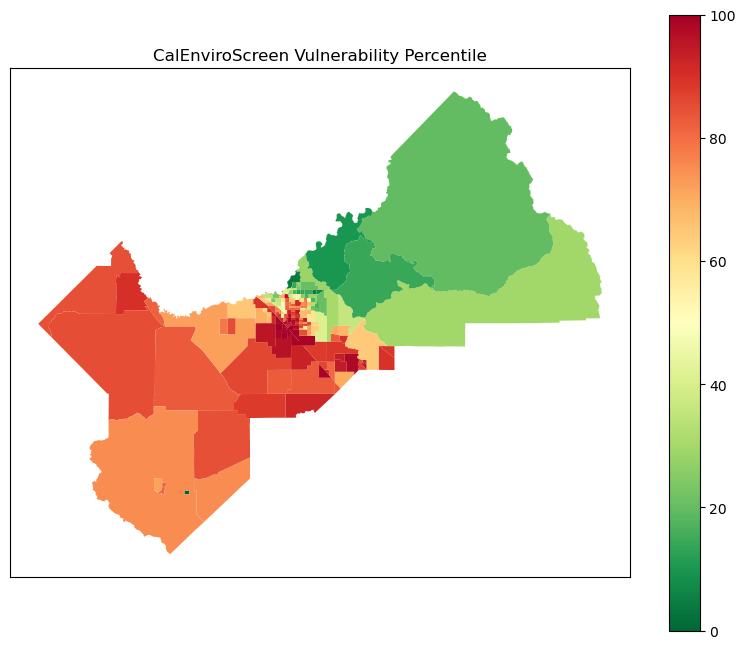
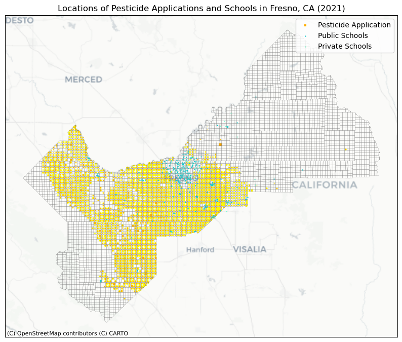
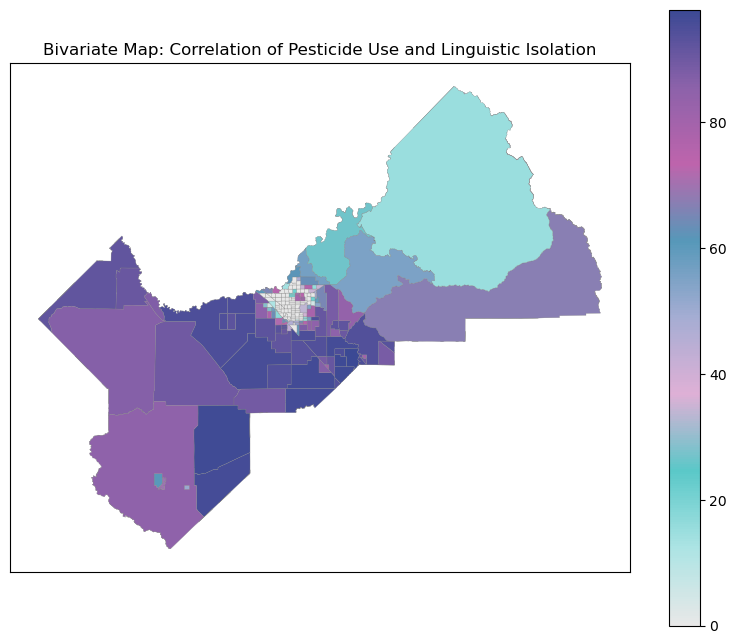

### Environmental Justice at the Urban-Agricultural Interface: Pesticide Use and Cumulative Burdens in Fresno, CA

Fresno is one of the top Agricultural producing counties in the U.S. and is a major part of the California Central Valley agricultural economy, which produces ¼ of the country’s food. The valley’s topography coupled with land use and air quality policy, distributional inequities, and discriminatory siting have, over time, led to the exposure of low-income families and small BIPOC farmers to pesticide drift and other cumulative air quality and environmental burdens. 




Exposure to pesticides through the air has been linked to a number of serious health conditions. Section 12972 of the California Food and Agriculture Code requires that any pesticide application take necessary precautions to prevent substantial drift to nontarget areas. However, community members have expressed that the County of Fresno and the state of California have failed to adequately enforce this, and it is disproportionately harming farmworkers and their families and residents living near pesticide spraying farms. As one of the most polluted regions in the nation, residents of the San Joaquin Valley are burdened by the cumulative effects of many drivers of pollution. 

Over 500,000 children in California attend schools located near hazardous pesticide applications. Latinx school children are 91% more likely to attend one of the most impacted schools compared to their white peers. This analysis uses the Department of Pesticide Regulation’s 2021 Pesticide Use Reporting (PUR) data set and the Deartment of Education’s school locations to show the proximity between the application of dangerous pesticides and schools. Children are especially vulnerable to the health impacts of pesticides.  

First, I converted the units to square miles to normalize the size of the pesticide applications and plotted them within 1 sq mile townships, and found the centroid points of each 1 square mile township section. I scaled the centroid markers based on the square mileage and layered them with the location of public and private schools in fresno to show  proximity. 
 

```python
def convert_to_sqmiles(row):
    amount = row["AMOUNT_TRE"]
    unit = row["UNIT_TREAT"]
    
    if unit == "A":
        # Convert acres to square miles
        return amount * 0.0015625  # 1 acre = 0.0015625 square miles
    elif unit == "S":
        # Convert square feet to square miles
        return amount * 3.587e-8  # 1 square foot = 3.587e-8 square miles
    elif unit == "C":
        # Convert cubic feet to square miles (assuming 30 ft height)
        depth_or_height_feet = 30  # Adjust as needed

        # Convert cubic feet to cubic miles
        volume_cubic_miles = amount / (5280 ** 3)

        # Calculate the equivalent area in square miles
        area_square_miles = volume_cubic_miles * depth_or_height_feet
    else:
        # Return None for unsupported units
        return None
# Apply the conversion function to create the new column
pur_gdf["AMOUNT_SQMILES"] = pur_gdf.apply(convert_to_sqmiles, axis=1)

```

```python

import pandas as pd
pd.set_option('display.max_columns', None)
pur_gdf2['centroid'] = pur_gdf2['geometry'].centroid
pur_gdf2.head()
```
<table border="1" class="dataframe">
  <thead>
    <tr style="text-align: right;">
      <th></th>
      <th>COUNTY_CD</th>
      <th>MTOWN</th>
      <th>RANGE</th>
      <th>SECTION</th>
      <th>REGIONNAME</th>
      <th>BASE_LN_ME</th>
      <th>TOWNSHIP</th>
      <th>MTRS</th>
      <th>MTR</th>
      <th>CO_MTRS</th>
      <th>REGION</th>
      <th>CO_MTR</th>
      <th>County_CDn</th>
      <th>NAME</th>
      <th>NAMELSAD</th>
      <th>OID_</th>
      <th>ADJUVANT</th>
      <th>YEAR</th>
      <th>DATE</th>
      <th>COUNTY_NAM</th>
      <th>COMTRS</th>
      <th>SITE_NAME</th>
      <th>PRODUCT_NA</th>
      <th>POUNDS_PRO</th>
      <th>CHEMICAL_N</th>
      <th>POUNDS_CHE</th>
      <th>AMOUNT_TRE</th>
      <th>UNIT_TREAT</th>
      <th>AERIAL_GRO</th>
      <th>AMOUNT_SQM</th>
      <th>Latitude</th>
      <th>Longitude</th>
      <th>geometry</th>
      <th>centroid</th>
    </tr>
  </thead>
  <tbody>
    <tr>
      <th>1287</th>
      <td>10</td>
      <td>M10S</td>
      <td>13E</td>
      <td>22</td>
      <td>CENTRAL VALLEY</td>
      <td>M</td>
      <td>10S</td>
      <td>M10S13E22</td>
      <td>M10S13E</td>
      <td>10M10S13E22</td>
      <td>5</td>
      <td>10M10S13E</td>
      <td>10</td>
      <td>Fresno</td>
      <td>Fresno County</td>
      <td>None</td>
      <td>None</td>
      <td>2021.0</td>
      <td>15-JUN-21</td>
      <td>FRESNO</td>
      <td>10M10S13E22</td>
      <td>COTTON, GENERAL</td>
      <td>AMIGO</td>
      <td>13.3836</td>
      <td>None</td>
      <td>NaN</td>
      <td>14.0</td>
      <td>A</td>
      <td>G</td>
      <td>0.021875</td>
      <td>-108134.36885</td>
      <td>-48198.642574</td>
      <td>POLYGON ((-48165.756 -107898.621, -48107.770 -...</td>
      <td>POINT (-48148.384 -108218.520)</td>
    </tr>
    <tr>
      <th>1288</th>
      <td>10</td>
      <td>M10S</td>
      <td>13E</td>
      <td>22</td>
      <td>CENTRAL VALLEY</td>
      <td>M</td>
      <td>10S</td>
      <td>M10S13E22</td>
      <td>M10S13E</td>
      <td>10M10S13E22</td>
      <td>5</td>
      <td>10M10S13E</td>
      <td>10</td>
      <td>Fresno</td>
      <td>Fresno County</td>
      <td>None</td>
      <td>None</td>
      <td>2021.0</td>
      <td>27-AUG-21</td>
      <td>FRESNO</td>
      <td>10M10S13E22</td>
      <td>COTTON, GENERAL</td>
      <td>AMIGO</td>
      <td>20.1136</td>
      <td>None</td>
      <td>NaN</td>
      <td>14.0</td>
      <td>A</td>
      <td>G</td>
      <td>0.021875</td>
      <td>-108134.36885</td>
      <td>-48198.642574</td>
      <td>POLYGON ((-48165.756 -107898.621, -48107.770 -...</td>
      <td>POINT (-48148.384 -108218.520)</td>
    </tr>
    <tr>
      <th>1289</th>
      <td>10</td>
      <td>M10S</td>
      <td>13E</td>
      <td>22</td>
      <td>CENTRAL VALLEY</td>
      <td>M</td>
      <td>10S</td>
      <td>M10S13E22</td>
      <td>M10S13E</td>
      <td>10M10S13E22</td>
      <td>5</td>
      <td>10M10S13E</td>
      <td>10</td>
      <td>Fresno</td>
      <td>Fresno County</td>
      <td>None</td>
      <td>NO</td>
      <td>2021.0</td>
      <td>27-AUG-21</td>
      <td>FRESNO</td>
      <td>10M10S13E22</td>
      <td>COTTON, GENERAL</td>
      <td>ASSAIL 70WP INSECTICIDE</td>
      <td>1.9400</td>
      <td>ACETAMIPRID</td>
      <td>1.358000</td>
      <td>14.0</td>
      <td>A</td>
      <td>G</td>
      <td>0.021875</td>
      <td>-108134.36885</td>
      <td>-48198.642574</td>
      <td>POLYGON ((-48165.756 -107898.621, -48107.770 -...</td>
      <td>POINT (-48148.384 -108218.520)</td>
    </tr>
    <tr>
      <th>1290</th>
      <td>10</td>
      <td>M10S</td>
      <td>13E</td>
      <td>22</td>
      <td>CENTRAL VALLEY</td>
      <td>M</td>
      <td>10S</td>
      <td>M10S13E22</td>
      <td>M10S13E</td>
      <td>10M10S13E22</td>
      <td>5</td>
      <td>10M10S13E</td>
      <td>10</td>
      <td>Fresno</td>
      <td>Fresno County</td>
      <td>None</td>
      <td>NO</td>
      <td>2021.0</td>
      <td>15-JUN-21</td>
      <td>FRESNO</td>
      <td>10M10S13E22</td>
      <td>COTTON, GENERAL</td>
      <td>BELAY INSECTICIDE</td>
      <td>5.0919</td>
      <td>CLOTHIANIDIN</td>
      <td>1.171137</td>
      <td>14.0</td>
      <td>A</td>
      <td>G</td>
      <td>0.021875</td>
      <td>-108134.36885</td>
      <td>-48198.642574</td>
      <td>POLYGON ((-48165.756 -107898.621, -48107.770 -...</td>
      <td>POINT (-48148.384 -108218.520)</td>
    </tr>
    <tr>
      <th>1291</th>
      <td>10</td>
      <td>M10S</td>
      <td>13E</td>
      <td>22</td>
      <td>CENTRAL VALLEY</td>
      <td>M</td>
      <td>10S</td>
      <td>M10S13E22</td>
      <td>M10S13E</td>
      <td>10M10S13E22</td>
      <td>5</td>
      <td>10M10S13E</td>
      <td>10</td>
      <td>Fresno</td>
      <td>Fresno County</td>
      <td>None</td>
      <td>NO</td>
      <td>2021.0</td>
      <td>16-SEP-21</td>
      <td>FRESNO</td>
      <td>10M10S13E22</td>
      <td>COTTON, GENERAL</td>
      <td>BOLL BUSTER</td>
      <td>38.0006</td>
      <td>ETHEPHON</td>
      <td>21.052332</td>
      <td>14.0</td>
      <td>A</td>
      <td>G</td>
      <td>0.021875</td>
      <td>-108134.36885</td>
      <td>-48198.642574</td>
      <td>POLYGON ((-48165.756 -107898.621, -48107.770 -...</td>
      <td>POINT (-48148.384 -108218.520)</td>
    </tr>
  </tbody>
</table>


```python


fig, ax = plt.subplots(figsize=(10, 10))

#normalize
min_value = pur_centroids['AMOUNT_SQM'].min()
max_value = pur_centroids['AMOUNT_SQM'].max()
pur_centroids['normalized_size'] = (pur_centroids['AMOUNT_SQM'] - min_value) / (max_value - min_value)

# Scale the normalized values
desired_min_size = 1
desired_max_size = 15
pur_centroids['marker_size'] = pur_centroids['normalized_size'] * (desired_max_size - desired_min_size) + desired_min_size

# Plot the primary shapefile
pur_centroids.plot(ax=ax,  markersize=pur_centroids['marker_size'], color='orange', edgecolor='yellow', linewidth=0.1, marker='s', label='Pesticide Application', legend=True)

# Plot townships and schools
fresno_gdf.plot(ax=ax, color='none', edgecolor='grey', linewidth=0.2)

public_fresno.plot(ax=ax, markersize=2.5, color='darkturquoise', edgecolor='darkgrey', linewidth=0.1, label='Public Schools', legend=True)

private_fresno.plot(ax=ax, markersize=2.5, color='aquamarine', edgecolor='darkgrey', linewidth=0.1, label='Private Schools', legend=True)

# Set plot title and labels
ax.set_title('Locations of Pesticide Applications and Schools in Fresno, CA (2021)')

#add basemap
ctx.add_basemap(ax,  source=cx.providers.CartoDB.Positron)

handles, labels = ax.get_legend_handles_labels()
ax.legend(handles, labels)

ax.set_xticks([])
ax.set_yticks([])
ax.set_xlabel('')
ax.set_ylabel('')

# Show the plot
plt.show()
```


    
This widget shows the wind speed and direction in real time, showing when and how drift is likely to happen in the direction of schools from near by applications. 

<iframe src="https://www.meteoblue.com/en/weather/maps/widget/fresno_united-states_5350937?windAnimation=0&windAnimation=1&gust=0&gust=1&satellite=0&satellite=1&cloudsAndPrecipitation=0&cloudsAndPrecipitation=1&temperature=0&temperature=1&sunshine=0&sunshine=1&extremeForecastIndex=0&extremeForecastIndex=1&geoloc=fixed&tempunit=C&windunit=km%252Fh&lengthunit=metric&zoom=5&autowidth=auto"  frameborder="0" scrolling="NO" allowtransparency="true" sandbox="allow-same-origin allow-scripts allow-popups allow-popups-to-escape-sandbox" style="width: 100%; height: 720px"></iframe><div><!-- DO NOT REMOVE THIS LINK --><a href="https://www.meteoblue.com/en/weather/maps/fresno_united-states_5350937?utm_source=weather_widget&utm_medium=linkus&utm_content=map&utm_campaign=Weather%2BWidget" target="_blank" rel="noopener">meteoblue</a></div>
Farmworkers and their families are especially exposed to pesticides. The bivariate maps below, using indicators and data from CalEnviroScreen 4.0, show pesticide use correlated with charecteristics common in farmworker communities in the Central Valley. Many of these characteristics also serve as barriers to reporting, which is the main way the County Agricultural Commisioners find out about pesticide drift instances.




